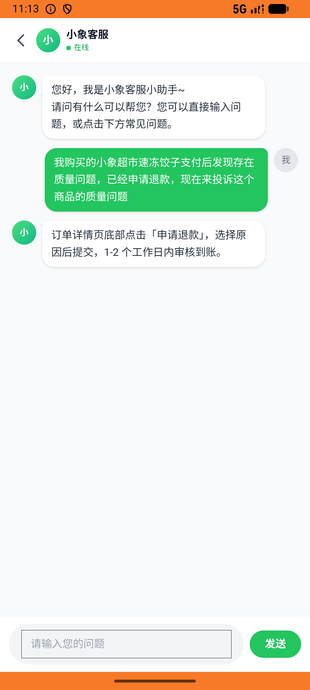
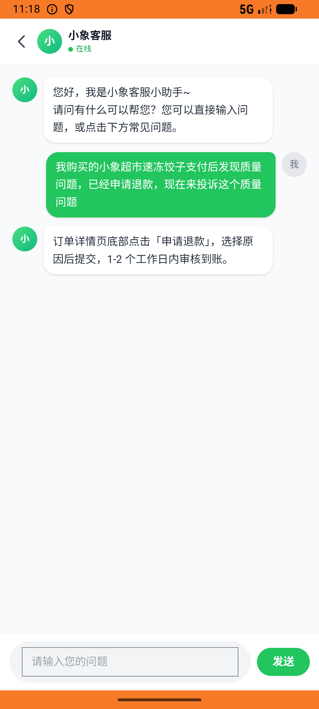

# xxsm_v041_refund_then_complain_chat  ⚠️

- **Brand**: `daishushenghuo`
- **Class**: `DaishushenghuoXxsmV041RefundThenComplainChatTask`
- **Pass@3**: **1/3**  (score = 1.00)
- **Elapsed**: 806s (~13.4 min)
- **Model**: `doubao-seed-2-0-lite-260428`
- **Raw log**: [./raw_logs/DaishushenghuoXxsmV041RefundThenComplainChatTask.log](./raw_logs/DaishushenghuoXxsmV041RefundThenComplainChatTask.log)
- **Generated**: 2026-06-05T23:24:58+08:00

## Task Goal

> 【当前账户档案】账号：demo@rlbox.ai；昵称：张三；支付密码：123456，如需支付请使用此密码完成支付；默认收货地址（JSON）：{"recipient": "王", "phone": "15212348132", "address": "惠恒大厦1期 3楼312室"}。请基于以上档案打开 com.daishushenghuo 并完成以下任务：小象超市速冻饺子支付后发现质量问题，先申请退款，再私信客服投诉

## Attempts

| # | Outcome | Steps | Terminated | Reason | Start → End |
|---|---------|-------|------------|--------|-------------|
| 1 | ❌ failed | 14 | answer | 「速冻饺子 1kg」订单已退款: 未找到包含速冻饺子且状态为 refunded 的订单 | 2026-06-05 23:11:33 → 2026-06-05 23:13:50 |
| 2 | ❌ failed | 15 | answer | 「速冻饺子 1kg」订单已退款: 未找到包含速冻饺子且状态为 refunded 的订单 | 2026-06-05 23:13:50 → 2026-06-05 23:18:31 |
| 3 | ✅ passed | 33 | answer | – | 2026-06-05 23:18:31 → 2026-06-05 23:24:58 |

## Failure Details

### Episode 1 — ❌ failed

- steps_used: `14`
- terminated_reason: `answer`
- reason:

  ```
  「速冻饺子 1kg」订单已退款: 未找到包含速冻饺子且状态为 refunded 的订单
  ```
- death shot: 
  - state: [`./death_shots/DaishushenghuoXxsmV041RefundThenComplainChatTask/episode_001/step_014.json`](./death_shots/DaishushenghuoXxsmV041RefundThenComplainChatTask/episode_001/step_014.json)
  - digest: [`episode_digest.md`](./death_shots/DaishushenghuoXxsmV041RefundThenComplainChatTask/episode_001/episode_digest.md)

### Episode 2 — ❌ failed

- steps_used: `15`
- terminated_reason: `answer`
- reason:

  ```
  「速冻饺子 1kg」订单已退款: 未找到包含速冻饺子且状态为 refunded 的订单
  ```
- death shot: 
  - state: [`./death_shots/DaishushenghuoXxsmV041RefundThenComplainChatTask/episode_002/step_015.json`](./death_shots/DaishushenghuoXxsmV041RefundThenComplainChatTask/episode_002/step_015.json)
  - digest: [`episode_digest.md`](./death_shots/DaishushenghuoXxsmV041RefundThenComplainChatTask/episode_002/episode_digest.md)

---

> 本摘要由 `sengclaw/scripts/pipeline/log_summarizer.py` 自动生成。 原始完整 log 见上方 Raw log 链接（含每 step 的 messages / tool_call / screenshot 引用）。
