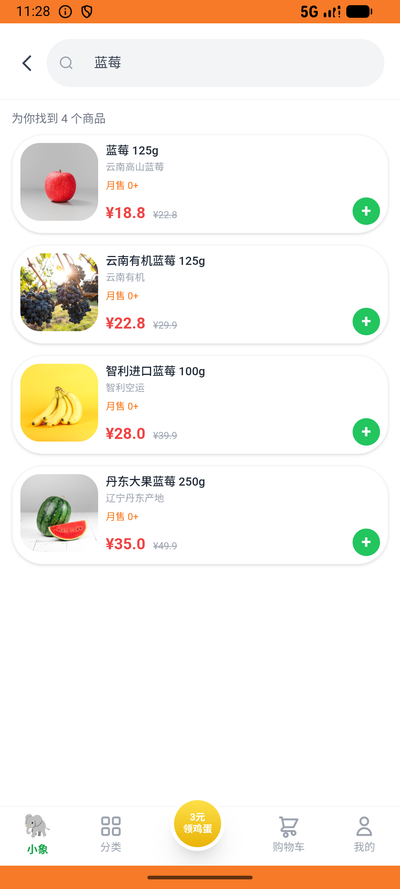

# xxsm_v042_browse_compare_chat_then_buy  ❌

- **Brand**: `daishushenghuo`
- **Class**: `DaishushenghuoXxsmV042BrowseCompareChatThenBuyTask`
- **Pass@3**: **0/3**  (score = 0.00)
- **Elapsed**: 483s (~8.1 min)
- **Model**: `doubao-seed-2-0-lite-260428`
- **Raw log**: [./raw_logs/DaishushenghuoXxsmV042BrowseCompareChatThenBuyTask.log](./raw_logs/DaishushenghuoXxsmV042BrowseCompareChatThenBuyTask.log)
- **Generated**: 2026-06-05T23:34:05+08:00

## Task Goal

> 【当前账户档案】账号：demo@rlbox.ai；昵称：张三；支付密码：123456，如需支付请使用此密码完成支付；默认收货地址（JSON）：{"recipient": "王", "phone": "15212348132", "address": "惠恒大厦1期 3楼312室"}。请基于以上档案打开 com.daishushenghuo 并完成以下任务：小象超市浏览蓝莓/美早樱桃/金煌芒比价，私信客服问哪个新鲜，再下单 1 件水果

## Attempts

| # | Outcome | Steps | Terminated | Reason | Start → End |
|---|---------|-------|------------|--------|-------------|
| 1 | ❌ failed | 11 | answer | 与小象超市的会话存在: 未找到与小象超市的会话; 小象超市已支付订单存在: 未找到已支付订单 | 2026-06-05 23:26:02 → 2026-06-05 23:28:31 |
| 2 | ❌ failed | 20 | answer | 与小象超市的会话存在: 未找到与小象超市的会话; 小象超市已支付订单存在: 未找到已支付订单 | 2026-06-05 23:28:32 → 2026-06-05 23:31:41 |
| 3 | ❌ failed | 12 | answer | 与小象超市的会话存在: 未找到与小象超市的会话; 小象超市已支付订单存在: 未找到已支付订单 | 2026-06-05 23:31:41 → 2026-06-05 23:34:05 |

## Failure Details

### Episode 1 — ❌ failed

- steps_used: `11`
- terminated_reason: `answer`
- reason:

  ```
  与小象超市的会话存在: 未找到与小象超市的会话; 小象超市已支付订单存在: 未找到已支付订单
  ```
- death shot: 
  - state: [`./death_shots/DaishushenghuoXxsmV042BrowseCompareChatThenBuyTask/episode_001/step_011.json`](./death_shots/DaishushenghuoXxsmV042BrowseCompareChatThenBuyTask/episode_001/step_011.json)
  - digest: [`episode_digest.md`](./death_shots/DaishushenghuoXxsmV042BrowseCompareChatThenBuyTask/episode_001/episode_digest.md)

### Episode 2 — ❌ failed

- steps_used: `20`
- terminated_reason: `answer`
- reason:

  ```
  与小象超市的会话存在: 未找到与小象超市的会话; 小象超市已支付订单存在: 未找到已支付订单
  ```
- death shot: 
  - state: [`./death_shots/DaishushenghuoXxsmV042BrowseCompareChatThenBuyTask/episode_002/step_020.json`](./death_shots/DaishushenghuoXxsmV042BrowseCompareChatThenBuyTask/episode_002/step_020.json)
  - digest: [`episode_digest.md`](./death_shots/DaishushenghuoXxsmV042BrowseCompareChatThenBuyTask/episode_002/episode_digest.md)

### Episode 3 — ❌ failed

- steps_used: `12`
- terminated_reason: `answer`
- reason:

  ```
  与小象超市的会话存在: 未找到与小象超市的会话; 小象超市已支付订单存在: 未找到已支付订单
  ```
- death shot: 
  - state: [`./death_shots/DaishushenghuoXxsmV042BrowseCompareChatThenBuyTask/episode_003/step_012.json`](./death_shots/DaishushenghuoXxsmV042BrowseCompareChatThenBuyTask/episode_003/step_012.json)
  - digest: [`episode_digest.md`](./death_shots/DaishushenghuoXxsmV042BrowseCompareChatThenBuyTask/episode_003/episode_digest.md)

---

> 本摘要由 `sengclaw/scripts/pipeline/log_summarizer.py` 自动生成。 原始完整 log 见上方 Raw log 链接（含每 step 的 messages / tool_call / screenshot 引用）。
