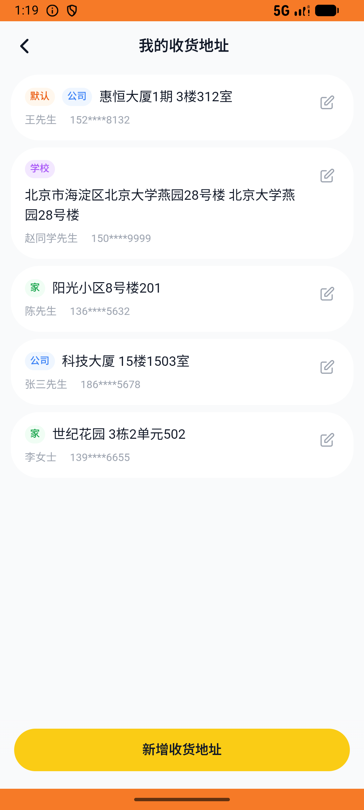

# address_v004_add_school_address  ⚠️

- **Brand**: `daishushenghuo`
- **Class**: `DaishushenghuoAddressV004AddSchoolAddressTask`
- **Pass@3**: **2/3**  (score = 1.00)
- **Elapsed**: 569s (~9.5 min)
- **Model**: `doubao-seed-2-0-lite-260428`
- **Raw log**: [./raw_logs/DaishushenghuoAddressV004AddSchoolAddressTask.log](./raw_logs/DaishushenghuoAddressV004AddSchoolAddressTask.log)
- **Generated**: 2026-06-06T01:25:32+08:00

## Task Goal

> 【当前账户档案】账号：demo@rlbox.ai；昵称：张三；支付密码：123456，如需支付请使用此密码完成支付；默认收货地址（JSON）：{"recipient": "王", "phone": "15212348132", "address": "惠恒大厦1期 3楼312室"}。请基于以上档案打开 com.daishushenghuo 并完成以下任务：新增一个学校收货地址，联系人赵同学 15088889999，地址北京市海淀区北京大学燕园28号楼

## Attempts

| # | Outcome | Steps | Terminated | Reason | Start → End |
|---|---------|-------|------------|--------|-------------|
| 1 | ❌ failed | 22 | answer | 完整地址 = 「北京市海淀区北京大学燕园28号楼」（兼容标签/详址两种存储）: 预期完整地址 '北京市海淀区北京大学燕园28号楼'，实际 label="北京市海淀区北京大学燕园28号楼" detail_address="北京大学燕园28号楼"（detail_only="北京... | 2026-06-06 01:16:03 → 2026-06-06 01:19:17 |
| 2 | ✅ passed | 18 | answer | – | 2026-06-06 01:19:17 → 2026-06-06 01:22:23 |
| 3 | ✅ passed | 17 | answer | – | 2026-06-06 01:22:23 → 2026-06-06 01:25:32 |

## Failure Details

### Episode 1 — ❌ failed

- steps_used: `22`
- terminated_reason: `answer`
- reason:

  ```
  完整地址 = 「北京市海淀区北京大学燕园28号楼」（兼容标签/详址两种存储）: 预期完整地址 '北京市海淀区北京大学燕园28号楼'，实际 label="北京市海淀区北京大学燕园28号楼" detail_address="北京大学燕园28号楼"（detail_only="北京大学燕园28号楼" concat="北京市海淀区北京大学燕园28号楼北京大学燕园28号楼"）
  Diff:
  @@ -1 +1 @@
  -true
  +false
  ```
- death shot: 
  - state: [`./death_shots/DaishushenghuoAddressV004AddSchoolAddressTask/episode_001/step_022.json`](./death_shots/DaishushenghuoAddressV004AddSchoolAddressTask/episode_001/step_022.json)
  - digest: [`episode_digest.md`](./death_shots/DaishushenghuoAddressV004AddSchoolAddressTask/episode_001/episode_digest.md)

---

> 本摘要由 `sengclaw/scripts/pipeline/log_summarizer.py` 自动生成。 原始完整 log 见上方 Raw log 链接（含每 step 的 messages / tool_call / screenshot 引用）。
