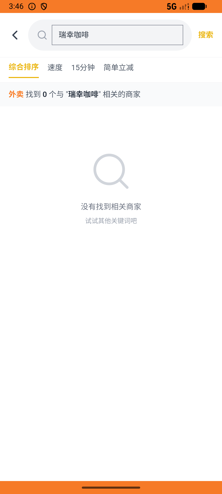
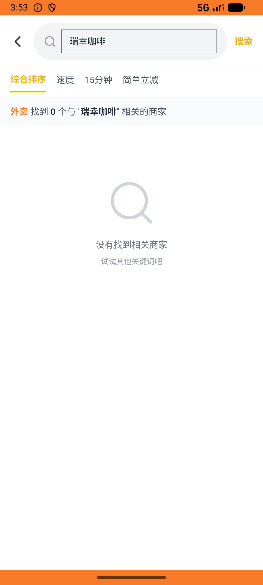

# group_deal_v001_place_order_tuangou  ❌

- **Brand**: `daishushenghuo`
- **Class**: `DaishushenghuoGroupDealV001PlaceOrderTuangouTask`
- **Pass@3**: **0/3**  (score = 0.00)
- **Elapsed**: 544s (~9.1 min)
- **Model**: `doubao-seed-2-0-lite-260428`
- **Raw log**: [./raw_logs/DaishushenghuoGroupDealV001PlaceOrderTuangouTask.log](./raw_logs/DaishushenghuoGroupDealV001PlaceOrderTuangouTask.log)
- **Generated**: 2026-06-06T03:54:01+08:00

## Task Goal

> 【当前账户档案】账号：demo@rlbox.ai；昵称：张三；支付密码：123456，如需支付请使用此密码完成支付；默认收货地址（JSON）：{"recipient": "王", "phone": "15212348132", "address": "惠恒大厦1期 3楼312室"}。请基于以上档案打开 com.daishushenghuo 并完成以下任务：去瑞幸咖啡国贸店买一份生椰拿铁大杯并支付

## Attempts

| # | Outcome | Steps | Terminated | Reason | Start → End |
|---|---------|-------|------------|--------|-------------|
| 1 | ❌ failed | 14 | answer | 团购订单已创建（店铺=瑞幸咖啡（国贸店），订单类型为团购订单）: 未找到用户 demo@rlbox.ai 在「瑞幸咖啡（国贸店）」的团购订单（order_type='group_deal'） | 2026-06-06 03:44:57 → 2026-06-06 03:46:45 |
| 2 | ❌ failed | 22 | answer | 团购订单已创建（店铺=瑞幸咖啡（国贸店），订单类型为团购订单）: 未找到用户 demo@rlbox.ai 在「瑞幸咖啡（国贸店）」的团购订单（order_type='group_deal'） | 2026-06-06 03:46:45 → 2026-06-06 03:49:52 |
| 3 | ❌ failed | 29 | answer | 团购订单已创建（店铺=瑞幸咖啡（国贸店），订单类型为团购订单）: 未找到用户 demo@rlbox.ai 在「瑞幸咖啡（国贸店）」的团购订单（order_type='group_deal'） | 2026-06-06 03:49:52 → 2026-06-06 03:54:01 |

## Failure Details

### Episode 1 — ❌ failed

- steps_used: `14`
- terminated_reason: `answer`
- reason:

  ```
  团购订单已创建（店铺=瑞幸咖啡（国贸店），订单类型为团购订单）: 未找到用户 demo@rlbox.ai 在「瑞幸咖啡（国贸店）」的团购订单（order_type='group_deal'）
  ```
- death shot: 
  - state: [`./death_shots/DaishushenghuoGroupDealV001PlaceOrderTuangouTask/episode_001/step_014.json`](./death_shots/DaishushenghuoGroupDealV001PlaceOrderTuangouTask/episode_001/step_014.json)
  - digest: [`episode_digest.md`](./death_shots/DaishushenghuoGroupDealV001PlaceOrderTuangouTask/episode_001/episode_digest.md)

### Episode 2 — ❌ failed

- steps_used: `22`
- terminated_reason: `answer`
- reason:

  ```
  团购订单已创建（店铺=瑞幸咖啡（国贸店），订单类型为团购订单）: 未找到用户 demo@rlbox.ai 在「瑞幸咖啡（国贸店）」的团购订单（order_type='group_deal'）
  ```
- death shot: 
  - state: [`./death_shots/DaishushenghuoGroupDealV001PlaceOrderTuangouTask/episode_002/step_022.json`](./death_shots/DaishushenghuoGroupDealV001PlaceOrderTuangouTask/episode_002/step_022.json)
  - digest: [`episode_digest.md`](./death_shots/DaishushenghuoGroupDealV001PlaceOrderTuangouTask/episode_002/episode_digest.md)

### Episode 3 — ❌ failed

- steps_used: `29`
- terminated_reason: `answer`
- reason:

  ```
  团购订单已创建（店铺=瑞幸咖啡（国贸店），订单类型为团购订单）: 未找到用户 demo@rlbox.ai 在「瑞幸咖啡（国贸店）」的团购订单（order_type='group_deal'）
  ```
- death shot: 
  - state: [`./death_shots/DaishushenghuoGroupDealV001PlaceOrderTuangouTask/episode_003/step_029.json`](./death_shots/DaishushenghuoGroupDealV001PlaceOrderTuangouTask/episode_003/step_029.json)
  - digest: [`episode_digest.md`](./death_shots/DaishushenghuoGroupDealV001PlaceOrderTuangouTask/episode_003/episode_digest.md)

---

> 本摘要由 `sengclaw/scripts/pipeline/log_summarizer.py` 自动生成。 原始完整 log 见上方 Raw log 链接（含每 step 的 messages / tool_call / screenshot 引用）。
