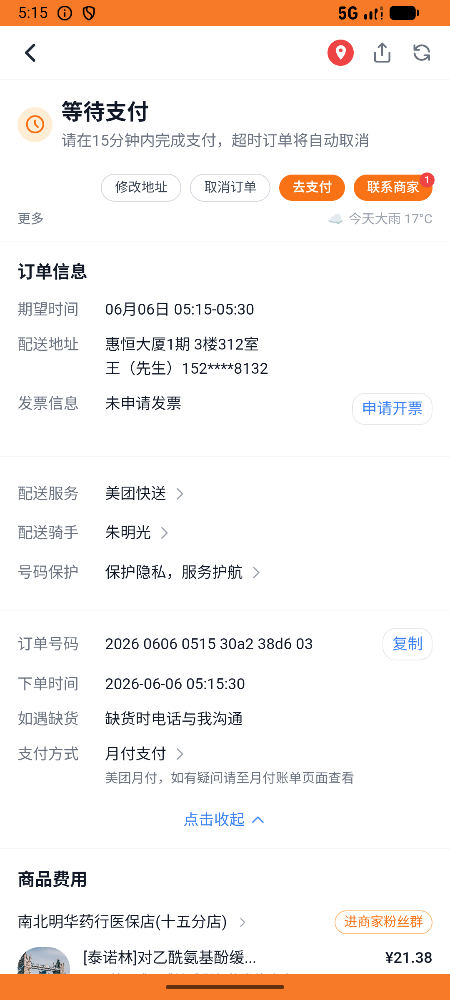

# kanbing_v019_place_order_tainuolin  ⚠️

- **Brand**: `daishushenghuo`
- **Class**: `DaishushenghuoKanbingV019PlaceOrderTainuolinTask`
- **Pass@3**: **2/3**  (score = 1.00)
- **Elapsed**: 564s (~9.4 min)
- **Model**: `doubao-seed-2-0-lite-260428`
- **Raw log**: [./raw_logs/DaishushenghuoKanbingV019PlaceOrderTainuolinTask.log](./raw_logs/DaishushenghuoKanbingV019PlaceOrderTainuolinTask.log)
- **Generated**: 2026-06-06T05:22:09+08:00

## Task Goal

> 【当前账户档案】账号：demo@rlbox.ai；昵称：张三；支付密码：123456，如需支付请使用此密码完成支付；默认收货地址（JSON）：{"recipient": "王", "phone": "15212348132", "address": "惠恒大厦1期 3楼312室"}。请基于以上档案打开 com.daishushenghuo 并完成以下任务：在明华大药房下单 1 盒泰诺林对乙酰氨基酚缓释片，使用默认地址，下单后不要支付

## Attempts

| # | Outcome | Steps | Terminated | Reason | Start → End |
|---|---------|-------|------------|--------|-------------|
| 1 | ❌ failed | 23 | answer | 订单已创建（店铺=明华大药房(岁宝店)）: expected: not nil      got: nil | 2026-06-06 05:12:46 → 2026-06-06 05:15:45 |
| 2 | ✅ passed | 28 | answer | – | 2026-06-06 05:15:45 → 2026-06-06 05:19:34 |
| 3 | ✅ passed | 19 | answer | – | 2026-06-06 05:19:34 → 2026-06-06 05:22:09 |

## Failure Details

### Episode 1 — ❌ failed

- steps_used: `23`
- terminated_reason: `answer`
- reason:

  ```
  订单已创建（店铺=明华大药房(岁宝店)）: expected: not nil
       got: nil
  ```
- death shot: 
  - state: [`./death_shots/DaishushenghuoKanbingV019PlaceOrderTainuolinTask/episode_001/step_023.json`](./death_shots/DaishushenghuoKanbingV019PlaceOrderTainuolinTask/episode_001/step_023.json)
  - digest: [`episode_digest.md`](./death_shots/DaishushenghuoKanbingV019PlaceOrderTainuolinTask/episode_001/episode_digest.md)

---

> 本摘要由 `sengclaw/scripts/pipeline/log_summarizer.py` 自动生成。 原始完整 log 见上方 Raw log 链接（含每 step 的 messages / tool_call / screenshot 引用）。
