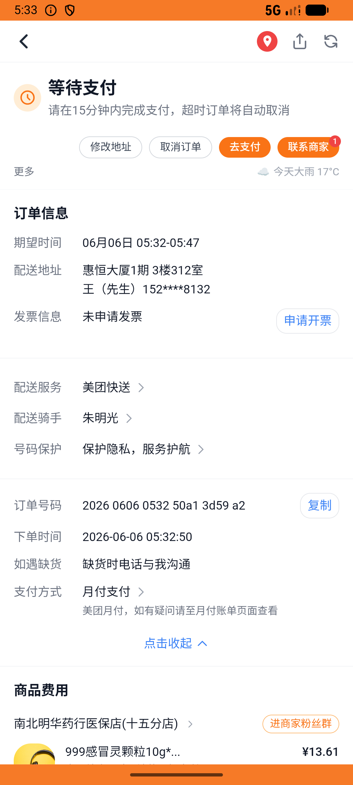

# kanbing_v020_place_order_three_medicines  ⚠️

- **Brand**: `daishushenghuo`
- **Class**: `DaishushenghuoKanbingV020PlaceOrderThreeMedicinesTask`
- **Pass@3**: **2/3**  (score = 1.00)
- **Elapsed**: 614s (~10.2 min)
- **Model**: `doubao-seed-2-0-lite-260428`
- **Raw log**: [./raw_logs/DaishushenghuoKanbingV020PlaceOrderThreeMedicinesTask.log](./raw_logs/DaishushenghuoKanbingV020PlaceOrderThreeMedicinesTask.log)
- **Generated**: 2026-06-06T05:33:19+08:00

## Task Goal

> 【当前账户档案】账号：demo@rlbox.ai；昵称：张三；支付密码：123456，如需支付请使用此密码完成支付；默认收货地址（JSON）：{"recipient": "王", "phone": "15212348132", "address": "惠恒大厦1期 3楼312室"}。请基于以上档案打开 com.daishushenghuo 并完成以下任务：从最近浏览找回南北明华药行，一次下单999感冒灵、小柴胡颗粒和蒲地蓝消炎片，下单后不要支付

## Attempts

| # | Outcome | Steps | Terminated | Reason | Start → End |
|---|---------|-------|------------|--------|-------------|
| 1 | ✅ passed | 30 | answer | – | 2026-06-06 05:23:04 → 2026-06-06 05:26:58 |
| 2 | ✅ passed | 30 | answer | – | 2026-06-06 05:26:58 → 2026-06-06 05:30:33 |
| 3 | ❌ failed | 21 | answer | 包含 云丰蒲地蓝消炎片（数量 1）: expected: not nil      got: nil; 订单总额 ≥ ¥53.95: expected: >= 0.5394e2      got:    48.94 | 2026-06-06 05:30:33 → 2026-06-06 05:33:18 |

## Failure Details

### Episode 3 — ❌ failed

- steps_used: `21`
- terminated_reason: `answer`
- reason:

  ```
  包含 云丰蒲地蓝消炎片（数量 1）: expected: not nil
       got: nil; 订单总额 ≥ ¥53.95: expected: >= 0.5394e2
       got:    48.94
  ```
- death shot: 
  - state: [`./death_shots/DaishushenghuoKanbingV020PlaceOrderThreeMedicinesTask/episode_003/step_021.json`](./death_shots/DaishushenghuoKanbingV020PlaceOrderThreeMedicinesTask/episode_003/step_021.json)
  - digest: [`episode_digest.md`](./death_shots/DaishushenghuoKanbingV020PlaceOrderThreeMedicinesTask/episode_003/episode_digest.md)

---

> 本摘要由 `sengclaw/scripts/pipeline/log_summarizer.py` 自动生成。 原始完整 log 见上方 Raw log 链接（含每 step 的 messages / tool_call / screenshot 引用）。
