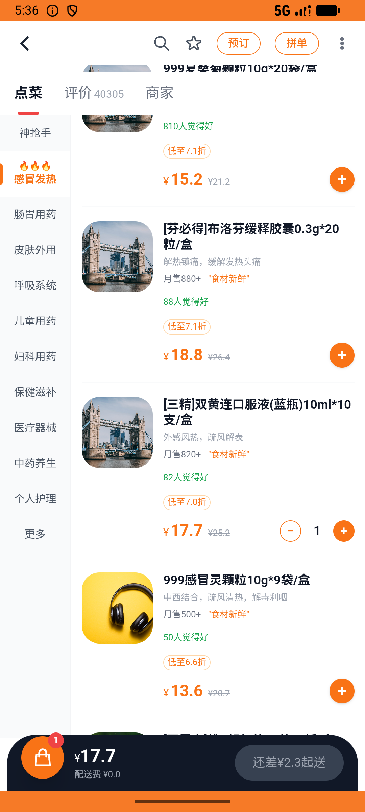
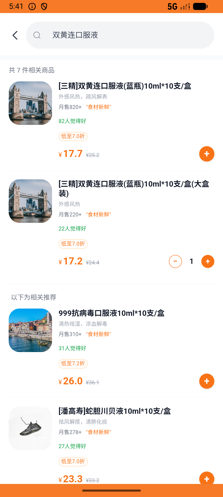

# kanbing_v034_cheapest_shuanghuanglian  ❌

- **Brand**: `daishushenghuo`
- **Class**: `DaishushenghuoKanbingV034CheapestShuanghuanglianTask`
- **Pass@3**: **0/3**  (score = 0.00)
- **Elapsed**: 463s (~7.7 min)
- **Model**: `doubao-seed-2-0-lite-260428`
- **Raw log**: [./raw_logs/DaishushenghuoKanbingV034CheapestShuanghuanglianTask.log](./raw_logs/DaishushenghuoKanbingV034CheapestShuanghuanglianTask.log)
- **Generated**: 2026-06-06T05:41:59+08:00

## Task Goal

> 【当前账户档案】账号：demo@rlbox.ai；昵称：张三；支付密码：123456，如需支付请使用此密码完成支付；默认收货地址（JSON）：{"recipient": "王", "phone": "15212348132", "address": "惠恒大厦1期 3楼312室"}。请基于以上档案打开 com.daishushenghuo 并完成以下任务：比价双黄连口服液，在最便宜的药店加购 1 盒

## Attempts

| # | Outcome | Steps | Terminated | Reason | Start → End |
|---|---------|-------|------------|--------|-------------|
| 1 | ❌ failed | 21 | answer | 选中的店铺 = 最便宜店铺: 预期最便宜店铺 海王星辰(人民南店)（¥17.46），实际选了 南北明华药行医保店(十五分店); 加购单价为最低价: 预期 ¥17.46，实际 ¥17.71 | 2026-06-06 05:34:16 → 2026-06-06 05:36:53 |
| 2 | ❌ failed | 19 | answer | 选中的店铺 = 最便宜店铺: 预期最便宜店铺 海王星辰(人民南店)（¥17.46），实际选了 南北明华药行医保店(十五分店); 加购单价为最低价: 预期 ¥17.46，实际 ¥17.71 | 2026-06-06 05:36:53 → 2026-06-06 05:39:10 |
| 3 | ❌ failed | 22 | answer | 已加购双黄连口服液到某家药店购物车: 所有候选药店购物车都没找到该药品 | 2026-06-06 05:39:10 → 2026-06-06 05:41:59 |

## Failure Details

### Episode 1 — ❌ failed

- steps_used: `21`
- terminated_reason: `answer`
- reason:

  ```
  选中的店铺 = 最便宜店铺: 预期最便宜店铺 海王星辰(人民南店)（¥17.46），实际选了 南北明华药行医保店(十五分店); 加购单价为最低价: 预期 ¥17.46，实际 ¥17.71
  ```
- death shot: 
  - state: [`./death_shots/DaishushenghuoKanbingV034CheapestShuanghuanglianTask/episode_001/step_021.json`](./death_shots/DaishushenghuoKanbingV034CheapestShuanghuanglianTask/episode_001/step_021.json)
  - digest: [`episode_digest.md`](./death_shots/DaishushenghuoKanbingV034CheapestShuanghuanglianTask/episode_001/episode_digest.md)

### Episode 2 — ❌ failed

- steps_used: `19`
- terminated_reason: `answer`
- reason:

  ```
  选中的店铺 = 最便宜店铺: 预期最便宜店铺 海王星辰(人民南店)（¥17.46），实际选了 南北明华药行医保店(十五分店); 加购单价为最低价: 预期 ¥17.46，实际 ¥17.71
  ```
- death shot: 
  - state: [`./death_shots/DaishushenghuoKanbingV034CheapestShuanghuanglianTask/episode_002/step_019.json`](./death_shots/DaishushenghuoKanbingV034CheapestShuanghuanglianTask/episode_002/step_019.json)
  - digest: [`episode_digest.md`](./death_shots/DaishushenghuoKanbingV034CheapestShuanghuanglianTask/episode_002/episode_digest.md)

### Episode 3 — ❌ failed

- steps_used: `22`
- terminated_reason: `answer`
- reason:

  ```
  已加购双黄连口服液到某家药店购物车: 所有候选药店购物车都没找到该药品
  ```
- death shot: 
  - state: [`./death_shots/DaishushenghuoKanbingV034CheapestShuanghuanglianTask/episode_003/step_022.json`](./death_shots/DaishushenghuoKanbingV034CheapestShuanghuanglianTask/episode_003/step_022.json)
  - digest: [`episode_digest.md`](./death_shots/DaishushenghuoKanbingV034CheapestShuanghuanglianTask/episode_003/episode_digest.md)

---

> 本摘要由 `sengclaw/scripts/pipeline/log_summarizer.py` 自动生成。 原始完整 log 见上方 Raw log 链接（含每 step 的 messages / tool_call / screenshot 引用）。
