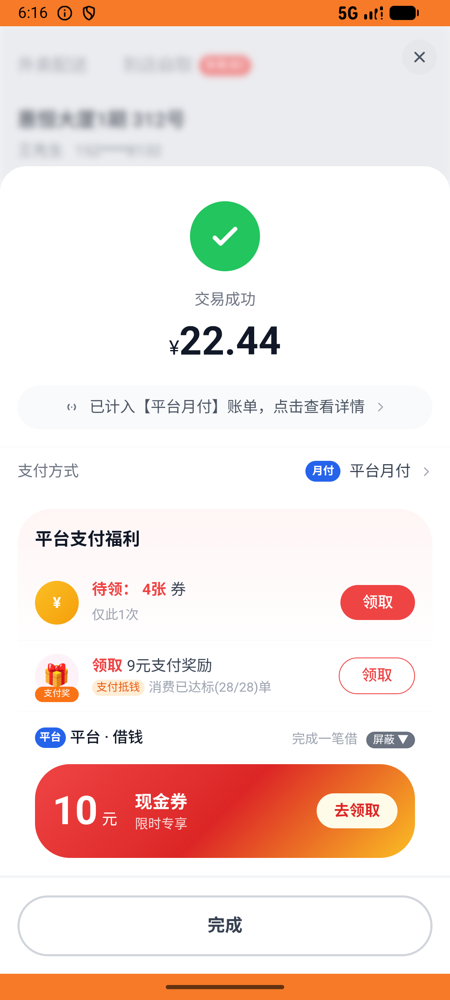

# kanbing_v043_checkout_multi_pharmacies  ❌

- **Brand**: `daishushenghuo`
- **Class**: `DaishushenghuoKanbingV043CheckoutMultiPharmaciesTask`
- **Pass@3**: **0/3**  (score = 0.00)
- **Elapsed**: 1240s (~20.7 min)
- **Model**: `doubao-seed-2-0-lite-260428`
- **Raw log**: [./raw_logs/DaishushenghuoKanbingV043CheckoutMultiPharmaciesTask.log](./raw_logs/DaishushenghuoKanbingV043CheckoutMultiPharmaciesTask.log)
- **Generated**: 2026-06-06T06:20:12+08:00

## Task Goal

> 【当前账户档案】账号：demo@rlbox.ai；昵称：张三；支付密码：123456，如需支付请使用此密码完成支付；默认收货地址（JSON）：{"recipient": "王", "phone": "15212348132", "address": "惠恒大厦1期 3楼312室"}。请基于以上档案打开 com.daishushenghuo 并完成以下任务：从看病买药购物车一起下单：南北明华999感冒灵 + 海王星辰复方板蓝根 + 大参林维C银翘片（一次结算 3 单）

## Attempts

| # | Outcome | Steps | Terminated | Reason | Start → End |
|---|---------|-------|------------|--------|-------------|
| 1 | ❌ failed | 53 | answer | 3 笔订单状态都是 pending（已下单未支付）: 南北明华药行医保店(十五分店) 订单状态应为 pending，实际 "paid" | 2026-06-06 05:59:32 → 2026-06-06 06:06:30 |
| 2 | ⏰ timeout | 80 | max_steps | 南北明华药店订单已创建（含999感冒灵 ×1）: 未找到南北明华订单; 大参林药店订单已创建（含维C银翘片 ×1）: 未找到大参林订单; 3 笔订单状态都是 pending（已下单未支付）: 海王星辰(人民南店) 订单状态应为 pending，实际 "paid"; 3 笔订... | 2026-06-06 06:06:30 → 2026-06-06 06:16:56 |
| 3 | ❌ failed | 25 | answer | 3 笔订单状态都是 pending（已下单未支付）: 南北明华药行医保店(十五分店) 订单状态应为 pending，实际 "paid" | 2026-06-06 06:16:56 → 2026-06-06 06:20:12 |

## Failure Details

### Episode 1 — ❌ failed

- steps_used: `53`
- terminated_reason: `answer`
- reason:

  ```
  3 笔订单状态都是 pending（已下单未支付）: 南北明华药行医保店(十五分店) 订单状态应为 pending，实际 "paid"
  ```
- death shot: 
  - state: [`./death_shots/DaishushenghuoKanbingV043CheckoutMultiPharmaciesTask/episode_001/step_053.json`](./death_shots/DaishushenghuoKanbingV043CheckoutMultiPharmaciesTask/episode_001/step_053.json)
  - digest: [`episode_digest.md`](./death_shots/DaishushenghuoKanbingV043CheckoutMultiPharmaciesTask/episode_001/episode_digest.md)

### Episode 2 — ⏰ timeout

- steps_used: `80`
- terminated_reason: `max_steps`
- reason:

  ```
  南北明华药店订单已创建（含999感冒灵 ×1）: 未找到南北明华订单; 大参林药店订单已创建（含维C银翘片 ×1）: 未找到大参林订单; 3 笔订单状态都是 pending（已下单未支付）: 海王星辰(人民南店) 订单状态应为 pending，实际 "paid"; 3 笔订单金额正确：南北明华¥14.61 + 海王¥22.44 + 大参林¥9.48 = ¥46.53: 南北明华预期 ¥14.61，实际 ¥; 3 家药店购物车都被清空: 南北明华药行医保店(十五分店) 购物车未清空，仍有 1 件商品
  ```
- death shot: 
  - state: [`./death_shots/DaishushenghuoKanbingV043CheckoutMultiPharmaciesTask/episode_002/step_080.json`](./death_shots/DaishushenghuoKanbingV043CheckoutMultiPharmaciesTask/episode_002/step_080.json)
  - digest: [`episode_digest.md`](./death_shots/DaishushenghuoKanbingV043CheckoutMultiPharmaciesTask/episode_002/episode_digest.md)

### Episode 3 — ❌ failed

- steps_used: `25`
- terminated_reason: `answer`
- reason:

  ```
  3 笔订单状态都是 pending（已下单未支付）: 南北明华药行医保店(十五分店) 订单状态应为 pending，实际 "paid"
  ```
- death shot: 
  - state: [`./death_shots/DaishushenghuoKanbingV043CheckoutMultiPharmaciesTask/episode_003/step_025.json`](./death_shots/DaishushenghuoKanbingV043CheckoutMultiPharmaciesTask/episode_003/step_025.json)
  - digest: [`episode_digest.md`](./death_shots/DaishushenghuoKanbingV043CheckoutMultiPharmaciesTask/episode_003/episode_digest.md)

---

> 本摘要由 `sengclaw/scripts/pipeline/log_summarizer.py` 自动生成。 原始完整 log 见上方 Raw log 链接（含每 step 的 messages / tool_call / screenshot 引用）。
