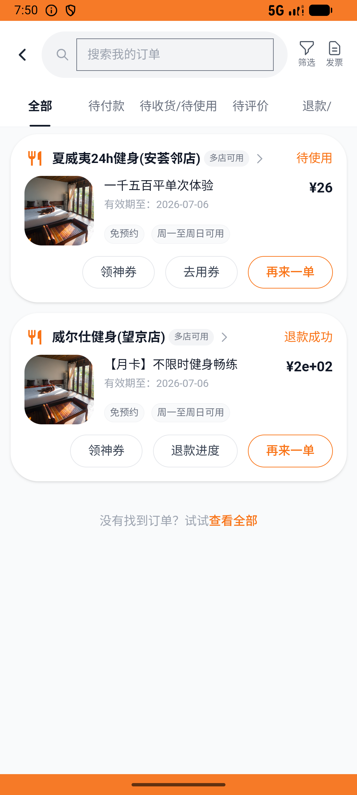

# leisure_v007_gym_monthly_refund_switch  ⚠️

- **Brand**: `daishushenghuo`
- **Class**: `DaishushenghuoLeisureV007GymMonthlyRefundSwitchTask`
- **Pass@3**: **2/3**  (score = 1.00)
- **Elapsed**: 534s (~8.9 min)
- **Model**: `doubao-seed-2-0-lite-260428`
- **Raw log**: [./raw_logs/DaishushenghuoLeisureV007GymMonthlyRefundSwitchTask.log](./raw_logs/DaishushenghuoLeisureV007GymMonthlyRefundSwitchTask.log)
- **Generated**: 2026-06-06T07:52:55+08:00

## Task Goal

> 【当前账户档案】账号：demo@rlbox.ai；昵称：张三；支付密码：123456，如需支付请使用此密码完成支付；默认收货地址（JSON）：{"recipient": "王", "phone": "15212348132", "address": "惠恒大厦1期 3楼312室"}。请基于以上档案打开 com.daishushenghuo 并完成以下任务：反悔威尔仕健身月卡：把已支付的威尔仕「【月卡】不限时健身畅练」申请退款，再去夏威夷24h健身买「一千五百平单次体验」并支付

## Attempts

| # | Outcome | Steps | Terminated | Reason | Start → End |
|---|---------|-------|------------|--------|-------------|
| 1 | ✅ passed | 21 | answer | – | 2026-06-06 07:44:01 → 2026-06-06 07:46:40 |
| 2 | ❌ failed | 29 | answer | 夏威夷订单金额 = ¥26.00: 预期 ¥26，实际 ¥52.0 | 2026-06-06 07:46:40 → 2026-06-06 07:50:15 |
| 3 | ✅ passed | 21 | answer | – | 2026-06-06 07:50:16 → 2026-06-06 07:52:55 |

## Failure Details

### Episode 2 — ❌ failed

- steps_used: `29`
- terminated_reason: `answer`
- reason:

  ```
  夏威夷订单金额 = ¥26.00: 预期 ¥26，实际 ¥52.0
  ```
- death shot: 
  - state: [`./death_shots/DaishushenghuoLeisureV007GymMonthlyRefundSwitchTask/episode_002/step_029.json`](./death_shots/DaishushenghuoLeisureV007GymMonthlyRefundSwitchTask/episode_002/step_029.json)
  - digest: [`episode_digest.md`](./death_shots/DaishushenghuoLeisureV007GymMonthlyRefundSwitchTask/episode_002/episode_digest.md)

---

> 本摘要由 `sengclaw/scripts/pipeline/log_summarizer.py` 自动生成。 原始完整 log 见上方 Raw log 链接（含每 step 的 messages / tool_call / screenshot 引用）。
