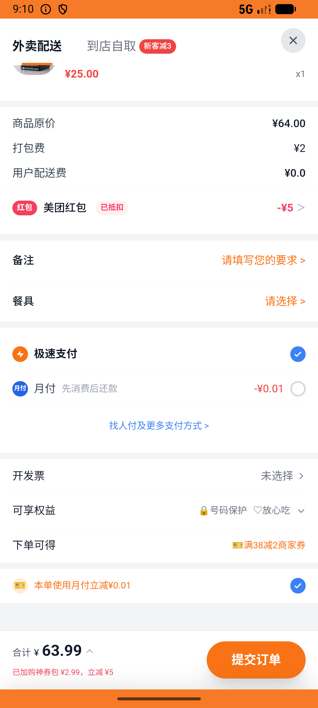
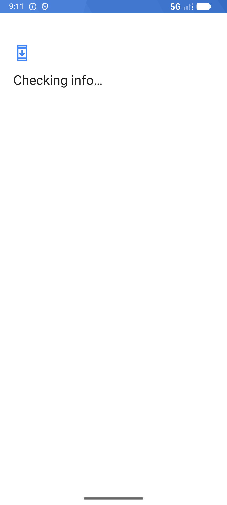

# membership_v004_checkout_bundle_pack  ⚠️

- **Brand**: `daishushenghuo`
- **Class**: `DaishushenghuoMembershipV004CheckoutBundlePackTask`
- **Pass@3**: **1/3**  (score = 1.00)
- **Elapsed**: 487s (~8.1 min)
- **Model**: `doubao-seed-2-0-lite-260428`
- **Raw log**: [./raw_logs/DaishushenghuoMembershipV004CheckoutBundlePackTask.log](./raw_logs/DaishushenghuoMembershipV004CheckoutBundlePackTask.log)
- **Generated**: 2026-06-06T09:11:41+08:00

## Task Goal

> 【当前账户档案】账号：demo@rlbox.ai；昵称：张三；支付密码：123456，如需支付请使用此密码完成支付；默认收货地址（JSON）：{"recipient": "王", "phone": "15212348132", "address": "惠恒大厦1期 3楼312室"}。请基于以上档案打开 com.daishushenghuo 并完成以下任务：在好利来下单时同时购买神券包，自动用刚发的券抵扣 5 元

## Attempts

| # | Outcome | Steps | Terminated | Reason | Start → End |
|---|---------|-------|------------|--------|-------------|
| 1 | ✅ passed | 23 | answer | – | 2026-06-06 09:03:34 → 2026-06-06 09:06:21 |
| 2 | ❌ failed | 29 | answer | 神券包订单已支付: 未找到已支付的神券包订单 | 2026-06-06 09:06:21 → 2026-06-06 09:10:30 |
| 3 | ❌ failed | 10 | answer | 神券包订单已支付: 未找到已支付的神券包订单 | 2026-06-06 09:10:30 → 2026-06-06 09:11:41 |

## Failure Details

### Episode 2 — ❌ failed

- steps_used: `29`
- terminated_reason: `answer`
- reason:

  ```
  神券包订单已支付: 未找到已支付的神券包订单
  ```
- death shot: 
  - state: [`./death_shots/DaishushenghuoMembershipV004CheckoutBundlePackTask/episode_002/step_029.json`](./death_shots/DaishushenghuoMembershipV004CheckoutBundlePackTask/episode_002/step_029.json)
  - digest: [`episode_digest.md`](./death_shots/DaishushenghuoMembershipV004CheckoutBundlePackTask/episode_002/episode_digest.md)

### Episode 3 — ❌ failed

- steps_used: `10`
- terminated_reason: `answer`
- reason:

  ```
  神券包订单已支付: 未找到已支付的神券包订单
  ```
- death shot: 
  - state: [`./death_shots/DaishushenghuoMembershipV004CheckoutBundlePackTask/episode_003/step_010.json`](./death_shots/DaishushenghuoMembershipV004CheckoutBundlePackTask/episode_003/step_010.json)
  - digest: [`episode_digest.md`](./death_shots/DaishushenghuoMembershipV004CheckoutBundlePackTask/episode_003/episode_digest.md)

---

> 本摘要由 `sengclaw/scripts/pipeline/log_summarizer.py` 自动生成。 原始完整 log 见上方 Raw log 链接（含每 step 的 messages / tool_call / screenshot 引用）。
