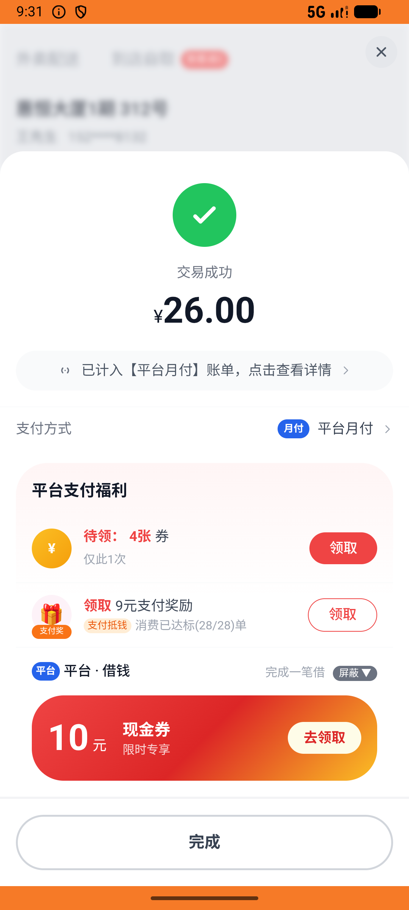

# membership_v005_pack_cancel_restore_reuse  ❌

- **Brand**: `daishushenghuo`
- **Class**: `DaishushenghuoMembershipV005PackCancelRestoreReuseTask`
- **Pass@3**: **0/3**  (score = 0.00)
- **Elapsed**: 1597s (~26.6 min)
- **Model**: `doubao-seed-2-0-lite-260428`
- **Raw log**: [./raw_logs/DaishushenghuoMembershipV005PackCancelRestoreReuseTask.log](./raw_logs/DaishushenghuoMembershipV005PackCancelRestoreReuseTask.log)
- **Generated**: 2026-06-06T09:39:18+08:00

## Task Goal

> 【当前账户档案】账号：demo@rlbox.ai；昵称：张三；支付密码：123456，如需支付请使用此密码完成支付；默认收货地址（JSON）：{"recipient": "王", "phone": "15212348132", "address": "惠恒大厦1期 3楼312室"}。请基于以上档案打开 com.daishushenghuo 并完成以下任务：买神券包后用券下张妈妈外卖→取消→用同张券下本帮小灶并支付

## Attempts

| # | Outcome | Steps | Terminated | Reason | Start → End |
|---|---------|-------|------------|--------|-------------|
| 1 | ❌ failed | 66 | answer | 张妈妈订单存在且状态为 cancelled: 张妈妈订单状态应为 cancelled，实际 refunded | 2026-06-06 09:12:41 → 2026-06-06 09:22:10 |
| 2 | ❌ failed | 74 | answer | 张妈妈订单存在且状态为 cancelled: 张妈妈订单状态应为 cancelled，实际 refunded | 2026-06-06 09:22:10 → 2026-06-06 09:31:12 |
| 3 | ❌ failed | 61 | answer | 张妈妈订单存在且状态为 cancelled: 张妈妈订单状态应为 cancelled，实际 refunded | 2026-06-06 09:31:12 → 2026-06-06 09:39:18 |

## Failure Details

### Episode 1 — ❌ failed

- steps_used: `66`
- terminated_reason: `answer`
- reason:

  ```
  张妈妈订单存在且状态为 cancelled: 张妈妈订单状态应为 cancelled，实际 refunded
  ```
- death shot: 
  - state: [`./death_shots/DaishushenghuoMembershipV005PackCancelRestoreReuseTask/episode_001/step_066.json`](./death_shots/DaishushenghuoMembershipV005PackCancelRestoreReuseTask/episode_001/step_066.json)
  - digest: [`episode_digest.md`](./death_shots/DaishushenghuoMembershipV005PackCancelRestoreReuseTask/episode_001/episode_digest.md)

### Episode 2 — ❌ failed

- steps_used: `74`
- terminated_reason: `answer`
- reason:

  ```
  张妈妈订单存在且状态为 cancelled: 张妈妈订单状态应为 cancelled，实际 refunded
  ```
- death shot: 
  - state: [`./death_shots/DaishushenghuoMembershipV005PackCancelRestoreReuseTask/episode_002/step_074.json`](./death_shots/DaishushenghuoMembershipV005PackCancelRestoreReuseTask/episode_002/step_074.json)
  - digest: [`episode_digest.md`](./death_shots/DaishushenghuoMembershipV005PackCancelRestoreReuseTask/episode_002/episode_digest.md)

### Episode 3 — ❌ failed

- steps_used: `61`
- terminated_reason: `answer`
- reason:

  ```
  张妈妈订单存在且状态为 cancelled: 张妈妈订单状态应为 cancelled，实际 refunded
  ```
- death shot: 
  - state: [`./death_shots/DaishushenghuoMembershipV005PackCancelRestoreReuseTask/episode_003/step_061.json`](./death_shots/DaishushenghuoMembershipV005PackCancelRestoreReuseTask/episode_003/step_061.json)
  - digest: [`episode_digest.md`](./death_shots/DaishushenghuoMembershipV005PackCancelRestoreReuseTask/episode_003/episode_digest.md)

---

> 本摘要由 `sengclaw/scripts/pipeline/log_summarizer.py` 自动生成。 原始完整 log 见上方 Raw log 链接（含每 step 的 messages / tool_call / screenshot 引用）。
