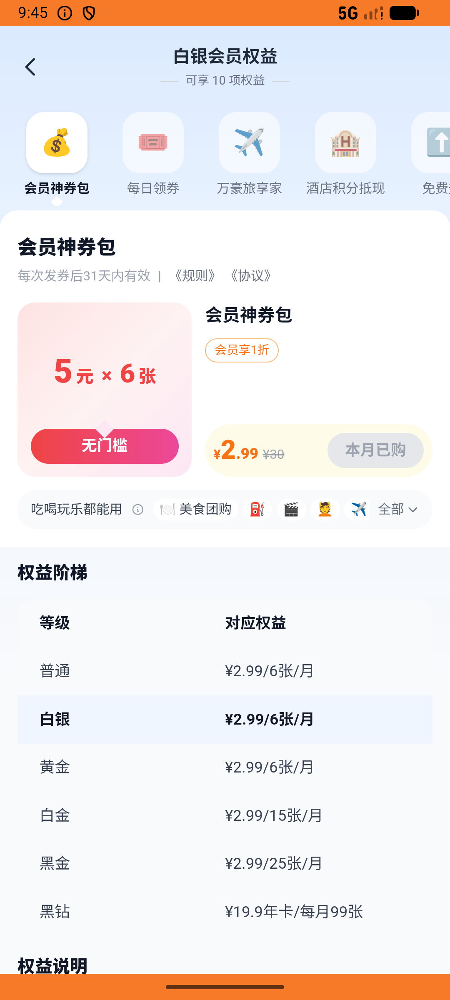

# membership_v006_pack_refund_food_order  ⚠️

- **Brand**: `daishushenghuo`
- **Class**: `DaishushenghuoMembershipV006PackRefundFoodOrderTask`
- **Pass@3**: **2/3**  (score = 1.00)
- **Elapsed**: 1006s (~16.8 min)
- **Model**: `doubao-seed-2-0-lite-260428`
- **Raw log**: [./raw_logs/DaishushenghuoMembershipV006PackRefundFoodOrderTask.log](./raw_logs/DaishushenghuoMembershipV006PackRefundFoodOrderTask.log)
- **Generated**: 2026-06-06T09:57:06+08:00

## Task Goal

> 【当前账户档案】账号：demo@rlbox.ai；昵称：张三；支付密码：123456，如需支付请使用此密码完成支付；默认收货地址（JSON）：{"recipient": "王", "phone": "15212348132", "address": "惠恒大厦1期 3楼312室"}。请基于以上档案打开 com.daishushenghuo 并完成以下任务：买神券包后用券下永记隆江外卖→退款，6 张券应全部恢复可用

## Attempts

| # | Outcome | Steps | Terminated | Reason | Start → End |
|---|---------|-------|------------|--------|-------------|
| 1 | ❌ failed | 40 | answer | 退款订单关联 user_coupon_id（还原前用过的券）: 退款订单应保留 user_coupon_id（用于追溯还原前使用的券）; 该 user_coupon 状态已还原为 unused: expected: not nil      got: nil | 2026-06-06 09:40:20 → 2026-06-06 09:45:11 |
| 2 | ✅ passed | 42 | answer | – | 2026-06-06 09:45:11 → 2026-06-06 09:50:34 |
| 3 | ✅ passed | 51 | answer | – | 2026-06-06 09:50:34 → 2026-06-06 09:57:06 |

## Failure Details

### Episode 1 — ❌ failed

- steps_used: `40`
- terminated_reason: `answer`
- reason:

  ```
  退款订单关联 user_coupon_id（还原前用过的券）: 退款订单应保留 user_coupon_id（用于追溯还原前使用的券）; 该 user_coupon 状态已还原为 unused: expected: not nil
       got: nil
  ```
- death shot: 
  - state: [`./death_shots/DaishushenghuoMembershipV006PackRefundFoodOrderTask/episode_001/step_040.json`](./death_shots/DaishushenghuoMembershipV006PackRefundFoodOrderTask/episode_001/step_040.json)
  - digest: [`episode_digest.md`](./death_shots/DaishushenghuoMembershipV006PackRefundFoodOrderTask/episode_001/episode_digest.md)

---

> 本摘要由 `sengclaw/scripts/pipeline/log_summarizer.py` 自动生成。 原始完整 log 见上方 Raw log 链接（含每 step 的 messages / tool_call / screenshot 引用）。
