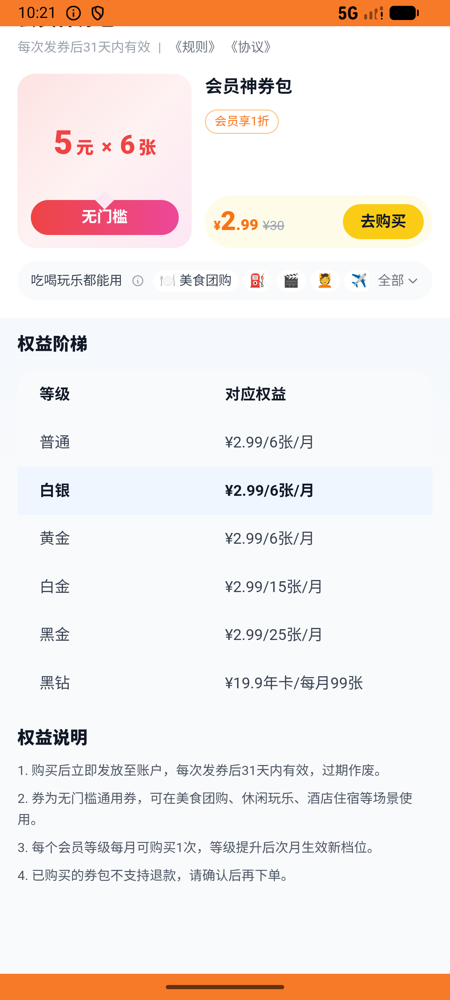
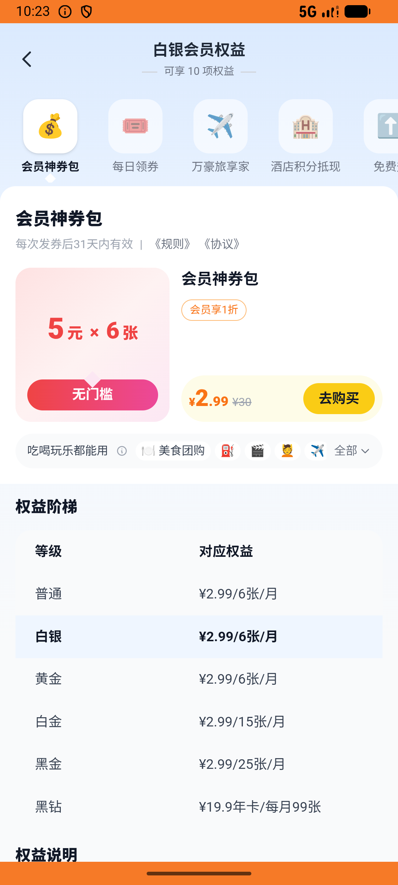

# membership_v008_benefit_detail_then_buy_pack_use  ⚠️

- **Brand**: `daishushenghuo`
- **Class**: `DaishushenghuoMembershipV008BenefitDetailThenBuyPackUseTask`
- **Pass@3**: **1/3**  (score = 1.00)
- **Elapsed**: 710s (~11.8 min)
- **Model**: `doubao-seed-2-0-lite-260428`
- **Raw log**: [./raw_logs/DaishushenghuoMembershipV008BenefitDetailThenBuyPackUseTask.log](./raw_logs/DaishushenghuoMembershipV008BenefitDetailThenBuyPackUseTask.log)
- **Generated**: 2026-06-06T10:31:43+08:00

## Task Goal

> 【当前账户档案】账号：demo@rlbox.ai；昵称：张三；支付密码：123456，如需支付请使用此密码完成支付；默认收货地址（JSON）：{"recipient": "王", "phone": "15212348132", "address": "惠恒大厦1期 3楼312室"}。请基于以上档案打开 com.daishushenghuo 并完成以下任务：先在会员中心点开「神券包」权益详情看一眼介绍，然后买一份白银神券包并支付，接着去喜茶下一单：多肉葡萄 + 阿华田厚茶，用 1 张刚发的神券抵扣，默认地址支付

## Attempts

| # | Outcome | Steps | Terminated | Reason | Start → End |
|---|---------|-------|------------|--------|-------------|
| 1 | ❌ failed | 13 | answer | 神券包订单已支付且发放 6 张优惠券: 未找到已支付的神券包订单; 喜茶订单已支付: 未找到喜茶已支付订单 | 2026-06-06 10:19:53 → 2026-06-06 10:21:35 |
| 2 | ❌ failed | 12 | answer | 神券包订单已支付且发放 6 张优惠券: 未找到已支付的神券包订单; 喜茶订单已支付: 未找到喜茶已支付订单 | 2026-06-06 10:21:35 → 2026-06-06 10:23:11 |
| 3 | ✅ passed | 65 | answer | – | 2026-06-06 10:23:11 → 2026-06-06 10:31:43 |

## Failure Details

### Episode 1 — ❌ failed

- steps_used: `13`
- terminated_reason: `answer`
- reason:

  ```
  神券包订单已支付且发放 6 张优惠券: 未找到已支付的神券包订单; 喜茶订单已支付: 未找到喜茶已支付订单
  ```
- death shot: 
  - state: [`./death_shots/DaishushenghuoMembershipV008BenefitDetailThenBuyPackUseTask/episode_001/step_013.json`](./death_shots/DaishushenghuoMembershipV008BenefitDetailThenBuyPackUseTask/episode_001/step_013.json)
  - digest: [`episode_digest.md`](./death_shots/DaishushenghuoMembershipV008BenefitDetailThenBuyPackUseTask/episode_001/episode_digest.md)

### Episode 2 — ❌ failed

- steps_used: `12`
- terminated_reason: `answer`
- reason:

  ```
  神券包订单已支付且发放 6 张优惠券: 未找到已支付的神券包订单; 喜茶订单已支付: 未找到喜茶已支付订单
  ```
- death shot: 
  - state: [`./death_shots/DaishushenghuoMembershipV008BenefitDetailThenBuyPackUseTask/episode_002/step_012.json`](./death_shots/DaishushenghuoMembershipV008BenefitDetailThenBuyPackUseTask/episode_002/step_012.json)
  - digest: [`episode_digest.md`](./death_shots/DaishushenghuoMembershipV008BenefitDetailThenBuyPackUseTask/episode_002/episode_digest.md)

---

> 本摘要由 `sengclaw/scripts/pipeline/log_summarizer.py` 自动生成。 原始完整 log 见上方 Raw log 链接（含每 step 的 messages / tool_call / screenshot 引用）。
