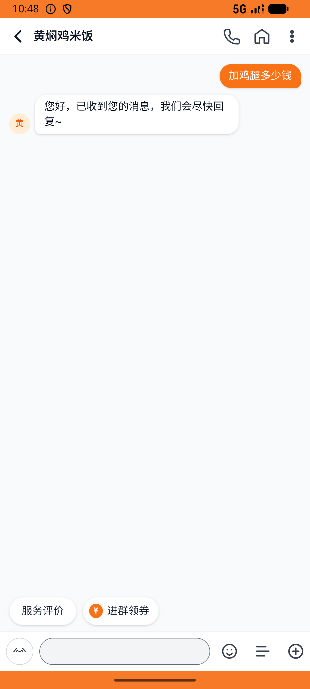
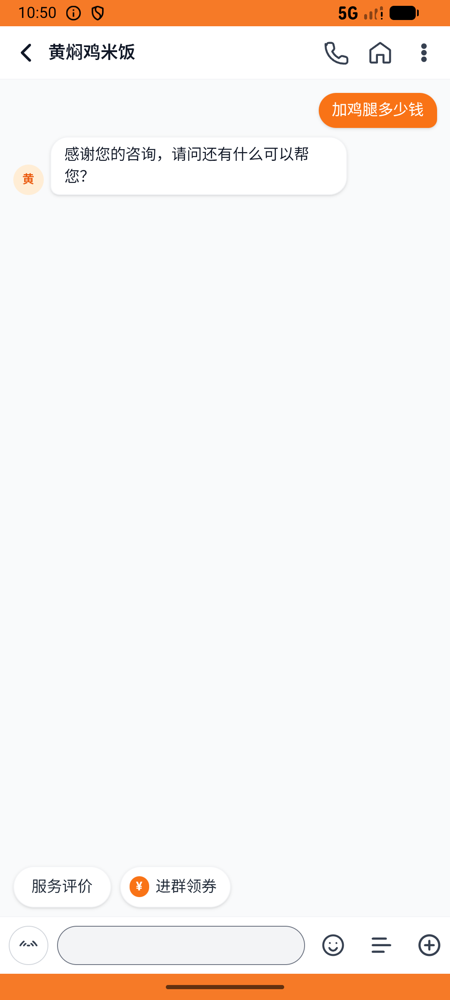

# messages_v004_multi_shop_price_inquiry  ⚠️

- **Brand**: `daishushenghuo`
- **Class**: `DaishushenghuoMessagesV004MultiShopPriceInquiryTask`
- **Pass@3**: **1/3**  (score = 1.00)
- **Elapsed**: 723s (~12.1 min)
- **Model**: `doubao-seed-2-0-lite-260428`
- **Raw log**: [./raw_logs/DaishushenghuoMessagesV004MultiShopPriceInquiryTask.log](./raw_logs/DaishushenghuoMessagesV004MultiShopPriceInquiryTask.log)
- **Generated**: 2026-06-06T10:57:42+08:00

## Task Goal

> 【当前账户档案】账号：demo@rlbox.ai；昵称：张三；支付密码：123456，如需支付请使用此密码完成支付；默认收货地址（JSON）：{"recipient": "王", "phone": "15212348132", "address": "惠恒大厦1期 3楼312室"}。请基于以上档案打开 com.daishushenghuo 并完成以下任务：私信黄焖鸡、永记隆江、老王牛肉面馆比价加鸡腿后，在永记下卤鸡腿饭并支付

## Attempts

| # | Outcome | Steps | Terminated | Reason | Start → End |
|---|---------|-------|------------|--------|-------------|
| 1 | ❌ failed | 21 | answer | 「永记隆江猪脚饭」会话已存在: 未找到 demo@rlbox.ai 与「永记隆江猪脚饭」的会话; 「老王牛肉面馆」会话已存在: 未找到 demo@rlbox.ai 与「老王牛肉面馆」的会话; 「永记隆江猪脚饭」用户消息内容包含「鸡腿」/「加鸡」相关询价: 「永记隆江猪脚饭」... | 2026-06-06 10:45:39 → 2026-06-06 10:48:20 |
| 2 | ❌ failed | 15 | answer | 「永记隆江猪脚饭」会话已存在: 未找到 demo@rlbox.ai 与「永记隆江猪脚饭」的会话; 「老王牛肉面馆」会话已存在: 未找到 demo@rlbox.ai 与「老王牛肉面馆」的会话; 「永记隆江猪脚饭」用户消息内容包含「鸡腿」/「加鸡」相关询价: 「永记隆江猪脚饭」... | 2026-06-06 10:48:20 → 2026-06-06 10:50:15 |
| 3 | ✅ passed | 58 | answer | – | 2026-06-06 10:50:15 → 2026-06-06 10:57:42 |

## Failure Details

### Episode 1 — ❌ failed

- steps_used: `21`
- terminated_reason: `answer`
- reason:

  ```
  「永记隆江猪脚饭」会话已存在: 未找到 demo@rlbox.ai 与「永记隆江猪脚饭」的会话; 「老王牛肉面馆」会话已存在: 未找到 demo@rlbox.ai 与「老王牛肉面馆」的会话; 「永记隆江猪脚饭」用户消息内容包含「鸡腿」/「加鸡」相关询价: 「永记隆江猪脚饭」会话不存在，跳过消息检查; 「老王牛肉面馆」用户消息内容包含「鸡腿」/「加鸡」相关询价: 「老王牛肉面馆」会话不存在，跳过消息检查; 「永记隆江猪脚饭」存在已支付订单: 未找到永记隆江猪脚饭的已支付订单
  ```
- death shot: 
  - state: [`./death_shots/DaishushenghuoMessagesV004MultiShopPriceInquiryTask/episode_001/step_021.json`](./death_shots/DaishushenghuoMessagesV004MultiShopPriceInquiryTask/episode_001/step_021.json)
  - digest: [`episode_digest.md`](./death_shots/DaishushenghuoMessagesV004MultiShopPriceInquiryTask/episode_001/episode_digest.md)

### Episode 2 — ❌ failed

- steps_used: `15`
- terminated_reason: `answer`
- reason:

  ```
  「永记隆江猪脚饭」会话已存在: 未找到 demo@rlbox.ai 与「永记隆江猪脚饭」的会话; 「老王牛肉面馆」会话已存在: 未找到 demo@rlbox.ai 与「老王牛肉面馆」的会话; 「永记隆江猪脚饭」用户消息内容包含「鸡腿」/「加鸡」相关询价: 「永记隆江猪脚饭」会话不存在，跳过消息检查; 「老王牛肉面馆」用户消息内容包含「鸡腿」/「加鸡」相关询价: 「老王牛肉面馆」会话不存在，跳过消息检查; 「永记隆江猪脚饭」存在已支付订单: 未找到永记隆江猪脚饭的已支付订单
  ```
- death shot: 
  - state: [`./death_shots/DaishushenghuoMessagesV004MultiShopPriceInquiryTask/episode_002/step_015.json`](./death_shots/DaishushenghuoMessagesV004MultiShopPriceInquiryTask/episode_002/step_015.json)
  - digest: [`episode_digest.md`](./death_shots/DaishushenghuoMessagesV004MultiShopPriceInquiryTask/episode_002/episode_digest.md)

---

> 本摘要由 `sengclaw/scripts/pipeline/log_summarizer.py` 自动生成。 原始完整 log 见上方 Raw log 链接（含每 step 的 messages / tool_call / screenshot 引用）。
