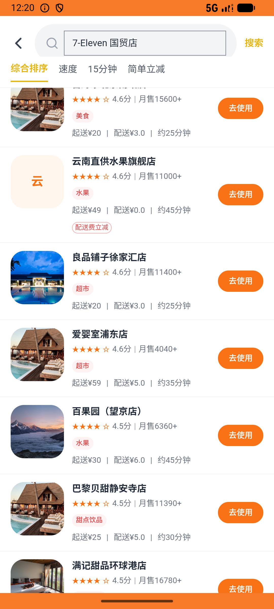

# order_v007_place_order_711  ⚠️

- **Brand**: `daishushenghuo`
- **Class**: `DaishushenghuoOrderV007PlaceOrder711Task`
- **Pass@3**: **2/3**  (score = 1.00)
- **Elapsed**: 563s (~9.4 min)
- **Model**: `doubao-seed-2-0-lite-260428`
- **Raw log**: [./raw_logs/DaishushenghuoOrderV007PlaceOrder711Task.log](./raw_logs/DaishushenghuoOrderV007PlaceOrder711Task.log)
- **Generated**: 2026-06-06T12:20:17+08:00

## Task Goal

> 【当前账户档案】账号：demo@rlbox.ai；昵称：张三；支付密码：123456，如需支付请使用此密码完成支付；默认收货地址（JSON）：{"recipient": "王", "phone": "15212348132", "address": "惠恒大厦1期 3楼312室"}。请基于以上档案打开 com.daishushenghuo 并完成以下任务：在 7-Eleven 国贸店下单 2 份饭团三文鱼和 1 份可口可乐，使用默认地址，待支付

## Attempts

| # | Outcome | Steps | Terminated | Reason | Start → End |
|---|---------|-------|------------|--------|-------------|
| 1 | ✅ passed | 35 | answer | – | 2026-06-06 12:10:54 → 2026-06-06 12:15:21 |
| 2 | ✅ passed | 33 | answer | – | 2026-06-06 12:15:21 → 2026-06-06 12:19:08 |
| 3 | ❌ failed | 9 | answer | 订单已创建（店铺=7-Eleven（国贸店））: 未找到用户 demo@rlbox.ai 在店铺「7-Eleven（国贸店）」的订单 | 2026-06-06 12:19:08 → 2026-06-06 12:20:17 |

## Failure Details

### Episode 3 — ❌ failed

- steps_used: `9`
- terminated_reason: `answer`
- reason:

  ```
  订单已创建（店铺=7-Eleven（国贸店））: 未找到用户 demo@rlbox.ai 在店铺「7-Eleven（国贸店）」的订单
  ```
- death shot: 
  - state: [`./death_shots/DaishushenghuoOrderV007PlaceOrder711Task/episode_003/step_009.json`](./death_shots/DaishushenghuoOrderV007PlaceOrder711Task/episode_003/step_009.json)
  - digest: [`episode_digest.md`](./death_shots/DaishushenghuoOrderV007PlaceOrder711Task/episode_003/episode_digest.md)

---

> 本摘要由 `sengclaw/scripts/pipeline/log_summarizer.py` 自动生成。 原始完整 log 见上方 Raw log 链接（含每 step 的 messages / tool_call / screenshot 引用）。
