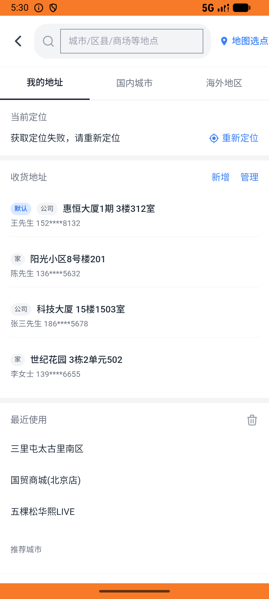

# xxsm_v029_place_order_address_fields_consistent  ⚠️

- **Brand**: `daishushenghuo`
- **Class**: `DaishushenghuoXxsmV029PlaceOrderAddressFieldsConsistentTask`
- **Pass@3**: **2/3**  (score = 1.00)
- **Elapsed**: 10957s (~182.6 min)
- **Model**: `doubao-seed-2-0-lite-260428`
- **Raw log**: [./raw_logs/DaishushenghuoXxsmV029PlaceOrderAddressFieldsConsistentTask.log](./raw_logs/DaishushenghuoXxsmV029PlaceOrderAddressFieldsConsistentTask.log)
- **Generated**: 2026-06-06T20:12:27+08:00

## Task Goal

> 【当前账户档案】账号：demo@rlbox.ai；昵称：张三；支付密码：123456，如需支付请使用此密码完成支付；默认收货地址（JSON）：{"recipient": "王", "phone": "15212348132", "address": "惠恒大厦1期 3楼312室"}。请基于以上档案打开 com.daishushenghuo 并完成以下任务：将收货地址切换为「世纪花园」（收货人：李），在小象超市下单 1 份小象精酿鲜啤，下单后不要支付

## Attempts

| # | Outcome | Steps | Terminated | Reason | Start → End |
|---|---------|-------|------------|--------|-------------|
| 1 | ❌ failed | 3 | unknown | 订单已创建（店铺=小象超市）: 未找到用户 demo@rlbox.ai 在店铺「小象超市」的订单（data_version：5f8a1301ad8d145c） | 2026-06-06 17:09:50 → 2026-06-06 18:55:11 |
| 2 | ✅ passed | 13 | answer | – | 2026-06-06 18:55:11 → 2026-06-06 20:10:19 |
| 3 | ✅ passed | 15 | answer | – | 2026-06-06 20:10:19 → 2026-06-06 20:12:27 |

## Failure Details

### Episode 1 — ❌ failed

- steps_used: `3`
- terminated_reason: `unknown`
- reason:

  ```
  订单已创建（店铺=小象超市）: 未找到用户 demo@rlbox.ai 在店铺「小象超市」的订单（data_version：5f8a1301ad8d145c）
  ```
- death shot: 
  - state: [`./death_shots/DaishushenghuoXxsmV029PlaceOrderAddressFieldsConsistentTask/episode_001/step_002.json`](./death_shots/DaishushenghuoXxsmV029PlaceOrderAddressFieldsConsistentTask/episode_001/step_002.json)
  - digest: [`episode_digest.md`](./death_shots/DaishushenghuoXxsmV029PlaceOrderAddressFieldsConsistentTask/episode_001/episode_digest.md)

---

> 本摘要由 `sengclaw/scripts/pipeline/log_summarizer.py` 自动生成。 原始完整 log 见上方 Raw log 链接（含每 step 的 messages / tool_call / screenshot 引用）。
