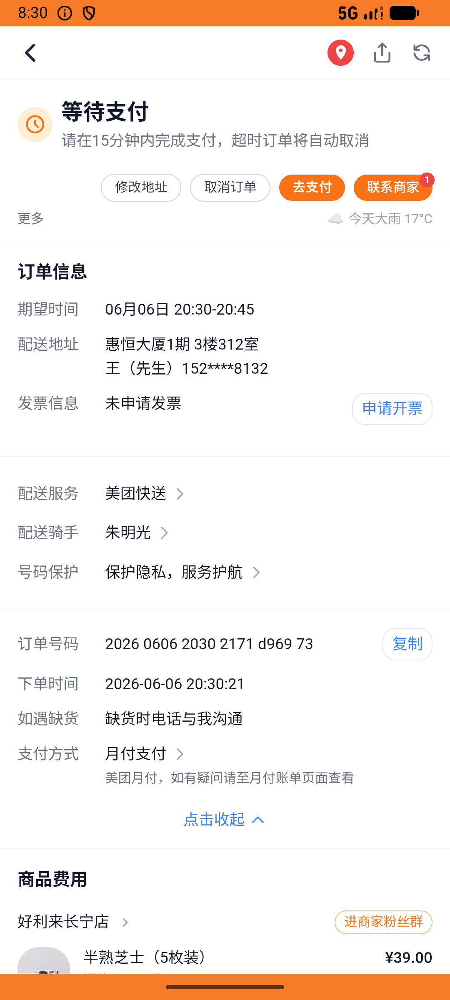
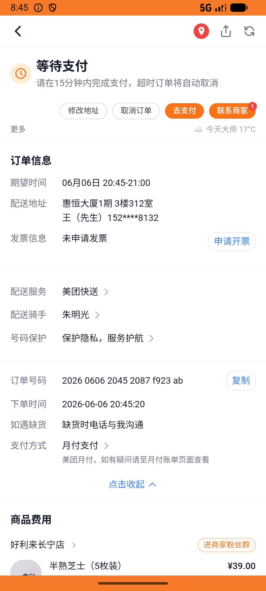

# xxsm_v039_afternoon_tea_checkout  ❌

- **Brand**: `daishushenghuo`
- **Class**: `DaishushenghuoXxsmV039AfternoonTeaCheckoutTask`
- **Pass@3**: **0/3**  (score = 0.00)
- **Elapsed**: 1262s (~21.0 min)
- **Model**: `doubao-seed-2-0-lite-260428`
- **Raw log**: [./raw_logs/DaishushenghuoXxsmV039AfternoonTeaCheckoutTask.log](./raw_logs/DaishushenghuoXxsmV039AfternoonTeaCheckoutTask.log)
- **Generated**: 2026-06-06T20:45:39+08:00

## Task Goal

> 【当前账户档案】账号：demo@rlbox.ai；昵称：张三；支付密码：123456，如需支付请使用此密码完成支付；默认收货地址（JSON）：{"recipient": "王", "phone": "15212348132", "address": "惠恒大厦1期 3楼312室"}。请基于以上档案打开 com.daishushenghuo 并完成以下任务：下午茶购物车一起下单：沪上阿姨杨枝甘露 + 好利来半熟芝士（一次结算 2 单，仅下单不支付）

## Attempts

| # | Outcome | Steps | Terminated | Reason | Start → End |
|---|---------|-------|------------|--------|-------------|
| 1 | ❌ failed | 49 | answer | 好利来订单金额 = ¥40.00: 预期 ¥40.00，实际 ¥66.0 | 2026-06-06 20:24:38 → 2026-06-06 20:30:38 |
| 2 | ❌ failed | 48 | answer | 好利来订单金额 = ¥40.00: 预期 ¥40.00，实际 ¥66.0 | 2026-06-06 20:30:38 → 2026-06-06 20:37:07 |
| 3 | ❌ failed | 65 | answer | 好利来订单金额 = ¥40.00: 预期 ¥40.00，实际 ¥66.0 | 2026-06-06 20:37:07 → 2026-06-06 20:45:39 |

## Failure Details

### Episode 1 — ❌ failed

- steps_used: `49`
- terminated_reason: `answer`
- reason:

  ```
  好利来订单金额 = ¥40.00: 预期 ¥40.00，实际 ¥66.0
  ```
- death shot: 
  - state: [`./death_shots/DaishushenghuoXxsmV039AfternoonTeaCheckoutTask/episode_001/step_049.json`](./death_shots/DaishushenghuoXxsmV039AfternoonTeaCheckoutTask/episode_001/step_049.json)
  - digest: [`episode_digest.md`](./death_shots/DaishushenghuoXxsmV039AfternoonTeaCheckoutTask/episode_001/episode_digest.md)

### Episode 2 — ❌ failed

- steps_used: `48`
- terminated_reason: `answer`
- reason:

  ```
  好利来订单金额 = ¥40.00: 预期 ¥40.00，实际 ¥66.0
  ```
- death shot: 
  - state: [`./death_shots/DaishushenghuoXxsmV039AfternoonTeaCheckoutTask/episode_002/step_048.json`](./death_shots/DaishushenghuoXxsmV039AfternoonTeaCheckoutTask/episode_002/step_048.json)
  - digest: [`episode_digest.md`](./death_shots/DaishushenghuoXxsmV039AfternoonTeaCheckoutTask/episode_002/episode_digest.md)

### Episode 3 — ❌ failed

- steps_used: `65`
- terminated_reason: `answer`
- reason:

  ```
  好利来订单金额 = ¥40.00: 预期 ¥40.00，实际 ¥66.0
  ```
- death shot: 
  - state: [`./death_shots/DaishushenghuoXxsmV039AfternoonTeaCheckoutTask/episode_003/step_065.json`](./death_shots/DaishushenghuoXxsmV039AfternoonTeaCheckoutTask/episode_003/step_065.json)
  - digest: [`episode_digest.md`](./death_shots/DaishushenghuoXxsmV039AfternoonTeaCheckoutTask/episode_003/episode_digest.md)

---

> 本摘要由 `sengclaw/scripts/pipeline/log_summarizer.py` 自动生成。 原始完整 log 见上方 Raw log 链接（含每 step 的 messages / tool_call / screenshot 引用）。
