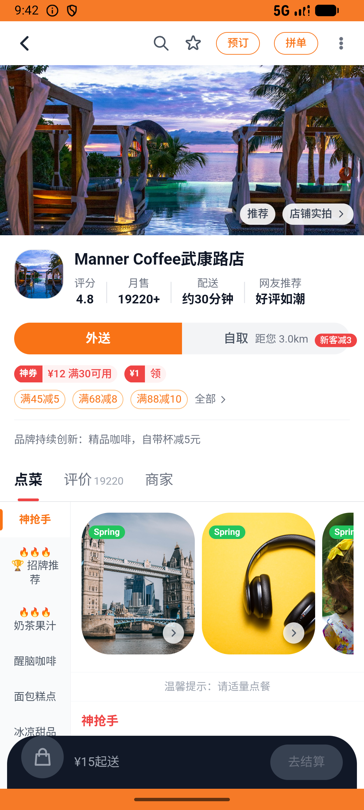
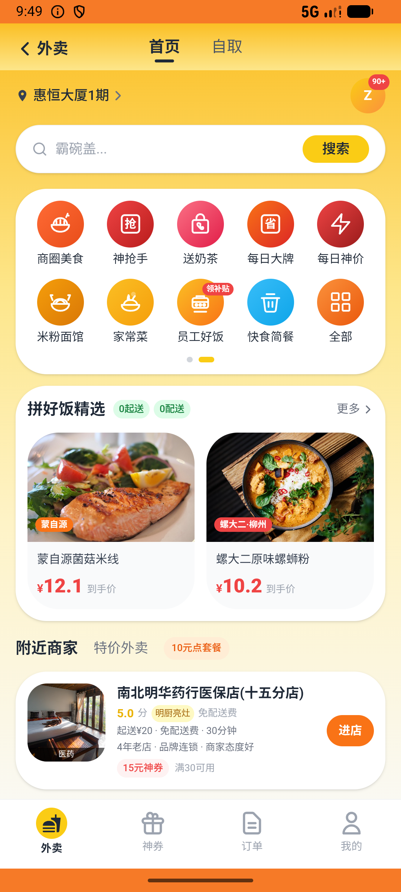

# flow_v015_recent_browse_manner_coffee  ❌

- **Brand**: `daishushenghuo`
- **Class**: `DaishushenghuoFlowV015RecentBrowseMannerCoffeeTask`
- **Pass@3**: **0/3**  (score = 0.00)
- **Elapsed**: 587s (~9.8 min)
- **Model**: `doubao-seed-2-0-lite-260428`
- **Raw log**: [./raw_logs/DaishushenghuoFlowV015RecentBrowseMannerCoffeeTask.log](./raw_logs/DaishushenghuoFlowV015RecentBrowseMannerCoffeeTask.log)
- **Generated**: 2026-06-06T23:26:48+08:00

## Task Goal

> 【当前账户档案】账号：demo@rlbox.ai；昵称：张三；支付密码：123456，如需支付请使用此密码完成支付；默认收货地址（JSON）：{"recipient": "王", "phone": "15212348132", "address": "惠恒大厦1期 3楼312室"}。请基于以上档案打开 com.daishushenghuo 并完成以下任务：先依次进 Manner Coffee 武康路店、瑞幸咖啡（国贸店）、喜茶 三家店主页比一比，再去「我的→浏览记录」回看一眼，选觉得最划算的 Manner 收藏起来，然后下 2 张「精品手冲咖啡 单杯券」¥19 的团购券并支付（共 ¥38）

## Attempts

| # | Outcome | Steps | Terminated | Reason | Start → End |
|---|---------|-------|------------|--------|-------------|
| 1 | ❌ failed | 8 | answer | 浏览历史包含 瑞幸咖啡（国贸店）: 浏览历史未记录 瑞幸咖啡（国贸店）; 浏览历史包含 喜茶: 浏览历史未记录 喜茶; Manner 已被收藏: 未收藏 Manner Coffee 武康路店; Manner 团购订单已支付（手冲咖啡单杯券）: 未找到 Manner 手冲咖啡... | 2026-06-06 21:39:47 → 2026-06-06 21:40:37 |
| 2 | ❌ failed | 14 | answer | 浏览历史包含 瑞幸咖啡（国贸店）: 浏览历史未记录 瑞幸咖啡（国贸店）; 浏览历史包含 喜茶: 浏览历史未记录 喜茶; Manner 已被收藏: 未收藏 Manner Coffee 武康路店; Manner 团购订单已支付（手冲咖啡单杯券）: 未找到 Manner 手冲咖啡... | 2026-06-06 21:40:37 → 2026-06-06 21:42:34 |
| 3 | ❌ failed | 58 | answer | 浏览历史包含 瑞幸咖啡（国贸店）: 浏览历史未记录 瑞幸咖啡（国贸店）; Manner 团购订单已支付（手冲咖啡单杯券）: 未找到 Manner 手冲咖啡券已支付团购订单; 团购订单 quantity = 2: 预期 quantity=2，实际 ; 团购订单 actual_... | 2026-06-06 21:42:34 → 2026-06-06 21:49:34 |

## Failure Details

### Episode 1 — ❌ failed

- steps_used: `8`
- terminated_reason: `answer`
- reason:

  ```
  浏览历史包含 瑞幸咖啡（国贸店）: 浏览历史未记录 瑞幸咖啡（国贸店）; 浏览历史包含 喜茶: 浏览历史未记录 喜茶; Manner 已被收藏: 未收藏 Manner Coffee 武康路店; Manner 团购订单已支付（手冲咖啡单杯券）: 未找到 Manner 手冲咖啡券已支付团购订单; 团购订单 quantity = 2: 预期 quantity=2，实际 ; 团购订单 actual_amount = ¥38.00（19 × 2）: 预期 ¥38.00，实际 ¥
  ```
- death shot: 
  - state: [`./death_shots/DaishushenghuoFlowV015RecentBrowseMannerCoffeeTask/episode_001/step_008.json`](./death_shots/DaishushenghuoFlowV015RecentBrowseMannerCoffeeTask/episode_001/step_008.json)
  - digest: [`episode_digest.md`](./death_shots/DaishushenghuoFlowV015RecentBrowseMannerCoffeeTask/episode_001/episode_digest.md)

### Episode 2 — ❌ failed

- steps_used: `14`
- terminated_reason: `answer`
- reason:

  ```
  浏览历史包含 瑞幸咖啡（国贸店）: 浏览历史未记录 瑞幸咖啡（国贸店）; 浏览历史包含 喜茶: 浏览历史未记录 喜茶; Manner 已被收藏: 未收藏 Manner Coffee 武康路店; Manner 团购订单已支付（手冲咖啡单杯券）: 未找到 Manner 手冲咖啡券已支付团购订单; 团购订单 quantity = 2: 预期 quantity=2，实际 ; 团购订单 actual_amount = ¥38.00（19 × 2）: 预期 ¥38.00，实际 ¥
  ```
- death shot: 
  - state: [`./death_shots/DaishushenghuoFlowV015RecentBrowseMannerCoffeeTask/episode_002/step_014.json`](./death_shots/DaishushenghuoFlowV015RecentBrowseMannerCoffeeTask/episode_002/step_014.json)
  - digest: [`episode_digest.md`](./death_shots/DaishushenghuoFlowV015RecentBrowseMannerCoffeeTask/episode_002/episode_digest.md)

### Episode 3 — ❌ failed

- steps_used: `58`
- terminated_reason: `answer`
- reason:

  ```
  浏览历史包含 瑞幸咖啡（国贸店）: 浏览历史未记录 瑞幸咖啡（国贸店）; Manner 团购订单已支付（手冲咖啡单杯券）: 未找到 Manner 手冲咖啡券已支付团购订单; 团购订单 quantity = 2: 预期 quantity=2，实际 ; 团购订单 actual_amount = ¥38.00（19 × 2）: 预期 ¥38.00，实际 ¥
  ```
- death shot: 
  - state: [`./death_shots/DaishushenghuoFlowV015RecentBrowseMannerCoffeeTask/episode_003/step_058.json`](./death_shots/DaishushenghuoFlowV015RecentBrowseMannerCoffeeTask/episode_003/step_058.json)
  - digest: [`episode_digest.md`](./death_shots/DaishushenghuoFlowV015RecentBrowseMannerCoffeeTask/episode_003/episode_digest.md)

---

> 本摘要由 `sengclaw/scripts/pipeline/log_summarizer.py` 自动生成。 原始完整 log 见上方 Raw log 链接（含每 step 的 messages / tool_call / screenshot 引用）。
