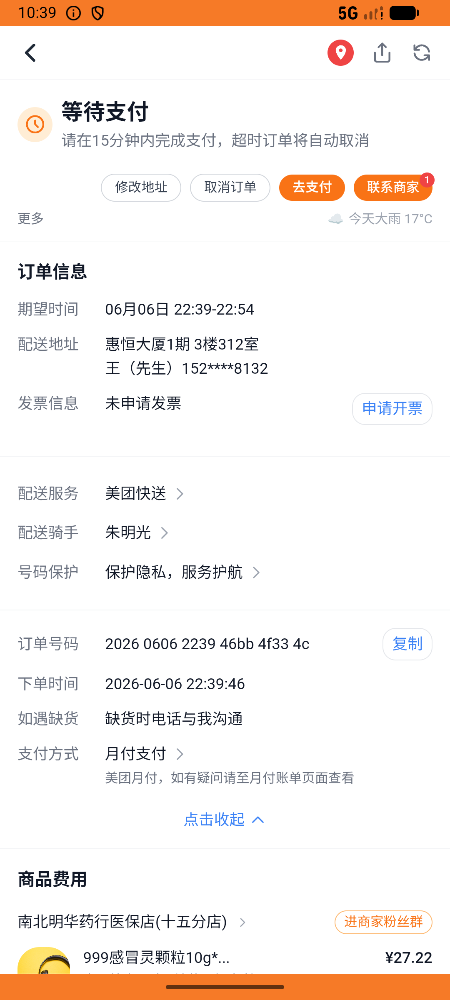

# kanbing_v043_checkout_multi_pharmacies  ⚠️

- **Brand**: `daishushenghuo`
- **Class**: `DaishushenghuoKanbingV043CheckoutMultiPharmaciesTask`
- **Pass@3**: **1/3**  (score = 1.00)
- **Elapsed**: 1017s (~16.9 min)
- **Model**: `doubao-seed-2-0-lite-260428`
- **Raw log**: [./raw_logs/DaishushenghuoKanbingV043CheckoutMultiPharmaciesTask.log](./raw_logs/DaishushenghuoKanbingV043CheckoutMultiPharmaciesTask.log)
- **Generated**: 2026-06-06T23:26:48+08:00

## Task Goal

> 【当前账户档案】账号：demo@rlbox.ai；昵称：张三；支付密码：123456，如需支付请使用此密码完成支付；默认收货地址（JSON）：{"recipient": "王", "phone": "15212348132", "address": "惠恒大厦1期 3楼312室"}。请基于以上档案打开 com.daishushenghuo 并完成以下任务：从看病买药购物车一起下单：南北明华999感冒灵 + 海王星辰复方板蓝根 + 大参林维C银翘片（一次结算 3 单，下单后不要支付）

## Attempts

| # | Outcome | Steps | Terminated | Reason | Start → End |
|---|---------|-------|------------|--------|-------------|
| 1 | ❌ failed | 28 | answer | 南北明华药店订单已创建（含999感冒灵 ×1）: 未找到南北明华订单; 海王星辰药店订单已创建（含复方板蓝根 ×1）: 未找到海王星辰订单; 大参林药店订单已创建（含维C银翘片 ×1）: 未找到大参林订单; 3 笔订单金额正确：南北明华¥14.61 + 海王¥22.44 +... | 2026-06-06 22:23:05 → 2026-06-06 22:26:19 |
| 2 | ✅ passed | 73 | answer | – | 2026-06-06 22:26:19 → 2026-06-06 22:34:51 |
| 3 | ❌ failed | 46 | answer | 南北明华药店订单已创建（含999感冒灵 ×1）: 数量应为 1，实际 2; 海王星辰药店订单已创建（含复方板蓝根 ×1）: 数量应为 1，实际 2; 大参林药店订单已创建（含维C银翘片 ×1）: 数量应为 1，实际 2; 3 笔订单金额正确：南北明华¥14.61 + 海王¥... | 2026-06-06 22:34:51 → 2026-06-06 22:40:02 |

## Failure Details

### Episode 1 — ❌ failed

- steps_used: `28`
- terminated_reason: `answer`
- reason:

  ```
  南北明华药店订单已创建（含999感冒灵 ×1）: 未找到南北明华订单; 海王星辰药店订单已创建（含复方板蓝根 ×1）: 未找到海王星辰订单; 大参林药店订单已创建（含维C银翘片 ×1）: 未找到大参林订单; 3 笔订单金额正确：南北明华¥14.61 + 海王¥22.44 + 大参林¥9.48 = ¥46.53: 南北明华预期 ¥14.61，实际 ¥; 3 家药店购物车都被清空: 南北明华药行医保店(十五分店) 购物车未清空，仍有 1 件商品
  ```
- death shot: 
  - state: [`./death_shots/DaishushenghuoKanbingV043CheckoutMultiPharmaciesTask/episode_001/step_028.json`](./death_shots/DaishushenghuoKanbingV043CheckoutMultiPharmaciesTask/episode_001/step_028.json)
  - digest: [`episode_digest.md`](./death_shots/DaishushenghuoKanbingV043CheckoutMultiPharmaciesTask/episode_001/episode_digest.md)

### Episode 3 — ❌ failed

- steps_used: `46`
- terminated_reason: `answer`
- reason:

  ```
  南北明华药店订单已创建（含999感冒灵 ×1）: 数量应为 1，实际 2; 海王星辰药店订单已创建（含复方板蓝根 ×1）: 数量应为 1，实际 2; 大参林药店订单已创建（含维C银翘片 ×1）: 数量应为 1，实际 2; 3 笔订单金额正确：南北明华¥14.61 + 海王¥22.44 + 大参林¥9.48 = ¥46.53: 南北明华预期 ¥14.61，实际 ¥29.22
  ```
- death shot: 
  - state: [`./death_shots/DaishushenghuoKanbingV043CheckoutMultiPharmaciesTask/episode_003/step_046.json`](./death_shots/DaishushenghuoKanbingV043CheckoutMultiPharmaciesTask/episode_003/step_046.json)
  - digest: [`episode_digest.md`](./death_shots/DaishushenghuoKanbingV043CheckoutMultiPharmaciesTask/episode_003/episode_digest.md)

---

> 本摘要由 `sengclaw/scripts/pipeline/log_summarizer.py` 自动生成。 原始完整 log 见上方 Raw log 链接（含每 step 的 messages / tool_call / screenshot 引用）。
