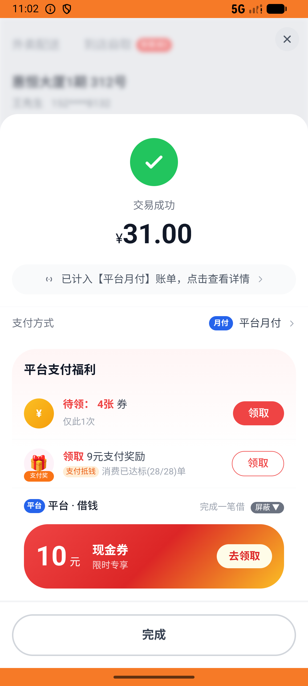

# membership_v005_pack_cancel_restore_reuse  ⚠️

- **Brand**: `daishushenghuo`
- **Class**: `DaishushenghuoMembershipV005PackCancelRestoreReuseTask`
- **Pass@3**: **2/3**  (score = 1.00)
- **Elapsed**: 1304s (~21.7 min)
- **Model**: `doubao-seed-2-0-lite-260428`
- **Raw log**: [./raw_logs/DaishushenghuoMembershipV005PackCancelRestoreReuseTask.log](./raw_logs/DaishushenghuoMembershipV005PackCancelRestoreReuseTask.log)
- **Generated**: 2026-06-06T23:26:48+08:00

## Task Goal

> 【当前账户档案】账号：demo@rlbox.ai；昵称：张三；支付密码：123456，如需支付请使用此密码完成支付；默认收货地址（JSON）：{"recipient": "王", "phone": "15212348132", "address": "惠恒大厦1期 3楼312室"}。请基于以上档案打开 com.daishushenghuo 并完成以下任务：买神券包后用券下张妈妈外卖→取消→用同张券下本帮小灶并支付

## Attempts

| # | Outcome | Steps | Terminated | Reason | Start → End |
|---|---------|-------|------------|--------|-------------|
| 1 | ✅ passed | 70 | answer | – | 2026-06-06 22:48:07 → 2026-06-06 22:56:26 |
| 2 | ❌ failed | 49 | answer | 张妈妈订单存在且已终止（cancelled 或 refunded）: 未找到张妈妈的订单 | 2026-06-06 22:56:26 → 2026-06-06 23:02:19 |
| 3 | ✅ passed | 61 | answer | – | 2026-06-06 23:02:19 → 2026-06-06 23:09:52 |

## Failure Details

### Episode 2 — ❌ failed

- steps_used: `49`
- terminated_reason: `answer`
- reason:

  ```
  张妈妈订单存在且已终止（cancelled 或 refunded）: 未找到张妈妈的订单
  ```
- death shot: 
  - state: [`./death_shots/DaishushenghuoMembershipV005PackCancelRestoreReuseTask/episode_002/step_049.json`](./death_shots/DaishushenghuoMembershipV005PackCancelRestoreReuseTask/episode_002/step_049.json)
  - digest: [`episode_digest.md`](./death_shots/DaishushenghuoMembershipV005PackCancelRestoreReuseTask/episode_002/episode_digest.md)

---

> 本摘要由 `sengclaw/scripts/pipeline/log_summarizer.py` 自动生成。 原始完整 log 见上方 Raw log 链接（含每 step 的 messages / tool_call / screenshot 引用）。
