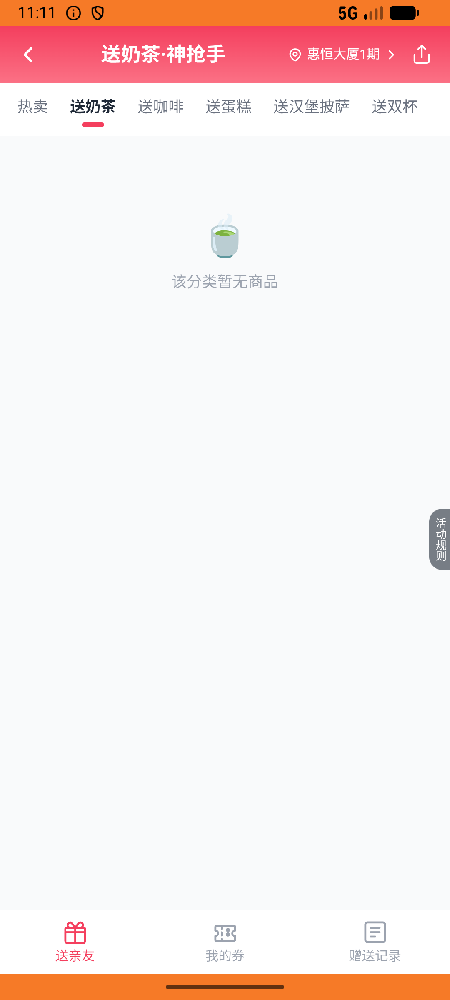
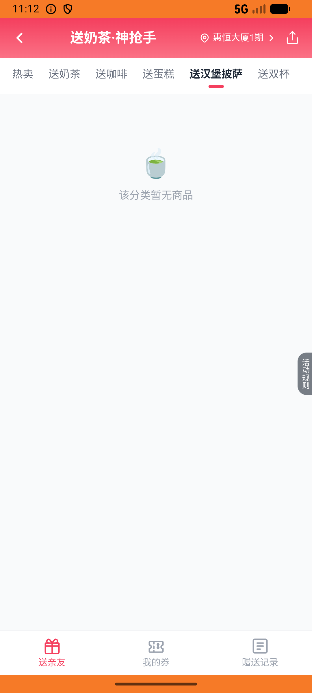
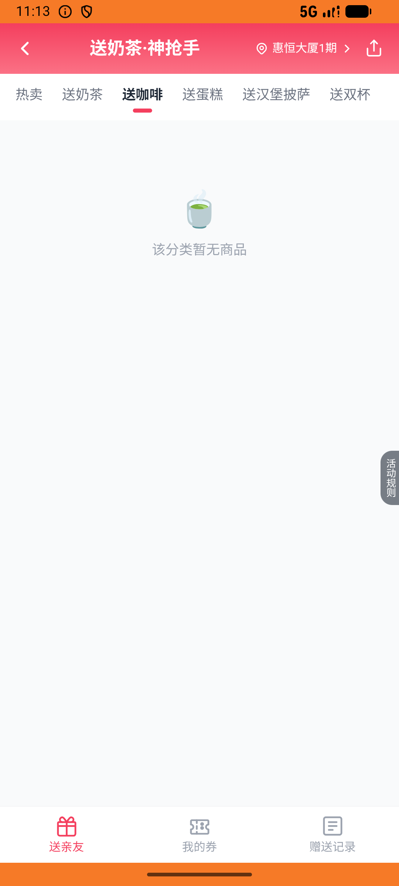

# order_v033_songnaicha_starbucks_latte  ❌

- **Brand**: `daishushenghuo`
- **Class**: `DaishushenghuoOrderV033SongnaichaStarbucksLatteTask`
- **Pass@3**: **0/3**  (score = 0.00)
- **Elapsed**: 153s (~2.5 min)
- **Model**: `doubao-seed-2-0-lite-260428`
- **Raw log**: [./raw_logs/DaishushenghuoOrderV033SongnaichaStarbucksLatteTask.log](./raw_logs/DaishushenghuoOrderV033SongnaichaStarbucksLatteTask.log)
- **Generated**: 2026-06-06T23:26:48+08:00

## Task Goal

> 【当前账户档案】账号：demo@rlbox.ai；昵称：张三；支付密码：123456，如需支付请使用此密码完成支付；默认收货地址（JSON）：{"recipient": "王", "phone": "15212348132", "address": "惠恒大厦1期 3楼312室"}。请基于以上档案打开 com.daishushenghuo 并完成以下任务：从首页进入「外卖」，把外卖页面的九宫格滑到第二屏，点击「送奶茶」入口，购买1份星巴克焙茶拿铁券并完成支付（支付密码 123456）

## Attempts

| # | Outcome | Steps | Terminated | Reason | Start → End |
|---|---------|-------|------------|--------|-------------|
| 1 | ❌ failed | 7 | answer | GiftOrder 已创建（product_id=1）: 未找到星巴克焙茶拿铁的礼品券订单 | 2026-06-06 23:10:33 → 2026-06-06 23:11:20 |
| 2 | ❌ failed | 9 | answer | GiftOrder 已创建（product_id=1）: 未找到星巴克焙茶拿铁的礼品券订单 | 2026-06-06 23:11:20 → 2026-06-06 23:12:23 |
| 3 | ❌ failed | 7 | answer | GiftOrder 已创建（product_id=1）: 未找到星巴克焙茶拿铁的礼品券订单 | 2026-06-06 23:12:23 → 2026-06-06 23:13:05 |

## Failure Details

### Episode 1 — ❌ failed

- steps_used: `7`
- terminated_reason: `answer`
- reason:

  ```
  GiftOrder 已创建（product_id=1）: 未找到星巴克焙茶拿铁的礼品券订单
  ```
- death shot: 
  - state: [`./death_shots/DaishushenghuoOrderV033SongnaichaStarbucksLatteTask/episode_001/step_007.json`](./death_shots/DaishushenghuoOrderV033SongnaichaStarbucksLatteTask/episode_001/step_007.json)
  - digest: [`episode_digest.md`](./death_shots/DaishushenghuoOrderV033SongnaichaStarbucksLatteTask/episode_001/episode_digest.md)

### Episode 2 — ❌ failed

- steps_used: `9`
- terminated_reason: `answer`
- reason:

  ```
  GiftOrder 已创建（product_id=1）: 未找到星巴克焙茶拿铁的礼品券订单
  ```
- death shot: 
  - state: [`./death_shots/DaishushenghuoOrderV033SongnaichaStarbucksLatteTask/episode_002/step_009.json`](./death_shots/DaishushenghuoOrderV033SongnaichaStarbucksLatteTask/episode_002/step_009.json)
  - digest: [`episode_digest.md`](./death_shots/DaishushenghuoOrderV033SongnaichaStarbucksLatteTask/episode_002/episode_digest.md)

### Episode 3 — ❌ failed

- steps_used: `7`
- terminated_reason: `answer`
- reason:

  ```
  GiftOrder 已创建（product_id=1）: 未找到星巴克焙茶拿铁的礼品券订单
  ```
- death shot: 
  - state: [`./death_shots/DaishushenghuoOrderV033SongnaichaStarbucksLatteTask/episode_003/step_007.json`](./death_shots/DaishushenghuoOrderV033SongnaichaStarbucksLatteTask/episode_003/step_007.json)
  - digest: [`episode_digest.md`](./death_shots/DaishushenghuoOrderV033SongnaichaStarbucksLatteTask/episode_003/episode_digest.md)

---

> 本摘要由 `sengclaw/scripts/pipeline/log_summarizer.py` 自动生成。 原始完整 log 见上方 Raw log 链接（含每 step 的 messages / tool_call / screenshot 引用）。
