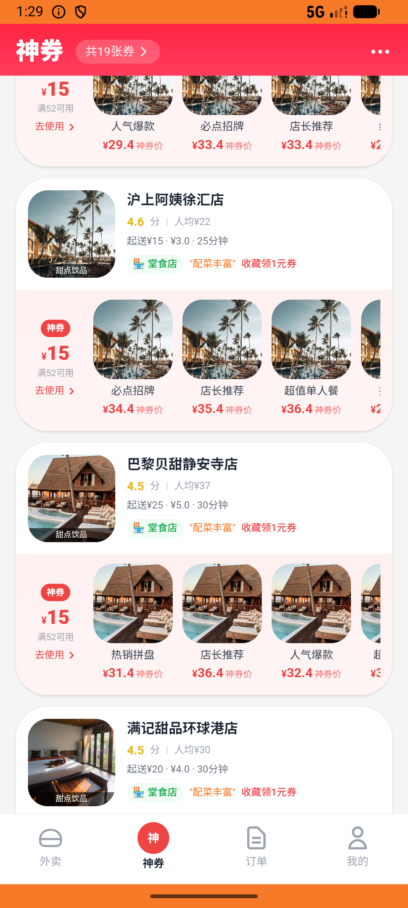

# flow_v005_parallel_orders_two_shops  ⚠️

- **Brand**: `daishushenghuo`
- **Class**: `DaishushenghuoFlowV005ParallelOrdersTwoShopsTask`
- **Pass@3**: **1/3**  (score = 1.00)
- **Elapsed**: 909s (~15.2 min)
- **Model**: `doubao-seed-2-0-lite-260428`
- **Raw log**: [./raw_logs/DaishushenghuoFlowV005ParallelOrdersTwoShopsTask.log](./raw_logs/DaishushenghuoFlowV005ParallelOrdersTwoShopsTask.log)
- **Generated**: 2026-06-07T14:35:23+08:00

## Task Goal

> 【当前账户档案】账号：demo@rlbox.ai；昵称：张三；支付密码：123456，如需支付请使用此密码完成支付；默认收货地址（JSON）：{"recipient": "王", "phone": "15212348132", "address": "惠恒大厦1期 3楼312室"}。请基于以上档案打开 com.daishushenghuo 并完成以下任务：老王牛肉面馆下一份红烧牛肉面先不付，同时在瑞幸国贸店买【经典必喝】生椰拿铁 大杯（9.9 元）团购券并支付

## Attempts

| # | Outcome | Steps | Terminated | Reason | Start → End |
|---|---------|-------|------------|--------|-------------|
| 1 | ❌ failed | 39 | answer | 存在两笔订单（老王 + 瑞幸）: 未找到老王那笔订单 | 2026-06-07 13:19:19 → 2026-06-07 13:24:28 |
| 2 | ❌ failed | 40 | answer | 存在两笔订单（老王 + 瑞幸）: 未找到老王那笔订单 | 2026-06-07 13:24:28 → 2026-06-07 13:29:25 |
| 3 | ✅ passed | 41 | answer | – | 2026-06-07 13:29:25 → 2026-06-07 13:34:27 |

## Failure Details

### Episode 1 — ❌ failed

- steps_used: `39`
- terminated_reason: `answer`
- reason:

  ```
  存在两笔订单（老王 + 瑞幸）: 未找到老王那笔订单
  ```
- death shot: 
  - state: [`./death_shots/DaishushenghuoFlowV005ParallelOrdersTwoShopsTask/episode_001/step_039.json`](./death_shots/DaishushenghuoFlowV005ParallelOrdersTwoShopsTask/episode_001/step_039.json)
  - digest: [`episode_digest.md`](./death_shots/DaishushenghuoFlowV005ParallelOrdersTwoShopsTask/episode_001/episode_digest.md)

### Episode 2 — ❌ failed

- steps_used: `40`
- terminated_reason: `answer`
- reason:

  ```
  存在两笔订单（老王 + 瑞幸）: 未找到老王那笔订单
  ```
- death shot: 
  - state: [`./death_shots/DaishushenghuoFlowV005ParallelOrdersTwoShopsTask/episode_002/step_040.json`](./death_shots/DaishushenghuoFlowV005ParallelOrdersTwoShopsTask/episode_002/step_040.json)
  - digest: [`episode_digest.md`](./death_shots/DaishushenghuoFlowV005ParallelOrdersTwoShopsTask/episode_002/episode_digest.md)

---

> 本摘要由 `sengclaw/scripts/pipeline/log_summarizer.py` 自动生成。 原始完整 log 见上方 Raw log 链接（含每 step 的 messages / tool_call / screenshot 引用）。
