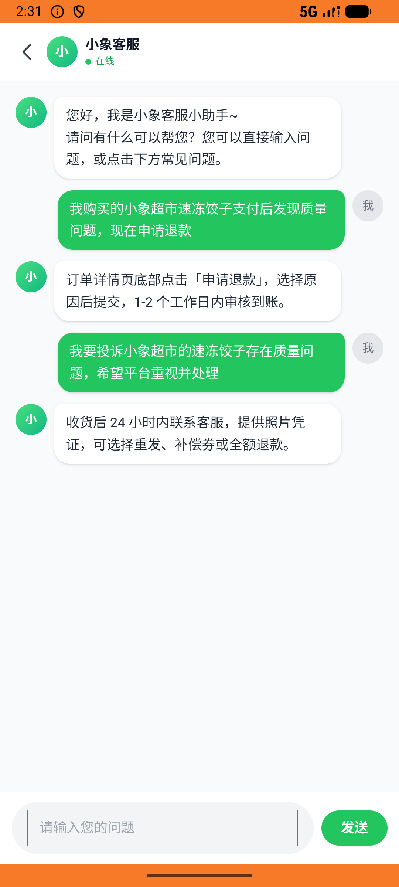

# xxsm_v041_refund_then_complain_chat  ⚠️

- **Brand**: `daishushenghuo`
- **Class**: `DaishushenghuoXxsmV041RefundThenComplainChatTask`
- **Pass@3**: **2/3**  (score = 1.00)
- **Elapsed**: 334s (~5.6 min)
- **Model**: `doubao-seed-2-0-lite-260428`
- **Raw log**: [./raw_logs/DaishushenghuoXxsmV041RefundThenComplainChatTask.log](./raw_logs/DaishushenghuoXxsmV041RefundThenComplainChatTask.log)
- **Generated**: 2026-06-07T14:35:23+08:00

## Task Goal

> 【当前账户档案】账号：demo@rlbox.ai；昵称：张三；支付密码：123456，如需支付请使用此密码完成支付；默认收货地址（JSON）：{"recipient": "王", "phone": "15212348132", "address": "惠恒大厦1期 3楼312室"}。请基于以上档案打开 com.daishushenghuo 并完成以下任务：小象超市速冻饺子支付后发现质量问题，先申请退款，再私信客服投诉

## Attempts

| # | Outcome | Steps | Terminated | Reason | Start → End |
|---|---------|-------|------------|--------|-------------|
| 1 | ❌ failed | 18 | answer | 「速冻饺子 1kg」订单已退款（refunded 或已支付后 cancelled）: 未找到包含速冻饺子且已退款/已取消（曾支付）的订单; 退款订单 paid_at 不为空（曾被支付）: 前置：退款订单未找到 | 2026-06-07 14:29:49 → 2026-06-07 14:31:59 |
| 2 | ✅ passed | 14 | answer | – | 2026-06-07 14:31:59 → 2026-06-07 14:33:45 |
| 3 | ✅ passed | 14 | answer | – | 2026-06-07 14:33:45 → 2026-06-07 14:35:23 |

## Failure Details

### Episode 1 — ❌ failed

- steps_used: `18`
- terminated_reason: `answer`
- reason:

  ```
  「速冻饺子 1kg」订单已退款（refunded 或已支付后 cancelled）: 未找到包含速冻饺子且已退款/已取消（曾支付）的订单; 退款订单 paid_at 不为空（曾被支付）: 前置：退款订单未找到
  ```
- death shot: 
  - state: [`./death_shots/DaishushenghuoXxsmV041RefundThenComplainChatTask/episode_001/step_018.json`](./death_shots/DaishushenghuoXxsmV041RefundThenComplainChatTask/episode_001/step_018.json)
  - digest: [`episode_digest.md`](./death_shots/DaishushenghuoXxsmV041RefundThenComplainChatTask/episode_001/episode_digest.md)

---

> 本摘要由 `sengclaw/scripts/pipeline/log_summarizer.py` 自动生成。 原始完整 log 见上方 Raw log 链接（含每 step 的 messages / tool_call / screenshot 引用）。
