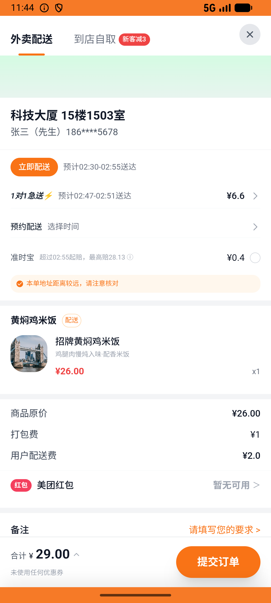

# address_v003_set_default_address  ⚠️

- **Brand**: `daishushenghuo`
- **Class**: `DaishushenghuoAddressV003SetDefaultAddressTask`
- **Pass@3**: **1/3**  (score = 1.00)
- **Elapsed**: 416s (~6.9 min)
- **Model**: `doubao-seed-evolving`
- **Raw log**: [./raw_logs/DaishushenghuoAddressV003SetDefaultAddressTask.log](./raw_logs/DaishushenghuoAddressV003SetDefaultAddressTask.log)
- **Generated**: 2026-07-08T02:35:14+08:00

## Task Goal

> 把科技大厦设为默认收货地址，再用这个地址在黄焖鸡米饭店下 1 单招牌黄焖鸡米饭并支付

## System Prompt

<details>
<summary>展开查看完整 System Prompt</summary>


> You are provided with a task description, a history of previous actions, and corresponding screenshots. Your goal is to perform the next action to complete the task. Please note that if performing the same action multiple times results in a static screen with no changes, you should attempt a modified or alternative action.
> 
> ---
> 
> ## Function Definition
> 
> - `clarify` — Ask the user for more information to complete the task.
> - `click` — Mouse left single click action.
> - `double_click` — Mouse left double click action.
> - `drag` — Perform a drag action from the start point to the end point. Typically used for swiping or selecting elements.
> - `long_press` — Perform a long press action at the specified coordinates.
> - `open_app` — Open the specified application.
> - `press_back` — Press the back button.
> - `press_enter` — Press the enter key.
> - `press_home` — Press the home button.
> - `take_notes` — Take notes and report the result in the specified content.
> - `type` — Type the specified content. You should manually delete any text from the input box that you want to remove.
> - `wait` — Wait for a certain period of time.

</details>

## User Query

> 请在 com.daishushenghuo 里面完成以下任务：
> 把科技大厦设为默认收货地址，再用这个地址在黄焖鸡米饭店下 1 单招牌黄焖鸡米饭并支付

## Attempts

| # | Outcome | Steps | Terminated | Reason | Start → End |
|---|---------|-------|------------|--------|-------------|
| 1 | ❌ failed | 20 | answer | 已创建黄焖鸡米饭店外卖订单: 未找到黄焖鸡米饭店的外卖订单; 订单含 1 份招牌黄焖鸡米饭: expected: not nil      got: nil; 订单实付金额正确（商品 + 配送费 + 打包费）: expected: not nil      got: nil... | 2026-07-08 02:28:19 → 2026-07-08 02:30:40 |
| 2 | ✅ passed | 29 | answer | – | 2026-07-08 02:30:40 → 2026-07-08 02:33:23 |
| 3 | ❌ failed | 17 | unknown | 已创建黄焖鸡米饭店外卖订单: 未找到黄焖鸡米饭店的外卖订单; 订单含 1 份招牌黄焖鸡米饭: expected: not nil      got: nil; 订单实付金额正确（商品 + 配送费 + 打包费）: expected: not nil      got: nil... | 2026-07-08 02:33:23 → 2026-07-08 02:35:14 |

## Failure Details

### Episode 1 — ❌ failed

- steps_used: `20`
- terminated_reason: `answer`
- reason:

  ```
  已创建黄焖鸡米饭店外卖订单: 未找到黄焖鸡米饭店的外卖订单; 订单含 1 份招牌黄焖鸡米饭: expected: not nil
       got: nil; 订单实付金额正确（商品 + 配送费 + 打包费）: expected: not nil
       got: nil; 订单收货地址 = 科技大厦完整地址: expected: not nil
       got: nil; 订单收货联系人/手机号 = 张三 / 18612345678: expected: not nil
       got: nil; 订单状态 = paid: expected: not nil
       got: nil
  ```
- death shot: 
  - state: [`./screenshots/DaishushenghuoAddressV003SetDefaultAddressTask/episode_001/step_020.json`](./screenshots/DaishushenghuoAddressV003SetDefaultAddressTask/episode_001/step_020.json)
  - digest: [`episode_digest.md`](./screenshots/DaishushenghuoAddressV003SetDefaultAddressTask/episode_001/episode_digest.md)

### Episode 3 — ❌ failed

- steps_used: `17`
- terminated_reason: `unknown`
- reason:

  ```
  已创建黄焖鸡米饭店外卖订单: 未找到黄焖鸡米饭店的外卖订单; 订单含 1 份招牌黄焖鸡米饭: expected: not nil
       got: nil; 订单实付金额正确（商品 + 配送费 + 打包费）: expected: not nil
       got: nil; 订单收货地址 = 科技大厦完整地址: expected: not nil
       got: nil; 订单收货联系人/手机号 = 张三 / 18612345678: expected: not nil
       got: nil; 订单状态 = paid: expected: not nil
       got: nil
  ```
- death shot: 
  - state: [`./screenshots/DaishushenghuoAddressV003SetDefaultAddressTask/episode_003/step_016.json`](./screenshots/DaishushenghuoAddressV003SetDefaultAddressTask/episode_003/step_016.json)
  - digest: [`episode_digest.md`](./screenshots/DaishushenghuoAddressV003SetDefaultAddressTask/episode_003/episode_digest.md)

---

> 本摘要由 `sengclaw/scripts/pipeline/log_summarizer.py` 自动生成。 原始完整 log 见上方 Raw log 链接（含每 step 的 messages / tool_call / screenshot 引用）。
