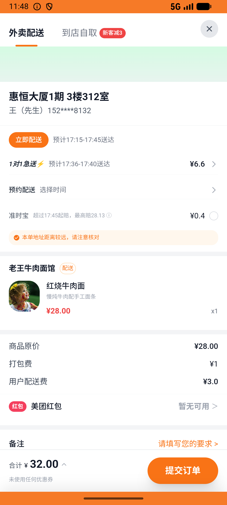
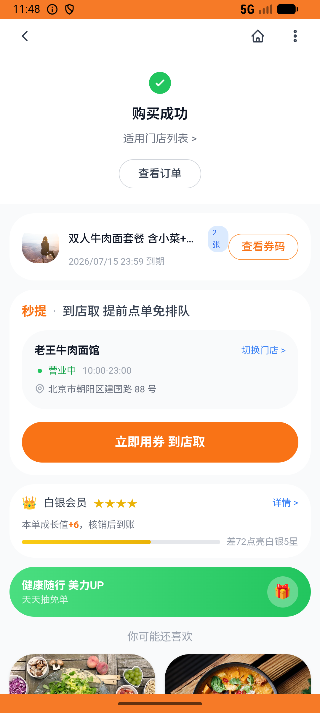

# group_deal_v012_place_order_laowang  ❌

- **Brand**: `daishushenghuo`
- **Class**: `DaishushenghuoGroupDealV012PlaceOrderLaowangTask`
- **Pass@3**: **0/3**  (score = 0.00)
- **Elapsed**: 833s (~13.9 min)
- **Model**: `doubao-seed-evolving`
- **Raw log**: [./raw_logs/DaishushenghuoGroupDealV012PlaceOrderLaowangTask.log](./raw_logs/DaishushenghuoGroupDealV012PlaceOrderLaowangTask.log)
- **Generated**: 2026-07-08T18:06:13+08:00

## Task Goal

> 在老王牛肉面馆点 1 份红烧牛肉面外卖送到家，再额外买 2 份双人牛肉面套餐团购券

## System Prompt

<details>
<summary>展开查看完整 System Prompt</summary>


> You are provided with a task description, a history of previous actions, and corresponding screenshots. Your goal is to perform the next action to complete the task. Please note that if performing the same action multiple times results in a static screen with no changes, you should attempt a modified or alternative action.
> 
> ---
> 
> ## Function Definition
> 
> - `clarify` — Ask the user for more information to complete the task.
> - `click` — Mouse left single click action.
> - `double_click` — Mouse left double click action.
> - `drag` — Perform a drag action from the start point to the end point. Typically used for swiping or selecting elements.
> - `long_press` — Perform a long press action at the specified coordinates.
> - `open_app` — Open the specified application.
> - `press_back` — Press the back button.
> - `press_enter` — Press the enter key.
> - `press_home` — Press the home button.
> - `take_notes` — Take notes and report the result in the specified content.
> - `type` — Type the specified content. You should manually delete any text from the input box that you want to remove.
> - `wait` — Wait for a certain period of time.

</details>

## User Query

> 请在 com.daishushenghuo 里面完成以下任务：
> 在老王牛肉面馆点 1 份红烧牛肉面外卖送到家，再额外买 2 份双人牛肉面套餐团购券

## Attempts

| # | Outcome | Steps | Terminated | Reason | Start → End |
|---|---------|-------|------------|--------|-------------|
| 1 | ❌ failed | 15 | unknown | 老王店外卖订单含 1 份红烧牛肉面: 未找到老王店外卖订单; 老王店产生 2 笔双人牛肉面套餐团购订单: 预期至少 2 笔团购订单，实际 0。每张团购券需要单独抢购 1 次 | 2026-07-08 17:07:49 → 2026-07-08 17:10:03 |
| 2 | ❌ failed | 34 | answer | 老王店外卖订单含 1 份红烧牛肉面: 未找到老王店外卖订单; 老王店产生 2 笔双人牛肉面套餐团购订单: 预期至少 2 笔团购订单，实际 0。每张团购券需要单独抢购 1 次 | 2026-07-08 17:10:03 → 2026-07-08 17:16:08 |
| 3 | ❌ failed | 41 | answer | 老王店产生 2 笔双人牛肉面套餐团购订单: 预期至少 2 笔团购订单，实际 1。每张团购券需要单独抢购 1 次 | 2026-07-08 17:16:08 → 2026-07-08 17:21:41 |

## Failure Details

### Episode 1 — ❌ failed

- steps_used: `15`
- terminated_reason: `unknown`
- reason:

  ```
  老王店外卖订单含 1 份红烧牛肉面: 未找到老王店外卖订单; 老王店产生 2 笔双人牛肉面套餐团购订单: 预期至少 2 笔团购订单，实际 0。每张团购券需要单独抢购 1 次
  ```
- death shot: 
  - state: [`./screenshots/DaishushenghuoGroupDealV012PlaceOrderLaowangTask/episode_001/step_014.json`](./screenshots/DaishushenghuoGroupDealV012PlaceOrderLaowangTask/episode_001/step_014.json)
  - digest: [`episode_digest.md`](./screenshots/DaishushenghuoGroupDealV012PlaceOrderLaowangTask/episode_001/episode_digest.md)

### Episode 2 — ❌ failed

- steps_used: `34`
- terminated_reason: `answer`
- reason:

  ```
  老王店外卖订单含 1 份红烧牛肉面: 未找到老王店外卖订单; 老王店产生 2 笔双人牛肉面套餐团购订单: 预期至少 2 笔团购订单，实际 0。每张团购券需要单独抢购 1 次
  ```
- death shot: 
  - state: [`./screenshots/DaishushenghuoGroupDealV012PlaceOrderLaowangTask/episode_002/step_034.json`](./screenshots/DaishushenghuoGroupDealV012PlaceOrderLaowangTask/episode_002/step_034.json)
  - digest: [`episode_digest.md`](./screenshots/DaishushenghuoGroupDealV012PlaceOrderLaowangTask/episode_002/episode_digest.md)

### Episode 3 — ❌ failed

- steps_used: `41`
- terminated_reason: `answer`
- reason:

  ```
  老王店产生 2 笔双人牛肉面套餐团购订单: 预期至少 2 笔团购订单，实际 1。每张团购券需要单独抢购 1 次
  ```
- death shot: 
  - state: [`./screenshots/DaishushenghuoGroupDealV012PlaceOrderLaowangTask/episode_003/step_041.json`](./screenshots/DaishushenghuoGroupDealV012PlaceOrderLaowangTask/episode_003/step_041.json)
  - digest: [`episode_digest.md`](./screenshots/DaishushenghuoGroupDealV012PlaceOrderLaowangTask/episode_003/episode_digest.md)

---

> 本摘要由 `sengclaw/scripts/pipeline/log_summarizer.py` 自动生成。 原始完整 log 见上方 Raw log 链接（含每 step 的 messages / tool_call / screenshot 引用）。
