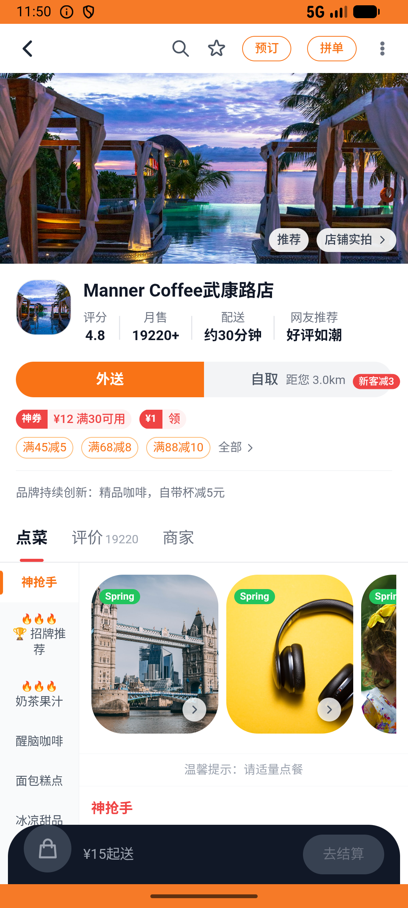

# flow_v015_recent_browse_manner_coffee  ❌

- **Brand**: `daishushenghuo`
- **Class**: `DaishushenghuoFlowV015RecentBrowseMannerCoffeeTask`
- **Pass@3**: **0/3**  (score = 0.00)
- **Elapsed**: 1576s (~26.3 min)
- **Model**: `doubao-seed-evolving`
- **Raw log**: [./raw_logs/DaishushenghuoFlowV015RecentBrowseMannerCoffeeTask.log](./raw_logs/DaishushenghuoFlowV015RecentBrowseMannerCoffeeTask.log)
- **Generated**: 2026-07-09T11:30:51+08:00

## Task Goal

> 先依次进 Manner Coffee 武康路店、瑞幸咖啡（国贸店）、喜茶 三家店主页比一比，再去「浏览记录」回看一眼（浏览记录在底部 Tab「我的」里，不在外卖模块或团购模块内部的「我的」），选觉得最划算的 Manner 收藏起来，然后下 2 张「精品手冲咖啡 单杯券」¥19 的团购券并支付（共 ¥38）

## System Prompt

<details>
<summary>展开查看完整 System Prompt</summary>


> You are provided with a task description, a history of previous actions, and corresponding screenshots. Your goal is to perform the next action to complete the task. Please note that if performing the same action multiple times results in a static screen with no changes, you should attempt a modified or alternative action.
> 
> ---
> 
> ## Function Definition
> 
> - `clarify` — Ask the user for more information to complete the task.
> - `click` — Mouse left single click action.
> - `double_click` — Mouse left double click action.
> - `drag` — Perform a drag action from the start point to the end point. Typically used for swiping or selecting elements.
> - `long_press` — Perform a long press action at the specified coordinates.
> - `open_app` — Open the specified application.
> - `press_back` — Press the back button.
> - `press_enter` — Press the enter key.
> - `press_home` — Press the home button.
> - `take_notes` — Take notes and report the result in the specified content.
> - `type` — Type the specified content. You should manually delete any text from the input box that you want to remove.
> - `wait` — Wait for a certain period of time.

</details>

## User Query

> 请在 com.daishushenghuo 里面完成以下任务：
> 先依次进 Manner Coffee 武康路店、瑞幸咖啡（国贸店）、喜茶 三家店主页比一比，再去「浏览记录」回看一眼（浏览记录在底部 Tab「我的」里，不在外卖模块或团购模块内部的「我的」），选觉得最划算的 Manner 收藏起来，然后下 2 张「精品手冲咖啡 单杯券」¥19 的团购券并支付（共 ¥38）

## Attempts

| # | Outcome | Steps | Terminated | Reason | Start → End |
|---|---------|-------|------------|--------|-------------|
| 1 | ⏰ timeout | 80 | max_steps | 浏览历史包含 瑞幸咖啡（国贸店）: 浏览历史未记录 瑞幸咖啡（国贸店）; 浏览历史包含 喜茶: 浏览历史未记录 喜茶; Manner 已被收藏: 未收藏 Manner Coffee 武康路店; Manner 团购订单已支付（手冲咖啡单杯券）: 未找到 Manner 手冲咖啡... | 2026-07-09 11:04:34 → 2026-07-09 11:17:43 |
| 2 | ❌ failed | 42 | answer | 浏览历史包含 瑞幸咖啡（国贸店）: 浏览历史未记录 瑞幸咖啡（国贸店）; 浏览历史包含 喜茶: 浏览历史未记录 喜茶; Manner 已被收藏: 未收藏 Manner Coffee 武康路店; Manner 团购订单已支付（手冲咖啡单杯券）: 未找到 Manner 手冲咖啡... | 2026-07-09 11:17:43 → 2026-07-09 11:25:46 |
| 3 | ❌ failed | 30 | answer | 浏览历史包含 瑞幸咖啡（国贸店）: 浏览历史未记录 瑞幸咖啡（国贸店）; 浏览历史包含 喜茶: 浏览历史未记录 喜茶; Manner 已被收藏: 未收藏 Manner Coffee 武康路店; Manner 团购订单已支付（手冲咖啡单杯券）: 未找到 Manner 手冲咖啡... | 2026-07-09 11:25:46 → 2026-07-09 11:30:50 |

## Failure Details

### Episode 1 — ⏰ timeout

- steps_used: `80`
- terminated_reason: `max_steps`
- reason:

  ```
  浏览历史包含 瑞幸咖啡（国贸店）: 浏览历史未记录 瑞幸咖啡（国贸店）; 浏览历史包含 喜茶: 浏览历史未记录 喜茶; Manner 已被收藏: 未收藏 Manner Coffee 武康路店; Manner 团购订单已支付（手冲咖啡单杯券）: 未找到 Manner 手冲咖啡券已支付团购订单; 团购订单 quantity = 2: 预期 quantity=2，实际 ; 团购订单 actual_amount = ¥38.00（19 × 2）: 预期 ¥38.00，实际 ¥
  ```
- death shot: 
  - state: [`./screenshots/DaishushenghuoFlowV015RecentBrowseMannerCoffeeTask/episode_001/step_080.json`](./screenshots/DaishushenghuoFlowV015RecentBrowseMannerCoffeeTask/episode_001/step_080.json)
  - digest: [`episode_digest.md`](./screenshots/DaishushenghuoFlowV015RecentBrowseMannerCoffeeTask/episode_001/episode_digest.md)

### Episode 2 — ❌ failed

- steps_used: `42`
- terminated_reason: `answer`
- reason:

  ```
  浏览历史包含 瑞幸咖啡（国贸店）: 浏览历史未记录 瑞幸咖啡（国贸店）; 浏览历史包含 喜茶: 浏览历史未记录 喜茶; Manner 已被收藏: 未收藏 Manner Coffee 武康路店; Manner 团购订单已支付（手冲咖啡单杯券）: 未找到 Manner 手冲咖啡券已支付团购订单; 团购订单 quantity = 2: 预期 quantity=2，实际 ; 团购订单 actual_amount = ¥38.00（19 × 2）: 预期 ¥38.00，实际 ¥
  ```
- death shot: 
  - state: [`./screenshots/DaishushenghuoFlowV015RecentBrowseMannerCoffeeTask/episode_002/step_042.json`](./screenshots/DaishushenghuoFlowV015RecentBrowseMannerCoffeeTask/episode_002/step_042.json)
  - digest: [`episode_digest.md`](./screenshots/DaishushenghuoFlowV015RecentBrowseMannerCoffeeTask/episode_002/episode_digest.md)

### Episode 3 — ❌ failed

- steps_used: `30`
- terminated_reason: `answer`
- reason:

  ```
  浏览历史包含 瑞幸咖啡（国贸店）: 浏览历史未记录 瑞幸咖啡（国贸店）; 浏览历史包含 喜茶: 浏览历史未记录 喜茶; Manner 已被收藏: 未收藏 Manner Coffee 武康路店; Manner 团购订单已支付（手冲咖啡单杯券）: 未找到 Manner 手冲咖啡券已支付团购订单; 团购订单 quantity = 2: 预期 quantity=2，实际 ; 团购订单 actual_amount = ¥38.00（19 × 2）: 预期 ¥38.00，实际 ¥
  ```
- death shot: 
  - state: [`./screenshots/DaishushenghuoFlowV015RecentBrowseMannerCoffeeTask/episode_003/step_030.json`](./screenshots/DaishushenghuoFlowV015RecentBrowseMannerCoffeeTask/episode_003/step_030.json)
  - digest: [`episode_digest.md`](./screenshots/DaishushenghuoFlowV015RecentBrowseMannerCoffeeTask/episode_003/episode_digest.md)

---

> 本摘要由 `sengclaw/scripts/pipeline/log_summarizer.py` 自动生成。 原始完整 log 见上方 Raw log 链接（含每 step 的 messages / tool_call / screenshot 引用）。
