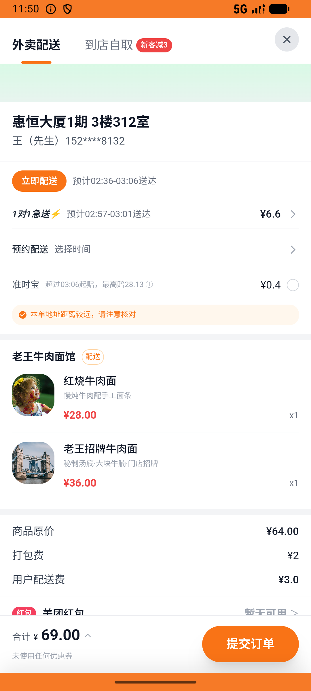
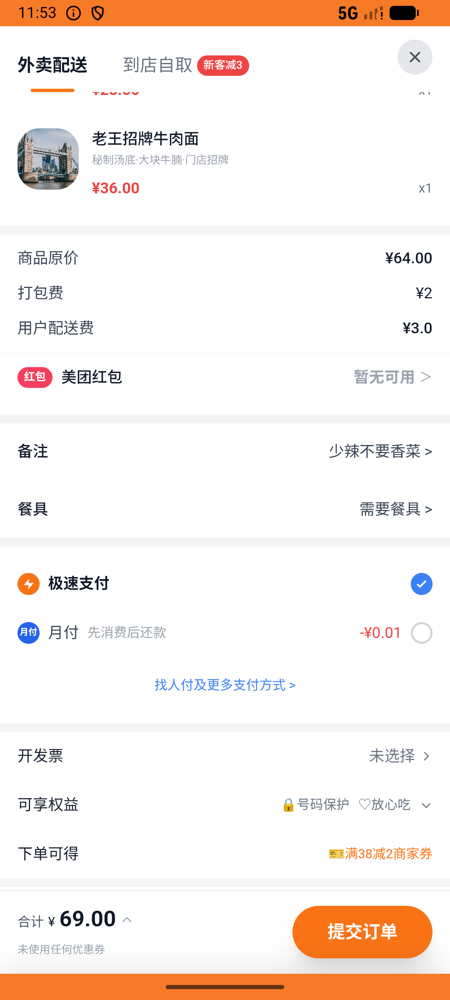
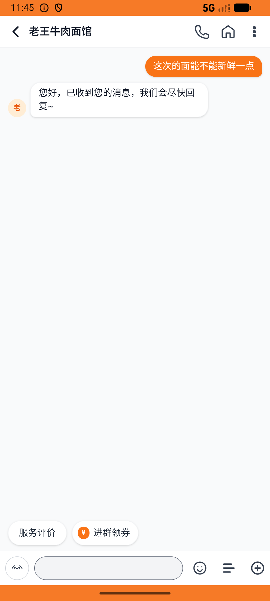

# order_v042_reorder_review_chat  ❌

- **Brand**: `daishushenghuo`
- **Class**: `DaishushenghuoOrderV042ReorderReviewChatTask`
- **Pass@3**: **0/3**  (score = 0.00)
- **Elapsed**: 1386s (~23.1 min)
- **Model**: `doubao-seed-evolving`
- **Raw log**: [./raw_logs/DaishushenghuoOrderV042ReorderReviewChatTask.log](./raw_logs/DaishushenghuoOrderV042ReorderReviewChatTask.log)
- **Generated**: 2026-07-10T18:50:31+08:00
- **Note**: backfilled from /tmp/pass_at_3_full_<ts>/ on 2026-05-02

## Task Goal

> 在订单列表里找到上次完成的「老王牛肉面馆」订单，点详情页的「再来一单」把红烧牛肉面+老王招牌牛肉面重新加入购物车，备注「少辣不要香菜」用默认地址下单并支付，再给老王发私信问「这次的面能不能新鲜一点」

## System Prompt

<details>
<summary>展开查看完整 System Prompt</summary>


> You are provided with a task description, a history of previous actions, and corresponding screenshots. Your goal is to perform the next action to complete the task. Please note that if performing the same action multiple times results in a static screen with no changes, you should attempt a modified or alternative action.
> 
> ---
> 
> ## Function Definition
> 
> - `clarify` — Ask the user for more information to complete the task.
> - `click` — Mouse left single click action.
> - `double_click` — Mouse left double click action.
> - `drag` — Perform a drag action from the start point to the end point. Typically used for swiping or selecting elements.
> - `long_press` — Perform a long press action at the specified coordinates.
> - `open_app` — Open the specified application.
> - `press_back` — Press the back button.
> - `press_enter` — Press the enter key.
> - `press_home` — Press the home button.
> - `take_notes` — Take notes and report the result in the specified content.
> - `type` — Type the specified content. You should manually delete any text from the input box that you want to remove.
> - `wait` — Wait for a certain period of time.

</details>

## User Query

> 请在 com.daishushenghuo 里面完成以下任务：
> 在订单列表里找到上次完成的「老王牛肉面馆」订单，点详情页的「再来一单」把红烧牛肉面+老王招牌牛肉面重新加入购物车，备注「少辣不要香菜」用默认地址下单并支付，再给老王发私信问「这次的面能不能新鲜一点」

## Attempts

| # | Outcome | Steps | Terminated | Reason | Start → End |
|---|---------|-------|------------|--------|-------------|
| 1 | ❌ failed | 42 | answer | 新订单已支付（老王牛肉面馆，2 件以上）: 未找到「再来一单」产生的新订单; 与老王牛肉面馆的会话存在: expected: not nil      got: nil | 2026-07-10 02:35:56 → 2026-07-10 02:44:25 |
| 2 | ⏰ timeout | 80 | max_steps | 新订单已支付（老王牛肉面馆，2 件以上）: 未找到「再来一单」产生的新订单; 与老王牛肉面馆的会话存在: expected: not nil      got: nil | 2026-07-10 02:44:25 → 2026-07-10 02:55:38 |
| 3 | ❌ failed | 26 | answer | 新订单已支付（老王牛肉面馆，2 件以上）: 未找到「再来一单」产生的新订单 | 2026-07-10 02:55:38 → 2026-07-10 02:59:02 |

## Failure Details

### Episode 1 — ❌ failed

- steps_used: `42`
- terminated_reason: `answer`
- reason:

  ```
  新订单已支付（老王牛肉面馆，2 件以上）: 未找到「再来一单」产生的新订单; 与老王牛肉面馆的会话存在: expected: not nil
       got: nil
  ```
- death shot: 
  - state: [`./death_shots/DaishushenghuoOrderV042ReorderReviewChatTask/episode_001/step_042.json`](./death_shots/DaishushenghuoOrderV042ReorderReviewChatTask/episode_001/step_042.json)
  - digest: [`episode_digest.md`](./death_shots/DaishushenghuoOrderV042ReorderReviewChatTask/episode_001/episode_digest.md)

### Episode 2 — ⏰ timeout

- steps_used: `80`
- terminated_reason: `max_steps`
- reason:

  ```
  新订单已支付（老王牛肉面馆，2 件以上）: 未找到「再来一单」产生的新订单; 与老王牛肉面馆的会话存在: expected: not nil
       got: nil
  ```
- death shot: 
  - state: [`./death_shots/DaishushenghuoOrderV042ReorderReviewChatTask/episode_002/step_080.json`](./death_shots/DaishushenghuoOrderV042ReorderReviewChatTask/episode_002/step_080.json)
  - digest: [`episode_digest.md`](./death_shots/DaishushenghuoOrderV042ReorderReviewChatTask/episode_002/episode_digest.md)

### Episode 3 — ❌ failed

- steps_used: `26`
- terminated_reason: `answer`
- reason:

  ```
  新订单已支付（老王牛肉面馆，2 件以上）: 未找到「再来一单」产生的新订单
  ```
- death shot: 
  - state: [`./death_shots/DaishushenghuoOrderV042ReorderReviewChatTask/episode_003/step_026.json`](./death_shots/DaishushenghuoOrderV042ReorderReviewChatTask/episode_003/step_026.json)
  - digest: [`episode_digest.md`](./death_shots/DaishushenghuoOrderV042ReorderReviewChatTask/episode_003/episode_digest.md)

---

> 本摘要由 `sengclaw/scripts/pipeline/log_summarizer.py` 自动生成。 原始完整 log 见上方 Raw log 链接（含每 step 的 messages / tool_call / screenshot 引用）。
