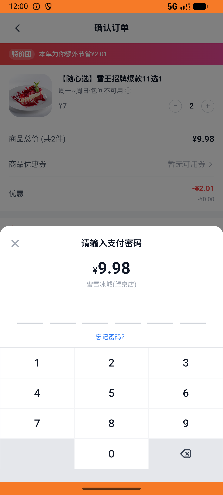
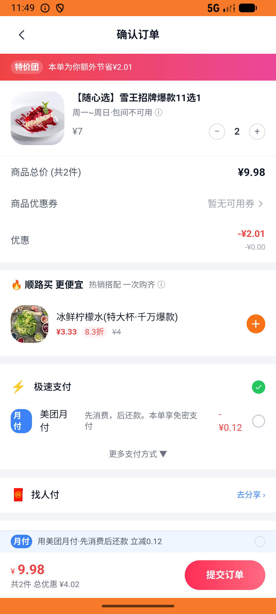

# group_deal_v002_place_order_mixue  ⚠️

- **Brand**: `daishushenghuo`
- **Class**: `DaishushenghuoGroupDealV002PlaceOrderMixueTask`
- **Pass@3**: **1/3**  (score = 1.00)
- **Elapsed**: 1693s (~28.2 min)
- **Model**: `doubao-seed-evolving`
- **Raw log**: [./raw_logs/DaishushenghuoGroupDealV002PlaceOrderMixueTask.log](./raw_logs/DaishushenghuoGroupDealV002PlaceOrderMixueTask.log)
- **Generated**: 2026-07-10T18:06:30+08:00

## Task Goal

> 在蜜雪冰城望京店买 2 份雪王随心团购券并支付，再到店核销其中 1 张

## System Prompt

<details>
<summary>展开查看完整 System Prompt</summary>


> You are provided with a task description, a history of previous actions, and corresponding screenshots. Your goal is to perform the next action to complete the task. Please note that if performing the same action multiple times results in a static screen with no changes, you should attempt a modified or alternative action.
> 
> ---
> 
> ## Function Definition
> 
> - `clarify` — Ask the user for more information to complete the task.
> - `click` — Mouse left single click action.
> - `double_click` — Mouse left double click action.
> - `drag` — Perform a drag action from the start point to the end point. Typically used for swiping or selecting elements.
> - `long_press` — Perform a long press action at the specified coordinates.
> - `open_app` — Open the specified application.
> - `press_back` — Press the back button.
> - `press_enter` — Press the enter key.
> - `press_home` — Press the home button.
> - `take_notes` — Take notes and report the result in the specified content.
> - `type` — Type the specified content. You should manually delete any text from the input box that you want to remove.
> - `wait` — Wait for a certain period of time.

</details>

## User Query

> 请在 com.daishushenghuo 里面完成以下任务：
> 在蜜雪冰城望京店买 2 份雪王随心团购券并支付，再到店核销其中 1 张

## Attempts

| # | Outcome | Steps | Terminated | Reason | Start → End |
|---|---------|-------|------------|--------|-------------|
| 1 | ⏰ timeout | 80 | max_steps | 订单生成 2 张团购券（order_vouchers）: 订单 #1 生成了 0 张券，预期 2 张; 其中 1 张已核销（voucher.status=used + redeemed_at 非空）: 预期 1 张已核销，实际 0 张。Agent 应该在订单详情或核销页选 ... | 2026-07-10 14:28:47 → 2026-07-10 14:46:58 |
| 2 | ❌ failed | 45 | answer | 蜜雪冰城望京店产生 1 笔雪王随心选团购订单（数量 2 / ¥9.98）: 预期 1 笔团购订单（一笔订单包含 2 份），实际 0 笔。如果是 2 笔，说明用了旧逻辑分两次抢购；正确做法是在购买页把数量调到 2，下一笔订单 | 2026-07-10 14:46:58 → 2026-07-10 14:54:11 |
| 3 | ✅ passed | 22 | answer | – | 2026-07-10 14:54:11 → 2026-07-10 14:56:59 |

## Failure Details

### Episode 1 — ⏰ timeout

- steps_used: `80`
- terminated_reason: `max_steps`
- reason:

  ```
  订单生成 2 张团购券（order_vouchers）: 订单 #1 生成了 0 张券，预期 2 张; 其中 1 张已核销（voucher.status=used + redeemed_at 非空）: 预期 1 张已核销，实际 0 张。Agent 应该在订单详情或核销页选 1 张券完成核销; 另 1 张仍未核销（voucher.status=unused）: 预期 1 张保留未核销，实际 0 张。如果 0 张说明把 2 张全核销了；如果 2 张说明都没核销
  ```
- death shot: 
  - state: [`./screenshots/DaishushenghuoGroupDealV002PlaceOrderMixueTask/episode_001/step_080.json`](./screenshots/DaishushenghuoGroupDealV002PlaceOrderMixueTask/episode_001/step_080.json)
  - digest: [`episode_digest.md`](./screenshots/DaishushenghuoGroupDealV002PlaceOrderMixueTask/episode_001/episode_digest.md)

### Episode 2 — ❌ failed

- steps_used: `45`
- terminated_reason: `answer`
- reason:

  ```
  蜜雪冰城望京店产生 1 笔雪王随心选团购订单（数量 2 / ¥9.98）: 预期 1 笔团购订单（一笔订单包含 2 份），实际 0 笔。如果是 2 笔，说明用了旧逻辑分两次抢购；正确做法是在购买页把数量调到 2，下一笔订单
  ```
- death shot: 
  - state: [`./screenshots/DaishushenghuoGroupDealV002PlaceOrderMixueTask/episode_002/step_045.json`](./screenshots/DaishushenghuoGroupDealV002PlaceOrderMixueTask/episode_002/step_045.json)
  - digest: [`episode_digest.md`](./screenshots/DaishushenghuoGroupDealV002PlaceOrderMixueTask/episode_002/episode_digest.md)

---

> 本摘要由 `sengclaw/scripts/pipeline/log_summarizer.py` 自动生成。 原始完整 log 见上方 Raw log 链接（含每 step 的 messages / tool_call / screenshot 引用）。
