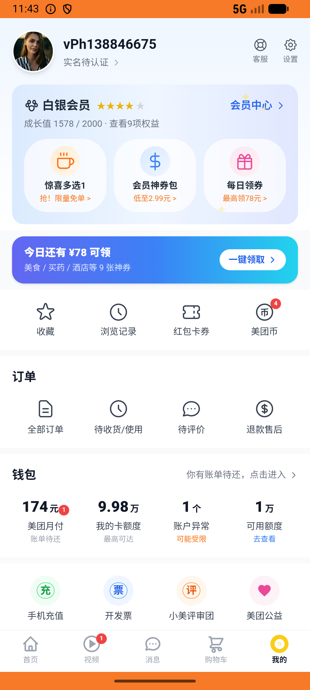

# coupon_v004_coupon_pack_order_uncancellable  ❌

- **Brand**: `daishushenghuo`
- **Class**: `DaishushenghuoCouponV004CouponPackOrderUncancellableTask`
- **Pass@3**: **0/3**  (score = 0.00)
- **Elapsed**: 116s (~1.9 min)
- **Model**: `doubao-seed-2-0-lite-260428`
- **Raw log**: [./raw_logs/DaishushenghuoCouponV004CouponPackOrderUncancellableTask.log](./raw_logs/DaishushenghuoCouponV004CouponPackOrderUncancellableTask.log)
- **Generated**: 2026-07-11T07:16:26+08:00

## Task Goal

> 买一份会员神券包并支付，然后试试能不能取消这笔订单

## System Prompt

<details>
<summary>展开查看完整 System Prompt</summary>


> You are provided with a task description, a history of previous actions, and corresponding screenshots. Your goal is to perform the next action to complete the task. Please note that if performing the same action multiple times results in a static screen with no changes, you should attempt a modified or alternative action.
> 
> ---
> 
> ## Function Definition
> 
> - `clarify` — Ask the user for more information to complete the task.
> - `click` — Mouse left single click action.
> - `double_click` — Mouse left double click action.
> - `drag` — Perform a drag action from the start point to the end point. Typically used for swiping or selecting elements.
> - `long_press` — Perform a long press action at the specified coordinates.
> - `open_app` — Open the specified application.
> - `press_back` — Press the back button.
> - `press_enter` — Press the enter key.
> - `press_home` — Press the home button.
> - `take_notes` — Take notes and report the result in the specified content.
> - `type` — Type the specified content. You should manually delete any text from the input box that you want to remove.
> - `wait` — Wait for a certain period of time.

</details>

## User Query

> 请在 com.daishushenghuo 里面完成以下任务：
> 买一份会员神券包并支付，然后试试能不能取消这笔订单

## Attempts

| # | Outcome | Steps | Terminated | Reason | Start → End |
|---|---------|-------|------------|--------|-------------|
| 1 | ❌ failed | 5 | answer | 神券包订单已支付（未被取消）: 订单状态错误：预期 paid，实际 "pending"（cancelled 表示取消生效，违反业务规则）; 6 张神券已发放且全部「未使用」: 神券数量错误：预期 6，实际 0; 订单已记录支付时间: paid_at 为空（订单未真正完成支付） | 2026-07-11 03:29:55 → 2026-07-11 03:30:39 |
| 2 | ❌ failed | 5 | answer | 神券包订单已支付（未被取消）: 神券包订单不存在（Agent 没下单或被错误删除） | 2026-07-11 03:30:39 → 2026-07-11 03:31:19 |
| 3 | ❌ failed | 3 | answer | 神券包订单已支付（未被取消）: 神券包订单不存在（Agent 没下单或被错误删除） | 2026-07-11 03:31:19 → 2026-07-11 03:31:51 |

## Failure Details

### Episode 1 — ❌ failed

- steps_used: `5`
- terminated_reason: `answer`
- reason:

  ```
  神券包订单已支付（未被取消）: 订单状态错误：预期 paid，实际 "pending"（cancelled 表示取消生效，违反业务规则）; 6 张神券已发放且全部「未使用」: 神券数量错误：预期 6，实际 0; 订单已记录支付时间: paid_at 为空（订单未真正完成支付）
  ```
- death shot: 
  - state: [`./screenshots/DaishushenghuoCouponV004CouponPackOrderUncancellableTask/episode_001/step_005.json`](./screenshots/DaishushenghuoCouponV004CouponPackOrderUncancellableTask/episode_001/step_005.json)
  - digest: [`episode_digest.md`](./screenshots/DaishushenghuoCouponV004CouponPackOrderUncancellableTask/episode_001/episode_digest.md)

### Episode 2 — ❌ failed

- steps_used: `5`
- terminated_reason: `answer`
- reason:

  ```
  神券包订单已支付（未被取消）: 神券包订单不存在（Agent 没下单或被错误删除）
  ```
- death shot: 
  - state: [`./screenshots/DaishushenghuoCouponV004CouponPackOrderUncancellableTask/episode_002/step_005.json`](./screenshots/DaishushenghuoCouponV004CouponPackOrderUncancellableTask/episode_002/step_005.json)
  - digest: [`episode_digest.md`](./screenshots/DaishushenghuoCouponV004CouponPackOrderUncancellableTask/episode_002/episode_digest.md)

### Episode 3 — ❌ failed

- steps_used: `3`
- terminated_reason: `answer`
- reason:

  ```
  神券包订单已支付（未被取消）: 神券包订单不存在（Agent 没下单或被错误删除）
  ```
- death shot: 
  - state: [`./screenshots/DaishushenghuoCouponV004CouponPackOrderUncancellableTask/episode_003/step_003.json`](./screenshots/DaishushenghuoCouponV004CouponPackOrderUncancellableTask/episode_003/step_003.json)
  - digest: [`episode_digest.md`](./screenshots/DaishushenghuoCouponV004CouponPackOrderUncancellableTask/episode_003/episode_digest.md)

---

> 本摘要由 `sengclaw/scripts/pipeline/log_summarizer.py` 自动生成。 原始完整 log 见上方 Raw log 链接（含每 step 的 messages / tool_call / screenshot 引用）。
