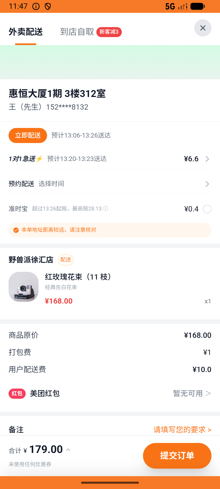
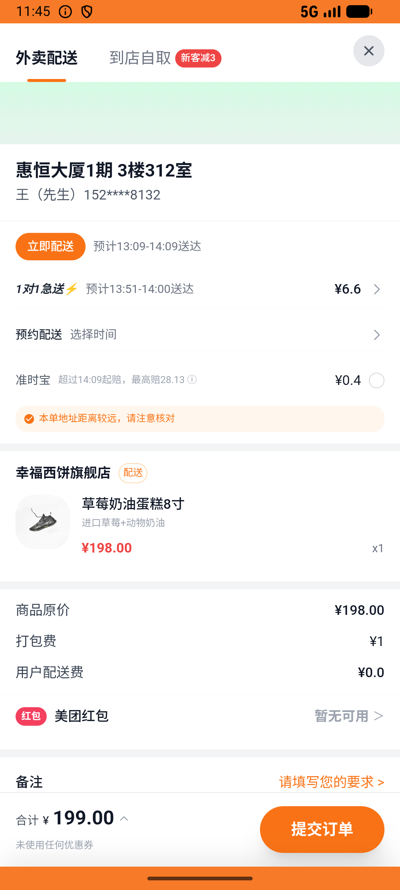

# flow_v012_birthday_flower_cake  ❌

- **Brand**: `daishushenghuo`
- **Class**: `DaishushenghuoFlowV012BirthdayFlowerCakeTask`
- **Pass@3**: **0/3**  (score = 0.00)
- **Elapsed**: 547s (~9.1 min)
- **Model**: `doubao-seed-2-0-lite-260428`
- **Raw log**: [./raw_logs/DaishushenghuoFlowV012BirthdayFlowerCakeTask.log](./raw_logs/DaishushenghuoFlowV012BirthdayFlowerCakeTask.log)
- **Generated**: 2026-07-11T17:36:24+08:00

## Task Goal

> 闺蜜生日：在野兽派徐汇店买 1 束红玫瑰（11枝）+ 幸福西饼旗舰店买 1 个草莓奶油蛋糕8寸，一起下单并完成支付

## System Prompt

<details>
<summary>展开查看完整 System Prompt</summary>


> You are provided with a task description, a history of previous actions, and corresponding screenshots. Your goal is to perform the next action to complete the task. Please note that if performing the same action multiple times results in a static screen with no changes, you should attempt a modified or alternative action.
> 
> ---
> 
> ## Function Definition
> 
> - `clarify` — Ask the user for more information to complete the task.
> - `click` — Mouse left single click action.
> - `double_click` — Mouse left double click action.
> - `drag` — Perform a drag action from the start point to the end point. Typically used for swiping or selecting elements.
> - `long_press` — Perform a long press action at the specified coordinates.
> - `open_app` — Open the specified application.
> - `press_back` — Press the back button.
> - `press_enter` — Press the enter key.
> - `press_home` — Press the home button.
> - `take_notes` — Take notes and report the result in the specified content.
> - `type` — Type the specified content. You should manually delete any text from the input box that you want to remove.
> - `wait` — Wait for a certain period of time.

</details>

## User Query

> 请在 com.daishushenghuo 里面完成以下任务：
> 闺蜜生日：在野兽派徐汇店买 1 束红玫瑰（11枝）+ 幸福西饼旗舰店买 1 个草莓奶油蛋糕8寸，一起下单并完成支付

## Attempts

| # | Outcome | Steps | Terminated | Reason | Start → End |
|---|---------|-------|------------|--------|-------------|
| 1 | ❌ failed | 33 | answer | 野兽派订单已创建（含红玫瑰花束11枝 ×1）: 未找到野兽派订单; 幸福西饼订单已创建（含草莓奶油蛋糕8寸 ×1）: 未找到幸福西饼订单; 野兽派订单状态 = paid: 预期 'paid'，实际 nil; 幸福西饼订单状态 = paid: 预期 'paid'，实际 nil... | 2026-07-11 13:01:28 → 2026-07-11 13:06:30 |
| 2 | ❌ failed | 25 | answer | 野兽派订单已创建（含红玫瑰花束11枝 ×1）: 未找到野兽派订单; 幸福西饼订单已创建（含草莓奶油蛋糕8寸 ×1）: 未找到幸福西饼订单; 野兽派订单状态 = paid: 预期 'paid'，实际 nil; 幸福西饼订单状态 = paid: 预期 'paid'，实际 nil... | 2026-07-11 13:06:30 → 2026-07-11 13:09:48 |
| 3 | ❌ failed | 6 | answer | 野兽派订单已创建（含红玫瑰花束11枝 ×1）: 未找到野兽派订单; 幸福西饼订单已创建（含草莓奶油蛋糕8寸 ×1）: 未找到幸福西饼订单; 野兽派订单状态 = paid: 预期 'paid'，实际 nil; 幸福西饼订单状态 = paid: 预期 'paid'，实际 nil... | 2026-07-11 13:09:48 → 2026-07-11 13:10:34 |

## Failure Details

### Episode 1 — ❌ failed

- steps_used: `33`
- terminated_reason: `answer`
- reason:

  ```
  野兽派订单已创建（含红玫瑰花束11枝 ×1）: 未找到野兽派订单; 幸福西饼订单已创建（含草莓奶油蛋糕8寸 ×1）: 未找到幸福西饼订单; 野兽派订单状态 = paid: 预期 'paid'，实际 nil; 幸福西饼订单状态 = paid: 预期 'paid'，实际 nil; 野兽派订单金额 = ¥179.00（168 + 10 配送 + 1 打包）: 预期 ¥179.00，实际 ¥; 幸福西饼订单金额 = ¥199.00（198 + 0 配送 + 1 打包）: 预期 ¥199.00，实际 ¥; 两笔订单 paid_at 都已记录: 野兽派订单 paid_at 为空; 两家店购物车都被清空: 野兽派徐汇店 购物车未清空，仍有 1 件商品
  ```
- death shot: 
  - state: [`./screenshots/DaishushenghuoFlowV012BirthdayFlowerCakeTask/episode_001/step_033.json`](./screenshots/DaishushenghuoFlowV012BirthdayFlowerCakeTask/episode_001/step_033.json)
  - digest: [`episode_digest.md`](./screenshots/DaishushenghuoFlowV012BirthdayFlowerCakeTask/episode_001/episode_digest.md)

### Episode 2 — ❌ failed

- steps_used: `25`
- terminated_reason: `answer`
- reason:

  ```
  野兽派订单已创建（含红玫瑰花束11枝 ×1）: 未找到野兽派订单; 幸福西饼订单已创建（含草莓奶油蛋糕8寸 ×1）: 未找到幸福西饼订单; 野兽派订单状态 = paid: 预期 'paid'，实际 nil; 幸福西饼订单状态 = paid: 预期 'paid'，实际 nil; 野兽派订单金额 = ¥179.00（168 + 10 配送 + 1 打包）: 预期 ¥179.00，实际 ¥; 幸福西饼订单金额 = ¥199.00（198 + 0 配送 + 1 打包）: 预期 ¥199.00，实际 ¥; 两笔订单 paid_at 都已记录: 野兽派订单 paid_at 为空; 两家店购物车都被清空: 野兽派徐汇店 购物车未清空，仍有 1 件商品
  ```
- death shot: 
  - state: [`./screenshots/DaishushenghuoFlowV012BirthdayFlowerCakeTask/episode_002/step_025.json`](./screenshots/DaishushenghuoFlowV012BirthdayFlowerCakeTask/episode_002/step_025.json)
  - digest: [`episode_digest.md`](./screenshots/DaishushenghuoFlowV012BirthdayFlowerCakeTask/episode_002/episode_digest.md)

### Episode 3 — ❌ failed

- steps_used: `6`
- terminated_reason: `answer`
- reason:

  ```
  野兽派订单已创建（含红玫瑰花束11枝 ×1）: 未找到野兽派订单; 幸福西饼订单已创建（含草莓奶油蛋糕8寸 ×1）: 未找到幸福西饼订单; 野兽派订单状态 = paid: 预期 'paid'，实际 nil; 幸福西饼订单状态 = paid: 预期 'paid'，实际 nil; 野兽派订单金额 = ¥179.00（168 + 10 配送 + 1 打包）: 预期 ¥179.00，实际 ¥; 幸福西饼订单金额 = ¥199.00（198 + 0 配送 + 1 打包）: 预期 ¥199.00，实际 ¥; 两笔订单 paid_at 都已记录: 野兽派订单 paid_at 为空
  ```
- death shot: 
  - state: [`./screenshots/DaishushenghuoFlowV012BirthdayFlowerCakeTask/episode_003/step_006.json`](./screenshots/DaishushenghuoFlowV012BirthdayFlowerCakeTask/episode_003/step_006.json)
  - digest: [`episode_digest.md`](./screenshots/DaishushenghuoFlowV012BirthdayFlowerCakeTask/episode_003/episode_digest.md)

---

> 本摘要由 `sengclaw/scripts/pipeline/log_summarizer.py` 自动生成。 原始完整 log 见上方 Raw log 链接（含每 step 的 messages / tool_call / screenshot 引用）。
