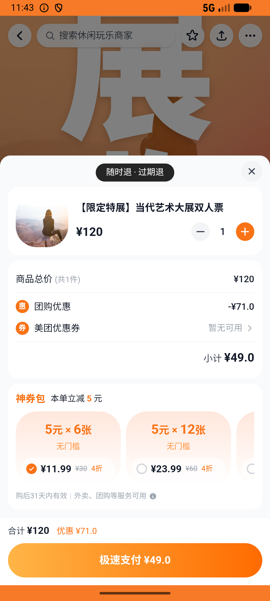
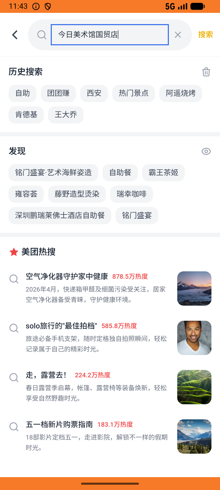

# flow_v013_exhibition_then_snacks  ❌

- **Brand**: `daishushenghuo`
- **Class**: `DaishushenghuoFlowV013ExhibitionThenSnacksTask`
- **Pass@3**: **0/3**  (score = 0.00)
- **Elapsed**: 334s (~5.6 min)
- **Model**: `doubao-seed-2-0-lite-260428`
- **Raw log**: [./raw_logs/DaishushenghuoFlowV013ExhibitionThenSnacksTask.log](./raw_logs/DaishushenghuoFlowV013ExhibitionThenSnacksTask.log)
- **Generated**: 2026-07-11T17:36:24+08:00

## Task Goal

> 周末看展+回家路上买零食：在今日美术馆国贸店买【限定特展】当代艺术大展双人票并支付，再去小象超市买 2 包薯片送到家并支付

## System Prompt

<details>
<summary>展开查看完整 System Prompt</summary>


> You are provided with a task description, a history of previous actions, and corresponding screenshots. Your goal is to perform the next action to complete the task. Please note that if performing the same action multiple times results in a static screen with no changes, you should attempt a modified or alternative action.
> 
> ---
> 
> ## Function Definition
> 
> - `clarify` — Ask the user for more information to complete the task.
> - `click` — Mouse left single click action.
> - `double_click` — Mouse left double click action.
> - `drag` — Perform a drag action from the start point to the end point. Typically used for swiping or selecting elements.
> - `long_press` — Perform a long press action at the specified coordinates.
> - `open_app` — Open the specified application.
> - `press_back` — Press the back button.
> - `press_enter` — Press the enter key.
> - `press_home` — Press the home button.
> - `take_notes` — Take notes and report the result in the specified content.
> - `type` — Type the specified content. You should manually delete any text from the input box that you want to remove.
> - `wait` — Wait for a certain period of time.

</details>

## User Query

> 请在 com.daishushenghuo 里面完成以下任务：
> 周末看展+回家路上买零食：在今日美术馆国贸店买【限定特展】当代艺术大展双人票并支付，再去小象超市买 2 包薯片送到家并支付

## Attempts

| # | Outcome | Steps | Terminated | Reason | Start → End |
|---|---------|-------|------------|--------|-------------|
| 1 | ❌ failed | 8 | answer | 今日美术馆已支付团购订单存在: 未找到今日美术馆「【限定特展】当代艺术大展双人票」的已支付团购订单; 美术馆订单 ¥49 + order_type=group_deal: 美术馆预期 ¥49，实际 ¥; 美术馆订单 paid_at 不为空: expected: not ni... | 2026-07-11 13:11:15 → 2026-07-11 13:12:21 |
| 2 | ❌ failed | 25 | answer | 今日美术馆已支付团购订单存在: 未找到今日美术馆「【限定特展】当代艺术大展双人票」的已支付团购订单; 美术馆订单 ¥49 + order_type=group_deal: 美术馆预期 ¥49，实际 ¥; 美术馆订单 paid_at 不为空: expected: not ni... | 2026-07-11 13:12:21 → 2026-07-11 13:15:58 |
| 3 | ❌ failed | 6 | answer | 今日美术馆已支付团购订单存在: 未找到今日美术馆「【限定特展】当代艺术大展双人票」的已支付团购订单; 美术馆订单 ¥49 + order_type=group_deal: 美术馆预期 ¥49，实际 ¥; 美术馆订单 paid_at 不为空: expected: not ni... | 2026-07-11 13:15:58 → 2026-07-11 13:16:49 |

## Failure Details

### Episode 1 — ❌ failed

- steps_used: `8`
- terminated_reason: `answer`
- reason:

  ```
  今日美术馆已支付团购订单存在: 未找到今日美术馆「【限定特展】当代艺术大展双人票」的已支付团购订单; 美术馆订单 ¥49 + order_type=group_deal: 美术馆预期 ¥49，实际 ¥; 美术馆订单 paid_at 不为空: expected: not nil
       got: nil; 小象超市外卖订单存在（含薯片 90g ×2）: 未找到小象超市的外卖订单; 小象超市订单金额 = ¥18.80（6.9×2 + 3 配送 + 2 打包）: 预期 ¥18.80，实际 ¥; 小象超市订单已支付（status=paid + paid_at 不为空）: 预期 'paid'，实际 nil; 小象超市订单 delivery_address 不是「到店消费」（送到家）: expected `nil.present?` to be truthy, got false
  ```
- death shot: 
  - state: [`./screenshots/DaishushenghuoFlowV013ExhibitionThenSnacksTask/episode_001/step_008.json`](./screenshots/DaishushenghuoFlowV013ExhibitionThenSnacksTask/episode_001/step_008.json)
  - digest: [`episode_digest.md`](./screenshots/DaishushenghuoFlowV013ExhibitionThenSnacksTask/episode_001/episode_digest.md)

### Episode 2 — ❌ failed

- steps_used: `25`
- terminated_reason: `answer`
- reason:

  ```
  今日美术馆已支付团购订单存在: 未找到今日美术馆「【限定特展】当代艺术大展双人票」的已支付团购订单; 美术馆订单 ¥49 + order_type=group_deal: 美术馆预期 ¥49，实际 ¥; 美术馆订单 paid_at 不为空: expected: not nil
       got: nil; 小象超市外卖订单存在（含薯片 90g ×2）: 未找到小象超市的外卖订单; 小象超市订单金额 = ¥18.80（6.9×2 + 3 配送 + 2 打包）: 预期 ¥18.80，实际 ¥; 小象超市订单已支付（status=paid + paid_at 不为空）: 预期 'paid'，实际 nil; 小象超市订单 delivery_address 不是「到店消费」（送到家）: expected `nil.present?` to be truthy, got false
  ```
- death shot: 
  - state: [`./screenshots/DaishushenghuoFlowV013ExhibitionThenSnacksTask/episode_002/step_025.json`](./screenshots/DaishushenghuoFlowV013ExhibitionThenSnacksTask/episode_002/step_025.json)
  - digest: [`episode_digest.md`](./screenshots/DaishushenghuoFlowV013ExhibitionThenSnacksTask/episode_002/episode_digest.md)

### Episode 3 — ❌ failed

- steps_used: `6`
- terminated_reason: `answer`
- reason:

  ```
  今日美术馆已支付团购订单存在: 未找到今日美术馆「【限定特展】当代艺术大展双人票」的已支付团购订单; 美术馆订单 ¥49 + order_type=group_deal: 美术馆预期 ¥49，实际 ¥; 美术馆订单 paid_at 不为空: expected: not nil
       got: nil; 小象超市外卖订单存在（含薯片 90g ×2）: 未找到小象超市的外卖订单; 小象超市订单金额 = ¥18.80（6.9×2 + 3 配送 + 2 打包）: 预期 ¥18.80，实际 ¥; 小象超市订单已支付（status=paid + paid_at 不为空）: 预期 'paid'，实际 nil; 小象超市订单 delivery_address 不是「到店消费」（送到家）: expected `nil.present?` to be truthy, got false
  ```
- death shot: 
  - state: [`./screenshots/DaishushenghuoFlowV013ExhibitionThenSnacksTask/episode_003/step_006.json`](./screenshots/DaishushenghuoFlowV013ExhibitionThenSnacksTask/episode_003/step_006.json)
  - digest: [`episode_digest.md`](./screenshots/DaishushenghuoFlowV013ExhibitionThenSnacksTask/episode_003/episode_digest.md)

---

> 本摘要由 `sengclaw/scripts/pipeline/log_summarizer.py` 自动生成。 原始完整 log 见上方 Raw log 链接（含每 step 的 messages / tool_call / screenshot 引用）。
