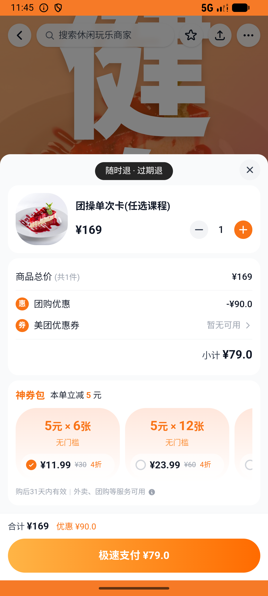
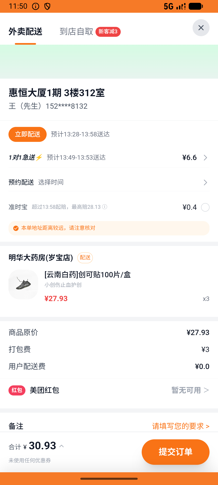

# flow_v014_gym_then_bandage  ❌

- **Brand**: `daishushenghuo`
- **Class**: `DaishushenghuoFlowV014GymThenBandageTask`
- **Pass@3**: **0/3**  (score = 0.00)
- **Elapsed**: 1194s (~19.9 min)
- **Model**: `doubao-seed-2-0-lite-260428`
- **Raw log**: [./raw_logs/DaishushenghuoFlowV014GymThenBandageTask.log](./raw_logs/DaishushenghuoFlowV014GymThenBandageTask.log)
- **Generated**: 2026-07-11T17:36:25+08:00

## Task Goal

> 团操课摔了一下：先在超级猩猩国贸店买「团操单次卡(任选课程)」¥79 团购券支付，下课后再去明华大药房买「[云南白药]创可贴100片/盒」并送到家支付（起送 ¥20，不够起送可凑单或多买几盒创可贴）

## System Prompt

<details>
<summary>展开查看完整 System Prompt</summary>


> You are provided with a task description, a history of previous actions, and corresponding screenshots. Your goal is to perform the next action to complete the task. Please note that if performing the same action multiple times results in a static screen with no changes, you should attempt a modified or alternative action.
> 
> ---
> 
> ## Function Definition
> 
> - `clarify` — Ask the user for more information to complete the task.
> - `click` — Mouse left single click action.
> - `double_click` — Mouse left double click action.
> - `drag` — Perform a drag action from the start point to the end point. Typically used for swiping or selecting elements.
> - `long_press` — Perform a long press action at the specified coordinates.
> - `open_app` — Open the specified application.
> - `press_back` — Press the back button.
> - `press_enter` — Press the enter key.
> - `press_home` — Press the home button.
> - `take_notes` — Take notes and report the result in the specified content.
> - `type` — Type the specified content. You should manually delete any text from the input box that you want to remove.
> - `wait` — Wait for a certain period of time.

</details>

## User Query

> 请在 com.daishushenghuo 里面完成以下任务：
> 团操课摔了一下：先在超级猩猩国贸店买「团操单次卡(任选课程)」¥79 团购券支付，下课后再去明华大药房买「[云南白药]创可贴100片/盒」并送到家支付（起送 ¥20，不够起送可凑单或多买几盒创可贴）

## Attempts

| # | Outcome | Steps | Terminated | Reason | Start → End |
|---|---------|-------|------------|--------|-------------|
| 1 | ❌ failed | 21 | answer | 超级猩猩团操单次卡已支付团购订单存在: 未找到 Super Monkey 超级猩猩(国贸店)「团操单次卡」的已支付团购订单; 团操订单 ¥79 + order_type=group_deal: 团操预期 ¥79，实际 ¥; 团操订单 paid_at 不为空: expecte... | 2026-07-11 13:17:30 → 2026-07-11 13:20:58 |
| 2 | ❌ failed | 53 | answer | 超级猩猩团操单次卡已支付团购订单存在: 未找到 Super Monkey 超级猩猩(国贸店)「团操单次卡」的已支付团购订单; 团操订单 ¥79 + order_type=group_deal: 团操预期 ¥79，实际 ¥; 团操订单 paid_at 不为空: expecte... | 2026-07-11 13:20:58 → 2026-07-11 13:29:00 |
| 3 | ❌ failed | 57 | answer | 超级猩猩团操单次卡已支付团购订单存在: 未找到 Super Monkey 超级猩猩(国贸店)「团操单次卡」的已支付团购订单; 团操订单 ¥79 + order_type=group_deal: 团操预期 ¥79，实际 ¥; 团操订单 paid_at 不为空: expecte... | 2026-07-11 13:29:00 → 2026-07-11 13:37:23 |

## Failure Details

### Episode 1 — ❌ failed

- steps_used: `21`
- terminated_reason: `answer`
- reason:

  ```
  超级猩猩团操单次卡已支付团购订单存在: 未找到 Super Monkey 超级猩猩(国贸店)「团操单次卡」的已支付团购订单; 团操订单 ¥79 + order_type=group_deal: 团操预期 ¥79，实际 ¥; 团操订单 paid_at 不为空: expected: not nil
       got: nil; 明华大药房外卖订单存在（含云南白药创可贴 ≥ 1）: 未找到明华大药房的外卖订单; 明华大药房订单金额满足起送（≥ ¥20）: 预期 ≥ ¥20.0，实际 ¥; 明华大药房订单已支付（status=paid + paid_at 不为空）: 预期 'paid'，实际 nil; 明华大药房订单 delivery_address 不是「到店消费」（送到家）: expected `nil.present?` to be truthy, got false
  ```
- death shot: 
  - state: [`./screenshots/DaishushenghuoFlowV014GymThenBandageTask/episode_001/step_021.json`](./screenshots/DaishushenghuoFlowV014GymThenBandageTask/episode_001/step_021.json)
  - digest: [`episode_digest.md`](./screenshots/DaishushenghuoFlowV014GymThenBandageTask/episode_001/episode_digest.md)

### Episode 2 — ❌ failed

- steps_used: `53`
- terminated_reason: `answer`
- reason:

  ```
  超级猩猩团操单次卡已支付团购订单存在: 未找到 Super Monkey 超级猩猩(国贸店)「团操单次卡」的已支付团购订单; 团操订单 ¥79 + order_type=group_deal: 团操预期 ¥79，实际 ¥; 团操订单 paid_at 不为空: expected: not nil
       got: nil; 明华大药房外卖订单存在（含云南白药创可贴 ≥ 1）: 未找到明华大药房的外卖订单; 明华大药房订单金额满足起送（≥ ¥20）: 预期 ≥ ¥20.0，实际 ¥; 明华大药房订单已支付（status=paid + paid_at 不为空）: 预期 'paid'，实际 nil; 明华大药房订单 delivery_address 不是「到店消费」（送到家）: expected `nil.present?` to be truthy, got false
  ```
- death shot: 
  - state: [`./screenshots/DaishushenghuoFlowV014GymThenBandageTask/episode_002/step_053.json`](./screenshots/DaishushenghuoFlowV014GymThenBandageTask/episode_002/step_053.json)
  - digest: [`episode_digest.md`](./screenshots/DaishushenghuoFlowV014GymThenBandageTask/episode_002/episode_digest.md)

### Episode 3 — ❌ failed

- steps_used: `57`
- terminated_reason: `answer`
- reason:

  ```
  超级猩猩团操单次卡已支付团购订单存在: 未找到 Super Monkey 超级猩猩(国贸店)「团操单次卡」的已支付团购订单; 团操订单 ¥79 + order_type=group_deal: 团操预期 ¥79，实际 ¥; 团操订单 paid_at 不为空: expected: not nil
       got: nil; 明华大药房外卖订单存在（含云南白药创可贴 ≥ 1）: 未找到明华大药房的外卖订单; 明华大药房订单金额满足起送（≥ ¥20）: 预期 ≥ ¥20.0，实际 ¥; 明华大药房订单已支付（status=paid + paid_at 不为空）: 预期 'paid'，实际 nil; 明华大药房订单 delivery_address 不是「到店消费」（送到家）: expected `nil.present?` to be truthy, got false
  ```
- death shot: 
  - state: [`./screenshots/DaishushenghuoFlowV014GymThenBandageTask/episode_003/step_057.json`](./screenshots/DaishushenghuoFlowV014GymThenBandageTask/episode_003/step_057.json)
  - digest: [`episode_digest.md`](./screenshots/DaishushenghuoFlowV014GymThenBandageTask/episode_003/episode_digest.md)

---

> 本摘要由 `sengclaw/scripts/pipeline/log_summarizer.py` 自动生成。 原始完整 log 见上方 Raw log 链接（含每 step 的 messages / tool_call / screenshot 引用）。
