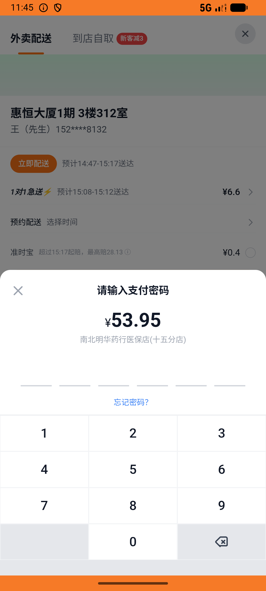
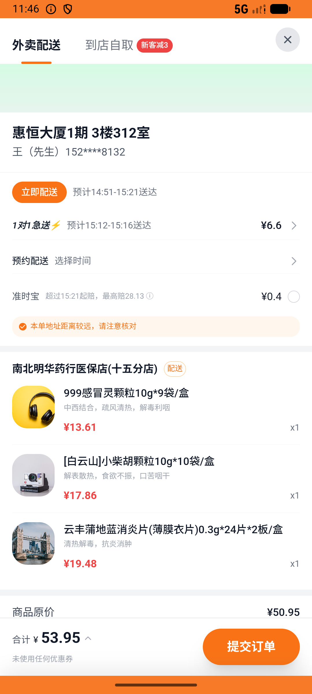

# kanbing_v046_frequent_purchases_three_meds  ❌

- **Brand**: `daishushenghuo`
- **Class**: `DaishushenghuoKanbingV046FrequentPurchasesThreeMedsTask`
- **Pass@3**: **0/3**  (score = 0.00)
- **Elapsed**: 654s (~10.9 min)
- **Model**: `doubao-seed-2-0-lite-260428`
- **Raw log**: [./raw_logs/DaishushenghuoKanbingV046FrequentPurchasesThreeMedsTask.log](./raw_logs/DaishushenghuoKanbingV046FrequentPurchasesThreeMedsTask.log)
- **Generated**: 2026-07-11T17:36:27+08:00

## Task Goal

> 在「我的→购物车」顶部「常买」入口找回上次买过的南北明华药行医保店(十五分店)，复购老药 999 感冒灵颗粒，再加[白云山]小柴胡颗粒10g*10袋/盒和云丰蒲地蓝消炎片各一盒，用默认地址下单支付

## System Prompt

<details>
<summary>展开查看完整 System Prompt</summary>


> You are provided with a task description, a history of previous actions, and corresponding screenshots. Your goal is to perform the next action to complete the task. Please note that if performing the same action multiple times results in a static screen with no changes, you should attempt a modified or alternative action.
> 
> ---
> 
> ## Function Definition
> 
> - `clarify` — Ask the user for more information to complete the task.
> - `click` — Mouse left single click action.
> - `double_click` — Mouse left double click action.
> - `drag` — Perform a drag action from the start point to the end point. Typically used for swiping or selecting elements.
> - `long_press` — Perform a long press action at the specified coordinates.
> - `open_app` — Open the specified application.
> - `press_back` — Press the back button.
> - `press_enter` — Press the enter key.
> - `press_home` — Press the home button.
> - `take_notes` — Take notes and report the result in the specified content.
> - `type` — Type the specified content. You should manually delete any text from the input box that you want to remove.
> - `wait` — Wait for a certain period of time.

</details>

## User Query

> 请在 com.daishushenghuo 里面完成以下任务：
> 在「我的→购物车」顶部「常买」入口找回上次买过的南北明华药行医保店(十五分店)，复购老药 999 感冒灵颗粒，再加[白云山]小柴胡颗粒10g*10袋/盒和云丰蒲地蓝消炎片各一盒，用默认地址下单支付

## Attempts

| # | Outcome | Steps | Terminated | Reason | Start → End |
|---|---------|-------|------------|--------|-------------|
| 1 | ❌ failed | 27 | answer | 新订单已支付（南北明华药行）: 未找到复购的新订单 | 2026-07-11 14:41:36 → 2026-07-11 14:45:05 |
| 2 | ❌ failed | 26 | answer | 新订单已支付（南北明华药行）: 未找到复购的新订单 | 2026-07-11 14:45:05 → 2026-07-11 14:48:15 |
| 3 | ❌ failed | 28 | answer | 新订单已支付（南北明华药行）: 未找到复购的新订单 | 2026-07-11 14:48:15 → 2026-07-11 14:52:30 |

## Failure Details

### Episode 1 — ❌ failed

- steps_used: `27`
- terminated_reason: `answer`
- reason:

  ```
  新订单已支付（南北明华药行）: 未找到复购的新订单
  ```
- death shot: 
  - state: [`./screenshots/DaishushenghuoKanbingV046FrequentPurchasesThreeMedsTask/episode_001/step_027.json`](./screenshots/DaishushenghuoKanbingV046FrequentPurchasesThreeMedsTask/episode_001/step_027.json)
  - digest: [`episode_digest.md`](./screenshots/DaishushenghuoKanbingV046FrequentPurchasesThreeMedsTask/episode_001/episode_digest.md)

### Episode 2 — ❌ failed

- steps_used: `26`
- terminated_reason: `answer`
- reason:

  ```
  新订单已支付（南北明华药行）: 未找到复购的新订单
  ```
- death shot: 
  - state: [`./screenshots/DaishushenghuoKanbingV046FrequentPurchasesThreeMedsTask/episode_002/step_026.json`](./screenshots/DaishushenghuoKanbingV046FrequentPurchasesThreeMedsTask/episode_002/step_026.json)
  - digest: [`episode_digest.md`](./screenshots/DaishushenghuoKanbingV046FrequentPurchasesThreeMedsTask/episode_002/episode_digest.md)

### Episode 3 — ❌ failed

- steps_used: `28`
- terminated_reason: `answer`
- reason:

  ```
  新订单已支付（南北明华药行）: 未找到复购的新订单
  ```
- death shot: 
  - state: [`./screenshots/DaishushenghuoKanbingV046FrequentPurchasesThreeMedsTask/episode_003/step_028.json`](./screenshots/DaishushenghuoKanbingV046FrequentPurchasesThreeMedsTask/episode_003/step_028.json)
  - digest: [`episode_digest.md`](./screenshots/DaishushenghuoKanbingV046FrequentPurchasesThreeMedsTask/episode_003/episode_digest.md)

---

> 本摘要由 `sengclaw/scripts/pipeline/log_summarizer.py` 自动生成。 原始完整 log 见上方 Raw log 链接（含每 step 的 messages / tool_call / screenshot 引用）。
