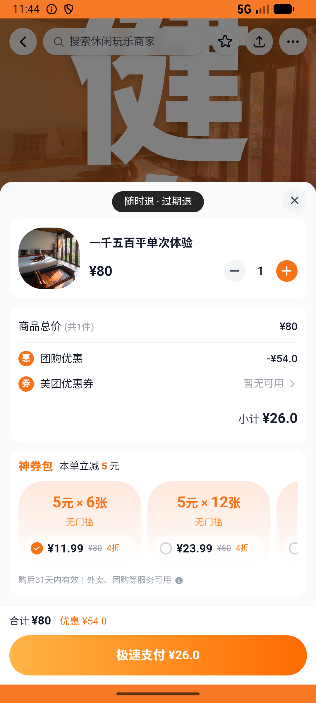

# leisure_v007_gym_monthly_refund_switch  ❌

- **Brand**: `daishushenghuo`
- **Class**: `DaishushenghuoLeisureV007GymMonthlyRefundSwitchTask`
- **Pass@3**: **0/3**  (score = 0.00)
- **Elapsed**: 368s (~6.1 min)
- **Model**: `doubao-seed-2-0-lite-260428`
- **Raw log**: [./raw_logs/DaishushenghuoLeisureV007GymMonthlyRefundSwitchTask.log](./raw_logs/DaishushenghuoLeisureV007GymMonthlyRefundSwitchTask.log)
- **Generated**: 2026-07-11T17:36:28+08:00

## Task Goal

> 反悔威尔仕健身月卡：把已支付的威尔仕「【月卡】不限时健身畅练」申请退款，再去夏威夷24h健身买 1 张「一千五百平单次体验」并支付（数量就 1 张，不要多买）

## System Prompt

<details>
<summary>展开查看完整 System Prompt</summary>


> You are provided with a task description, a history of previous actions, and corresponding screenshots. Your goal is to perform the next action to complete the task. Please note that if performing the same action multiple times results in a static screen with no changes, you should attempt a modified or alternative action.
> 
> ---
> 
> ## Function Definition
> 
> - `clarify` — Ask the user for more information to complete the task.
> - `click` — Mouse left single click action.
> - `double_click` — Mouse left double click action.
> - `drag` — Perform a drag action from the start point to the end point. Typically used for swiping or selecting elements.
> - `long_press` — Perform a long press action at the specified coordinates.
> - `open_app` — Open the specified application.
> - `press_back` — Press the back button.
> - `press_enter` — Press the enter key.
> - `press_home` — Press the home button.
> - `take_notes` — Take notes and report the result in the specified content.
> - `type` — Type the specified content. You should manually delete any text from the input box that you want to remove.
> - `wait` — Wait for a certain period of time.

</details>

## User Query

> 请在 com.daishushenghuo 里面完成以下任务：
> 反悔威尔仕健身月卡：把已支付的威尔仕「【月卡】不限时健身畅练」申请退款，再去夏威夷24h健身买 1 张「一千五百平单次体验」并支付（数量就 1 张，不要多买）

## Attempts

| # | Outcome | Steps | Terminated | Reason | Start → End |
|---|---------|-------|------------|--------|-------------|
| 1 | ❌ failed | 13 | answer | 夏威夷一千五百平单次体验已支付团购订单存在: 未找到夏威夷24h健身（安荟邻店）「一千五百平单次体验」的已支付团购订单; 夏威夷订单金额 = ¥26.00: 预期 ¥26，实际 ¥; 夏威夷订单 paid_at 不为空: expected: not nil      got... | 2026-07-11 15:07:22 → 2026-07-11 15:09:25 |
| 2 | ❌ failed | 14 | answer | 夏威夷一千五百平单次体验已支付团购订单存在: 未找到夏威夷24h健身（安荟邻店）「一千五百平单次体验」的已支付团购订单; 夏威夷订单金额 = ¥26.00: 预期 ¥26，实际 ¥; 夏威夷订单 paid_at 不为空: expected: not nil      got... | 2026-07-11 15:09:25 → 2026-07-11 15:11:34 |
| 3 | ❌ failed | 13 | answer | 夏威夷一千五百平单次体验已支付团购订单存在: 未找到夏威夷24h健身（安荟邻店）「一千五百平单次体验」的已支付团购订单; 夏威夷订单金额 = ¥26.00: 预期 ¥26，实际 ¥; 夏威夷订单 paid_at 不为空: expected: not nil      got... | 2026-07-11 15:11:34 → 2026-07-11 15:13:30 |

## Failure Details

### Episode 1 — ❌ failed

- steps_used: `13`
- terminated_reason: `answer`
- reason:

  ```
  夏威夷一千五百平单次体验已支付团购订单存在: 未找到夏威夷24h健身（安荟邻店）「一千五百平单次体验」的已支付团购订单; 夏威夷订单金额 = ¥26.00: 预期 ¥26，实际 ¥; 夏威夷订单 paid_at 不为空: expected: not nil
       got: nil; 夏威夷订单 order_type = group_deal: 
  expected: "group_deal"
       got: nil
  
  (compared using ==)
  ```
- death shot: 
  - state: [`./screenshots/DaishushenghuoLeisureV007GymMonthlyRefundSwitchTask/episode_001/step_013.json`](./screenshots/DaishushenghuoLeisureV007GymMonthlyRefundSwitchTask/episode_001/step_013.json)
  - digest: [`episode_digest.md`](./screenshots/DaishushenghuoLeisureV007GymMonthlyRefundSwitchTask/episode_001/episode_digest.md)

### Episode 2 — ❌ failed

- steps_used: `14`
- terminated_reason: `answer`
- reason:

  ```
  夏威夷一千五百平单次体验已支付团购订单存在: 未找到夏威夷24h健身（安荟邻店）「一千五百平单次体验」的已支付团购订单; 夏威夷订单金额 = ¥26.00: 预期 ¥26，实际 ¥; 夏威夷订单 paid_at 不为空: expected: not nil
       got: nil; 夏威夷订单 order_type = group_deal: 
  expected: "group_deal"
       got: nil
  
  (compared using ==)
  ```
- death shot: 
  - state: [`./screenshots/DaishushenghuoLeisureV007GymMonthlyRefundSwitchTask/episode_002/step_014.json`](./screenshots/DaishushenghuoLeisureV007GymMonthlyRefundSwitchTask/episode_002/step_014.json)
  - digest: [`episode_digest.md`](./screenshots/DaishushenghuoLeisureV007GymMonthlyRefundSwitchTask/episode_002/episode_digest.md)

### Episode 3 — ❌ failed

- steps_used: `13`
- terminated_reason: `answer`
- reason:

  ```
  夏威夷一千五百平单次体验已支付团购订单存在: 未找到夏威夷24h健身（安荟邻店）「一千五百平单次体验」的已支付团购订单; 夏威夷订单金额 = ¥26.00: 预期 ¥26，实际 ¥; 夏威夷订单 paid_at 不为空: expected: not nil
       got: nil; 夏威夷订单 order_type = group_deal: 
  expected: "group_deal"
       got: nil
  
  (compared using ==)
  ```
- death shot: 
  - state: [`./screenshots/DaishushenghuoLeisureV007GymMonthlyRefundSwitchTask/episode_003/step_013.json`](./screenshots/DaishushenghuoLeisureV007GymMonthlyRefundSwitchTask/episode_003/step_013.json)
  - digest: [`episode_digest.md`](./screenshots/DaishushenghuoLeisureV007GymMonthlyRefundSwitchTask/episode_003/episode_digest.md)

---

> 本摘要由 `sengclaw/scripts/pipeline/log_summarizer.py` 自动生成。 原始完整 log 见上方 Raw log 链接（含每 step 的 messages / tool_call / screenshot 引用）。
