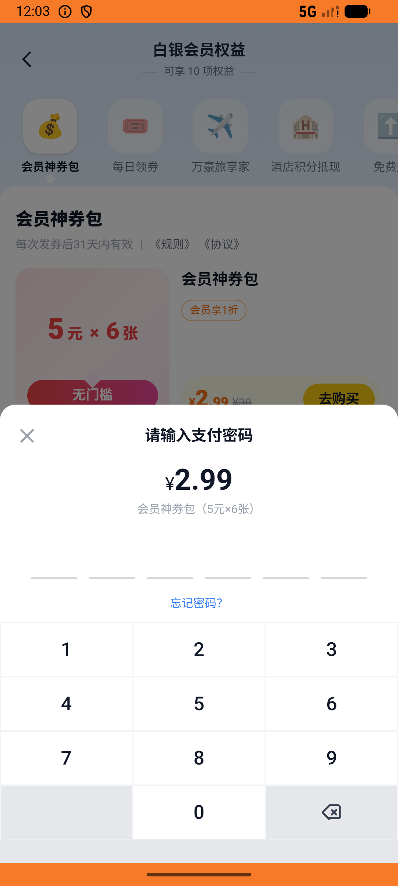

# membership_v008_benefit_detail_then_buy_pack_use  ❌

- **Brand**: `daishushenghuo`
- **Class**: `DaishushenghuoMembershipV008BenefitDetailThenBuyPackUseTask`
- **Pass@3**: **0/3**  (score = 0.00)
- **Elapsed**: 1389s (~23.1 min)
- **Model**: `doubao-seed-2-0-lite-260428`
- **Raw log**: [./raw_logs/DaishushenghuoMembershipV008BenefitDetailThenBuyPackUseTask.log](./raw_logs/DaishushenghuoMembershipV008BenefitDetailThenBuyPackUseTask.log)
- **Generated**: 2026-07-11T17:36:31+08:00

## Task Goal

> 买一份白银神券包并支付（可在「我的→会员中心→神券包」入口购买），然后去喜茶下一单：多肉葡萄 + 阿华田厚茶，用 1 张刚发的神券抵扣，默认地址支付

## System Prompt

<details>
<summary>展开查看完整 System Prompt</summary>


> You are provided with a task description, a history of previous actions, and corresponding screenshots. Your goal is to perform the next action to complete the task. Please note that if performing the same action multiple times results in a static screen with no changes, you should attempt a modified or alternative action.
> 
> ---
> 
> ## Function Definition
> 
> - `clarify` — Ask the user for more information to complete the task.
> - `click` — Mouse left single click action.
> - `double_click` — Mouse left double click action.
> - `drag` — Perform a drag action from the start point to the end point. Typically used for swiping or selecting elements.
> - `long_press` — Perform a long press action at the specified coordinates.
> - `open_app` — Open the specified application.
> - `press_back` — Press the back button.
> - `press_enter` — Press the enter key.
> - `press_home` — Press the home button.
> - `take_notes` — Take notes and report the result in the specified content.
> - `type` — Type the specified content. You should manually delete any text from the input box that you want to remove.
> - `wait` — Wait for a certain period of time.

</details>

## User Query

> 请在 com.daishushenghuo 里面完成以下任务：
> 买一份白银神券包并支付（可在「我的→会员中心→神券包」入口购买），然后去喜茶下一单：多肉葡萄 + 阿华田厚茶，用 1 张刚发的神券抵扣，默认地址支付

## Attempts

| # | Outcome | Steps | Terminated | Reason | Start → End |
|---|---------|-------|------------|--------|-------------|
| 1 | ❌ failed | 6 | answer | 神券包订单已支付且发放 6 张优惠券: 未找到已支付的神券包订单; 喜茶订单已支付: 未找到喜茶已支付订单; 喜茶订单含多肉葡萄 + 阿华田厚茶: 未找到喜茶已支付订单; 喜茶订单使用了神券包发放的券: 未找到喜茶已支付订单; 喜茶订单 coupon_discount = ... | 2026-07-11 16:20:29 → 2026-07-11 16:21:18 |
| 2 | ❌ failed | 6 | answer | 神券包订单已支付且发放 6 张优惠券: 未找到已支付的神券包订单; 喜茶订单已支付: 未找到喜茶已支付订单; 喜茶订单含多肉葡萄 + 阿华田厚茶: 未找到喜茶已支付订单; 喜茶订单使用了神券包发放的券: 未找到喜茶已支付订单; 喜茶订单 coupon_discount = ... | 2026-07-11 16:21:18 → 2026-07-11 16:22:08 |
| 3 | ⏰ timeout | 80 | max_steps | 神券包订单已支付且发放 6 张优惠券: 未找到已支付的神券包订单; 喜茶订单已支付: 未找到喜茶已支付订单; 喜茶订单含多肉葡萄 + 阿华田厚茶: 未找到喜茶已支付订单; 喜茶订单使用了神券包发放的券: 未找到喜茶已支付订单; 喜茶订单 coupon_discount = ... | 2026-07-11 16:22:08 → 2026-07-11 16:43:38 |

## Failure Details

### Episode 1 — ❌ failed

- steps_used: `6`
- terminated_reason: `answer`
- reason:

  ```
  神券包订单已支付且发放 6 张优惠券: 未找到已支付的神券包订单; 喜茶订单已支付: 未找到喜茶已支付订单; 喜茶订单含多肉葡萄 + 阿华田厚茶: 未找到喜茶已支付订单; 喜茶订单使用了神券包发放的券: 未找到喜茶已支付订单; 喜茶订单 coupon_discount = 5: 未找到喜茶已支付订单
  ```
- death shot: 
  - state: [`./screenshots/DaishushenghuoMembershipV008BenefitDetailThenBuyPackUseTask/episode_001/step_006.json`](./screenshots/DaishushenghuoMembershipV008BenefitDetailThenBuyPackUseTask/episode_001/step_006.json)
  - digest: [`episode_digest.md`](./screenshots/DaishushenghuoMembershipV008BenefitDetailThenBuyPackUseTask/episode_001/episode_digest.md)

### Episode 2 — ❌ failed

- steps_used: `6`
- terminated_reason: `answer`
- reason:

  ```
  神券包订单已支付且发放 6 张优惠券: 未找到已支付的神券包订单; 喜茶订单已支付: 未找到喜茶已支付订单; 喜茶订单含多肉葡萄 + 阿华田厚茶: 未找到喜茶已支付订单; 喜茶订单使用了神券包发放的券: 未找到喜茶已支付订单; 喜茶订单 coupon_discount = 5: 未找到喜茶已支付订单
  ```
- death shot: 
  - state: [`./screenshots/DaishushenghuoMembershipV008BenefitDetailThenBuyPackUseTask/episode_002/step_006.json`](./screenshots/DaishushenghuoMembershipV008BenefitDetailThenBuyPackUseTask/episode_002/step_006.json)
  - digest: [`episode_digest.md`](./screenshots/DaishushenghuoMembershipV008BenefitDetailThenBuyPackUseTask/episode_002/episode_digest.md)

### Episode 3 — ⏰ timeout

- steps_used: `80`
- terminated_reason: `max_steps`
- reason:

  ```
  神券包订单已支付且发放 6 张优惠券: 未找到已支付的神券包订单; 喜茶订单已支付: 未找到喜茶已支付订单; 喜茶订单含多肉葡萄 + 阿华田厚茶: 未找到喜茶已支付订单; 喜茶订单使用了神券包发放的券: 未找到喜茶已支付订单; 喜茶订单 coupon_discount = 5: 未找到喜茶已支付订单
  ```
- death shot: 
  - state: [`./screenshots/DaishushenghuoMembershipV008BenefitDetailThenBuyPackUseTask/episode_003/step_080.json`](./screenshots/DaishushenghuoMembershipV008BenefitDetailThenBuyPackUseTask/episode_003/step_080.json)
  - digest: [`episode_digest.md`](./screenshots/DaishushenghuoMembershipV008BenefitDetailThenBuyPackUseTask/episode_003/episode_digest.md)

---

> 本摘要由 `sengclaw/scripts/pipeline/log_summarizer.py` 自动生成。 原始完整 log 见上方 Raw log 链接（含每 step 的 messages / tool_call / screenshot 引用）。
