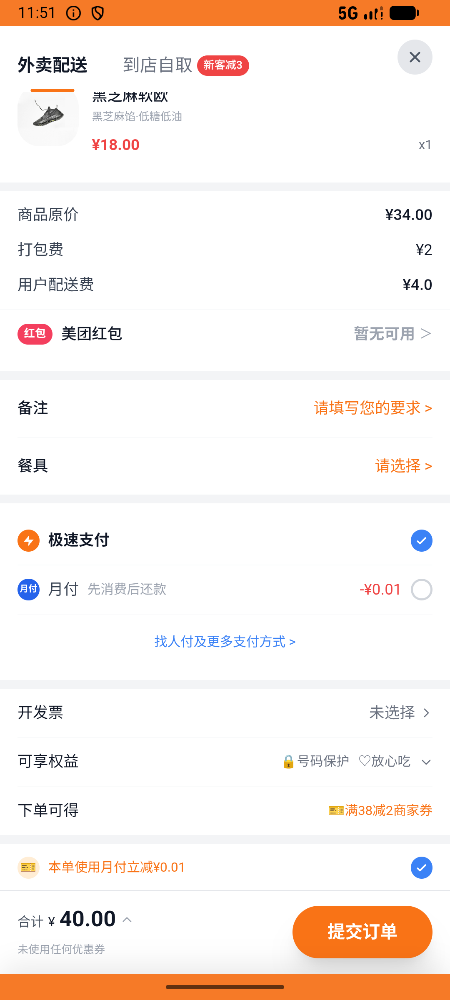
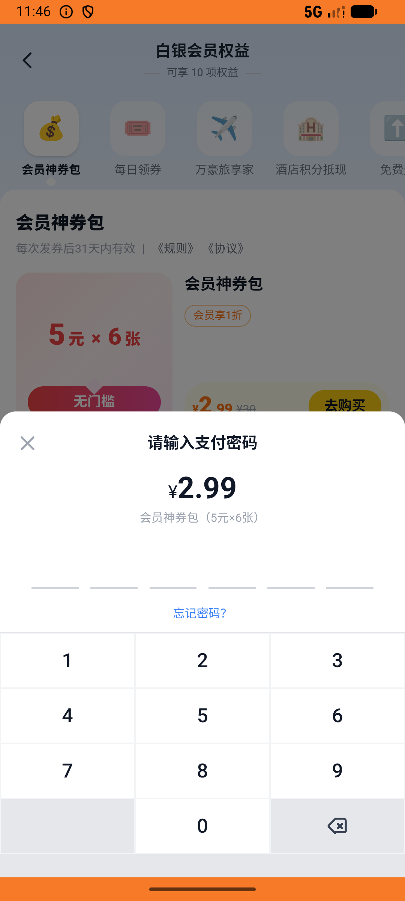

# messages_v008_chat_then_pack_coupon_order  ❌

- **Brand**: `daishushenghuo`
- **Class**: `DaishushenghuoMessagesV008ChatThenPackCouponOrderTask`
- **Pass@3**: **0/3**  (score = 0.00)
- **Elapsed**: 916s (~15.3 min)
- **Model**: `doubao-seed-2-0-lite-260428`
- **Raw log**: [./raw_logs/DaishushenghuoMessagesV008ChatThenPackCouponOrderTask.log](./raw_logs/DaishushenghuoMessagesV008ChatThenPackCouponOrderTask.log)
- **Generated**: 2026-07-11T17:36:32+08:00

## Task Goal

> 私信原麦山丘问几点出炉，再到「我的→会员中心→神券包」买一份白银神券包并支付，最后用刚发的 1 张神券抵扣去原麦山丘下蔓越莓贝果（不够起送可凑单）

## System Prompt

<details>
<summary>展开查看完整 System Prompt</summary>


> You are provided with a task description, a history of previous actions, and corresponding screenshots. Your goal is to perform the next action to complete the task. Please note that if performing the same action multiple times results in a static screen with no changes, you should attempt a modified or alternative action.
> 
> ---
> 
> ## Function Definition
> 
> - `clarify` — Ask the user for more information to complete the task.
> - `click` — Mouse left single click action.
> - `double_click` — Mouse left double click action.
> - `drag` — Perform a drag action from the start point to the end point. Typically used for swiping or selecting elements.
> - `long_press` — Perform a long press action at the specified coordinates.
> - `open_app` — Open the specified application.
> - `press_back` — Press the back button.
> - `press_enter` — Press the enter key.
> - `press_home` — Press the home button.
> - `take_notes` — Take notes and report the result in the specified content.
> - `type` — Type the specified content. You should manually delete any text from the input box that you want to remove.
> - `wait` — Wait for a certain period of time.

</details>

## User Query

> 请在 com.daishushenghuo 里面完成以下任务：
> 私信原麦山丘问几点出炉，再到「我的→会员中心→神券包」买一份白银神券包并支付，最后用刚发的 1 张神券抵扣去原麦山丘下蔓越莓贝果（不够起送可凑单）

## Attempts

| # | Outcome | Steps | Terminated | Reason | Start → End |
|---|---------|-------|------------|--------|-------------|
| 1 | ❌ failed | 52 | answer | 神券包订单已支付且发出 6 张券: 未找到已支付的神券包订单 | 2026-07-11 17:21:07 → 2026-07-11 17:30:25 |
| 2 | ❌ failed | 22 | answer | 神券包订单已支付且发出 6 张券: 未找到已支付的神券包订单 | 2026-07-11 17:30:25 → 2026-07-11 17:34:08 |
| 3 | ❌ failed | 16 | answer | 神券包订单已支付且发出 6 张券: 未找到已支付的神券包订单 | 2026-07-11 17:34:08 → 2026-07-11 17:36:23 |

## Failure Details

### Episode 1 — ❌ failed

- steps_used: `52`
- terminated_reason: `answer`
- reason:

  ```
  神券包订单已支付且发出 6 张券: 未找到已支付的神券包订单
  ```
- death shot: 
  - state: [`./screenshots/DaishushenghuoMessagesV008ChatThenPackCouponOrderTask/episode_001/step_052.json`](./screenshots/DaishushenghuoMessagesV008ChatThenPackCouponOrderTask/episode_001/step_052.json)
  - digest: [`episode_digest.md`](./screenshots/DaishushenghuoMessagesV008ChatThenPackCouponOrderTask/episode_001/episode_digest.md)

### Episode 2 — ❌ failed

- steps_used: `22`
- terminated_reason: `answer`
- reason:

  ```
  神券包订单已支付且发出 6 张券: 未找到已支付的神券包订单
  ```
- death shot: 
  - state: [`./screenshots/DaishushenghuoMessagesV008ChatThenPackCouponOrderTask/episode_002/step_022.json`](./screenshots/DaishushenghuoMessagesV008ChatThenPackCouponOrderTask/episode_002/step_022.json)
  - digest: [`episode_digest.md`](./screenshots/DaishushenghuoMessagesV008ChatThenPackCouponOrderTask/episode_002/episode_digest.md)

### Episode 3 — ❌ failed

- steps_used: `16`
- terminated_reason: `answer`
- reason:

  ```
  神券包订单已支付且发出 6 张券: 未找到已支付的神券包订单
  ```
- death shot: 
  - state: [`./screenshots/DaishushenghuoMessagesV008ChatThenPackCouponOrderTask/episode_003/step_016.json`](./screenshots/DaishushenghuoMessagesV008ChatThenPackCouponOrderTask/episode_003/step_016.json)
  - digest: [`episode_digest.md`](./screenshots/DaishushenghuoMessagesV008ChatThenPackCouponOrderTask/episode_003/episode_digest.md)

---

> 本摘要由 `sengclaw/scripts/pipeline/log_summarizer.py` 自动生成。 原始完整 log 见上方 Raw log 链接（含每 step 的 messages / tool_call / screenshot 引用）。
