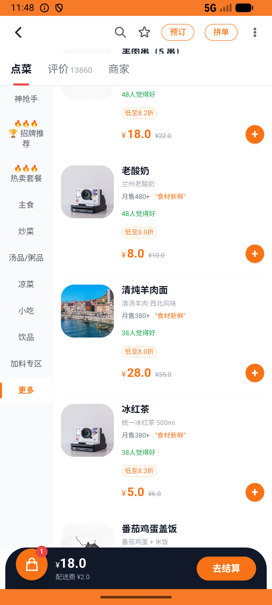

# flow_v011_late_night_meal_laowang  ❌

- **Brand**: `daishushenghuo`
- **Class**: `DaishushenghuoFlowV011LateNightMealLaowangTask`
- **Pass@3**: **0/3**  (score = 0.00)
- **Elapsed**: 935s (~15.6 min)
- **Model**: `doubao-seed-2-0-lite-260428`
- **Raw log**: [./raw_logs/DaishushenghuoFlowV011LateNightMealLaowangTask.log](./raw_logs/DaishushenghuoFlowV011LateNightMealLaowangTask.log)
- **Generated**: 2026-07-13T10:28:56+08:00
- **Note**: backfilled from /tmp/pass_at_3_full_<ts>/ on 2026-05-02

## Task Goal

> 在兰州拉面国贸店下单 1 份招牌牛肉拉面 + 1 份凉拌牛肉，送世纪花园，备注加辣，不用券，支付；再加入兰州拉面国贸店粉丝群（店铺页右上角⋯→联系商家→进群领券→加入群聊领取专属福利）并收藏这家店

## System Prompt

<details>
<summary>展开查看完整 System Prompt</summary>


> You are provided with a task description, a history of previous actions, and corresponding screenshots. Your goal is to perform the next action to complete the task. Please note that if performing the same action multiple times results in a static screen with no changes, you should attempt a modified or alternative action.
> 
> ---
> 
> ## Function Definition
> 
> - `clarify` — Ask the user for more information to complete the task.
> - `click` — Mouse left single click action.
> - `double_click` — Mouse left double click action.
> - `drag` — Perform a drag action from the start point to the end point. Typically used for swiping or selecting elements.
> - `long_press` — Perform a long press action at the specified coordinates.
> - `open_app` — Open the specified application.
> - `press_back` — Press the back button.
> - `press_enter` — Press the enter key.
> - `press_home` — Press the home button.
> - `take_notes` — Take notes and report the result in the specified content.
> - `type` — Type the specified content. You should manually delete any text from the input box that you want to remove.
> - `wait` — Wait for a certain period of time.

</details>

## User Query

> 请在 com.daishushenghuo 里面完成以下任务：
> 在兰州拉面国贸店下单 1 份招牌牛肉拉面 + 1 份凉拌牛肉，送世纪花园，备注加辣，不用券，支付；再加入兰州拉面国贸店粉丝群（店铺页右上角⋯→联系商家→进群领券→加入群聊领取专属福利）并收藏这家店

## Attempts

| # | Outcome | Steps | Terminated | Reason | Start → End |
|---|---------|-------|------------|--------|-------------|
| 1 | ❌ failed | 29 | answer | 订单里有 1 份招牌牛肉拉面: 未找到兰州拉面国贸店的订单; 订单里有 1 份凉拌牛肉: expected: not nil      got: nil; 收货地址是世纪花园: expected: not nil      got: nil; 备注里写了加辣: expect... | 2026-07-12 21:21:22 → 2026-07-12 21:25:37 |
| 2 | ❌ failed | 44 | answer | 订单里有 1 份招牌牛肉拉面: 未找到兰州拉面国贸店的订单; 订单里有 1 份凉拌牛肉: expected: not nil      got: nil; 收货地址是世纪花园: expected: not nil      got: nil; 备注里写了加辣: expect... | 2026-07-12 21:25:37 → 2026-07-12 21:32:00 |
| 3 | ❌ failed | 34 | answer | 订单里有 1 份招牌牛肉拉面: 未找到兰州拉面国贸店的订单; 订单里有 1 份凉拌牛肉: expected: not nil      got: nil; 收货地址是世纪花园: expected: not nil      got: nil; 备注里写了加辣: expect... | 2026-07-12 21:32:00 → 2026-07-12 21:36:57 |

## Failure Details

### Episode 1 — ❌ failed

- steps_used: `29`
- terminated_reason: `answer`
- reason:

  ```
  订单里有 1 份招牌牛肉拉面: 未找到兰州拉面国贸店的订单; 订单里有 1 份凉拌牛肉: expected: not nil
       got: nil; 收货地址是世纪花园: expected: not nil
       got: nil; 备注里写了加辣: expected: not nil
       got: nil; 没有使用优惠券: expected: not nil
       got: nil; 实付金额是 ¥50: expected: not nil
       got: nil; 订单已支付: expected: not nil
       got: nil; 已加入兰州拉面国贸店粉丝群: 未找到加入兰州拉面国贸店粉丝群的成员记录; 已收藏兰州拉面国贸店: 未找到对兰州拉面国贸店的收藏
  ```
- death shot: 
  - state: [`./death_shots/DaishushenghuoFlowV011LateNightMealLaowangTask/episode_001/step_029.json`](./death_shots/DaishushenghuoFlowV011LateNightMealLaowangTask/episode_001/step_029.json)
  - digest: [`episode_digest.md`](./death_shots/DaishushenghuoFlowV011LateNightMealLaowangTask/episode_001/episode_digest.md)

### Episode 2 — ❌ failed

- steps_used: `44`
- terminated_reason: `answer`
- reason:

  ```
  订单里有 1 份招牌牛肉拉面: 未找到兰州拉面国贸店的订单; 订单里有 1 份凉拌牛肉: expected: not nil
       got: nil; 收货地址是世纪花园: expected: not nil
       got: nil; 备注里写了加辣: expected: not nil
       got: nil; 没有使用优惠券: expected: not nil
       got: nil; 实付金额是 ¥50: expected: not nil
       got: nil; 订单已支付: expected: not nil
       got: nil; 已加入兰州拉面国贸店粉丝群: 未找到加入兰州拉面国贸店粉丝群的成员记录; 已收藏兰州拉面国贸店: 未找到对兰州拉面国贸店的收藏
  ```
- death shot: 
  - state: [`./death_shots/DaishushenghuoFlowV011LateNightMealLaowangTask/episode_002/step_044.json`](./death_shots/DaishushenghuoFlowV011LateNightMealLaowangTask/episode_002/step_044.json)
  - digest: [`episode_digest.md`](./death_shots/DaishushenghuoFlowV011LateNightMealLaowangTask/episode_002/episode_digest.md)

### Episode 3 — ❌ failed

- steps_used: `34`
- terminated_reason: `answer`
- reason:

  ```
  订单里有 1 份招牌牛肉拉面: 未找到兰州拉面国贸店的订单; 订单里有 1 份凉拌牛肉: expected: not nil
       got: nil; 收货地址是世纪花园: expected: not nil
       got: nil; 备注里写了加辣: expected: not nil
       got: nil; 没有使用优惠券: expected: not nil
       got: nil; 实付金额是 ¥50: expected: not nil
       got: nil; 订单已支付: expected: not nil
       got: nil; 已加入兰州拉面国贸店粉丝群: 未找到加入兰州拉面国贸店粉丝群的成员记录; 已收藏兰州拉面国贸店: 未找到对兰州拉面国贸店的收藏
  ```
- death shot: 
  - state: [`./death_shots/DaishushenghuoFlowV011LateNightMealLaowangTask/episode_003/step_034.json`](./death_shots/DaishushenghuoFlowV011LateNightMealLaowangTask/episode_003/step_034.json)
  - digest: [`episode_digest.md`](./death_shots/DaishushenghuoFlowV011LateNightMealLaowangTask/episode_003/episode_digest.md)

---

> 本摘要由 `sengclaw/scripts/pipeline/log_summarizer.py` 自动生成。 原始完整 log 见上方 Raw log 链接（含每 step 的 messages / tool_call / screenshot 引用）。
