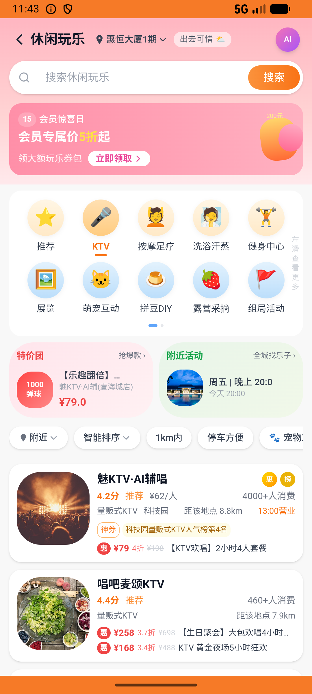

# leisure_v008_ktv_compare_lowest_pick  ❌

- **Brand**: `daishushenghuo`
- **Class**: `DaishushenghuoLeisureV008KtvCompareLowestPickTask`
- **Pass@3**: **0/3**  (score = 0.00)
- **Elapsed**: 319s (~5.3 min)
- **Model**: `doubao-seed-2-0-lite-260428`
- **Raw log**: [./raw_logs/DaishushenghuoLeisureV008KtvCompareLowestPickTask.log](./raw_logs/DaishushenghuoLeisureV008KtvCompareLowestPickTask.log)
- **Generated**: 2026-07-13T10:28:56+08:00
- **Note**: backfilled from /tmp/pass_at_3_full_<ts>/ on 2026-05-02

## Task Goal

> 在休闲玩乐里比价 KTV：唱吧麦颂KTV(望京店)、魅KTV·AI辅唱(南山科技园店)、哇噢KTV(朝阳大悦城店)三家中挑价格最低的那家下单支付，另外两家先收藏

## System Prompt

<details>
<summary>展开查看完整 System Prompt</summary>


> You are provided with a task description, a history of previous actions, and corresponding screenshots. Your goal is to perform the next action to complete the task. Please note that if performing the same action multiple times results in a static screen with no changes, you should attempt a modified or alternative action.
> 
> ---
> 
> ## Function Definition
> 
> - `clarify` — Ask the user for more information to complete the task.
> - `click` — Mouse left single click action.
> - `double_click` — Mouse left double click action.
> - `drag` — Perform a drag action from the start point to the end point. Typically used for swiping or selecting elements.
> - `long_press` — Perform a long press action at the specified coordinates.
> - `open_app` — Open the specified application.
> - `press_back` — Press the back button.
> - `press_enter` — Press the enter key.
> - `press_home` — Press the home button.
> - `take_notes` — Take notes and report the result in the specified content.
> - `type` — Type the specified content. You should manually delete any text from the input box that you want to remove.
> - `wait` — Wait for a certain period of time.

</details>

## User Query

> 请在 com.daishushenghuo 里面完成以下任务：
> 在休闲玩乐里比价 KTV：唱吧麦颂KTV(望京店)、魅KTV·AI辅唱(南山科技园店)、哇噢KTV(朝阳大悦城店)三家中挑价格最低的那家下单支付，另外两家先收藏

## Attempts

| # | Outcome | Steps | Terminated | Reason | Start → End |
|---|---------|-------|------------|--------|-------------|
| 1 | ❌ failed | 4 | answer | 魅KTV 2小时4人已支付订单存在: 未找到魅KTV·AI辅唱(南山科技园店)「【KTV欢唱】2小时4人套餐」的已支付团购订单; 魅KTV 订单金额 = ¥79.00: 预期 ¥79，实际 ¥; 魅KTV 订单 order_type = group_deal:  expec... | 2026-07-12 21:58:38 → 2026-07-12 21:59:20 |
| 2 | ❌ failed | 9 | answer | 魅KTV 2小时4人已支付订单存在: 未找到魅KTV·AI辅唱(南山科技园店)「【KTV欢唱】2小时4人套餐」的已支付团购订单; 魅KTV 订单金额 = ¥79.00: 预期 ¥79，实际 ¥; 魅KTV 订单 order_type = group_deal:  expec... | 2026-07-12 21:59:20 → 2026-07-12 22:02:35 |
| 3 | ❌ failed | 9 | answer | 魅KTV 2小时4人已支付订单存在: 未找到魅KTV·AI辅唱(南山科技园店)「【KTV欢唱】2小时4人套餐」的已支付团购订单; 魅KTV 订单金额 = ¥79.00: 预期 ¥79，实际 ¥; 魅KTV 订单 order_type = group_deal:  expec... | 2026-07-12 22:02:35 → 2026-07-12 22:03:57 |

## Failure Details

### Episode 1 — ❌ failed

- steps_used: `4`
- terminated_reason: `answer`
- reason:

  ```
  魅KTV 2小时4人已支付订单存在: 未找到魅KTV·AI辅唱(南山科技园店)「【KTV欢唱】2小时4人套餐」的已支付团购订单; 魅KTV 订单金额 = ¥79.00: 预期 ¥79，实际 ¥; 魅KTV 订单 order_type = group_deal: 
  expected: "group_deal"
       got: nil
  
  (compared using ==)
  ; 魅KTV 订单 paid_at 不为空: expected: not nil
       got: nil; 收藏「唱吧麦颂KTV(望京店)」: 未找到对唱吧麦颂KTV(望京店)的收藏; 收藏「哇噢KTV(朝阳大悦城店)」: 未找到对哇噢KTV(朝阳大悦城店)的收藏
  ```
- death shot: 
  - state: [`./death_shots/DaishushenghuoLeisureV008KtvCompareLowestPickTask/episode_001/step_004.json`](./death_shots/DaishushenghuoLeisureV008KtvCompareLowestPickTask/episode_001/step_004.json)
  - digest: [`episode_digest.md`](./death_shots/DaishushenghuoLeisureV008KtvCompareLowestPickTask/episode_001/episode_digest.md)

### Episode 2 — ❌ failed

- steps_used: `9`
- terminated_reason: `answer`
- reason:

  ```
  魅KTV 2小时4人已支付订单存在: 未找到魅KTV·AI辅唱(南山科技园店)「【KTV欢唱】2小时4人套餐」的已支付团购订单; 魅KTV 订单金额 = ¥79.00: 预期 ¥79，实际 ¥; 魅KTV 订单 order_type = group_deal: 
  expected: "group_deal"
       got: nil
  
  (compared using ==)
  ; 魅KTV 订单 paid_at 不为空: expected: not nil
       got: nil; 收藏「唱吧麦颂KTV(望京店)」: 未找到对唱吧麦颂KTV(望京店)的收藏; 收藏「哇噢KTV(朝阳大悦城店)」: 未找到对哇噢KTV(朝阳大悦城店)的收藏
  ```
- death shot: 
  - state: [`./death_shots/DaishushenghuoLeisureV008KtvCompareLowestPickTask/episode_002/step_009.json`](./death_shots/DaishushenghuoLeisureV008KtvCompareLowestPickTask/episode_002/step_009.json)
  - digest: [`episode_digest.md`](./death_shots/DaishushenghuoLeisureV008KtvCompareLowestPickTask/episode_002/episode_digest.md)

### Episode 3 — ❌ failed

- steps_used: `9`
- terminated_reason: `answer`
- reason:

  ```
  魅KTV 2小时4人已支付订单存在: 未找到魅KTV·AI辅唱(南山科技园店)「【KTV欢唱】2小时4人套餐」的已支付团购订单; 魅KTV 订单金额 = ¥79.00: 预期 ¥79，实际 ¥; 魅KTV 订单 order_type = group_deal: 
  expected: "group_deal"
       got: nil
  
  (compared using ==)
  ; 魅KTV 订单 paid_at 不为空: expected: not nil
       got: nil; 收藏「唱吧麦颂KTV(望京店)」: 未找到对唱吧麦颂KTV(望京店)的收藏; 收藏「哇噢KTV(朝阳大悦城店)」: 未找到对哇噢KTV(朝阳大悦城店)的收藏
  ```
- death shot: 
  - state: [`./death_shots/DaishushenghuoLeisureV008KtvCompareLowestPickTask/episode_003/step_009.json`](./death_shots/DaishushenghuoLeisureV008KtvCompareLowestPickTask/episode_003/step_009.json)
  - digest: [`episode_digest.md`](./death_shots/DaishushenghuoLeisureV008KtvCompareLowestPickTask/episode_003/episode_digest.md)

---

> 本摘要由 `sengclaw/scripts/pipeline/log_summarizer.py` 自动生成。 原始完整 log 见上方 Raw log 链接（含每 step 的 messages / tool_call / screenshot 引用）。
