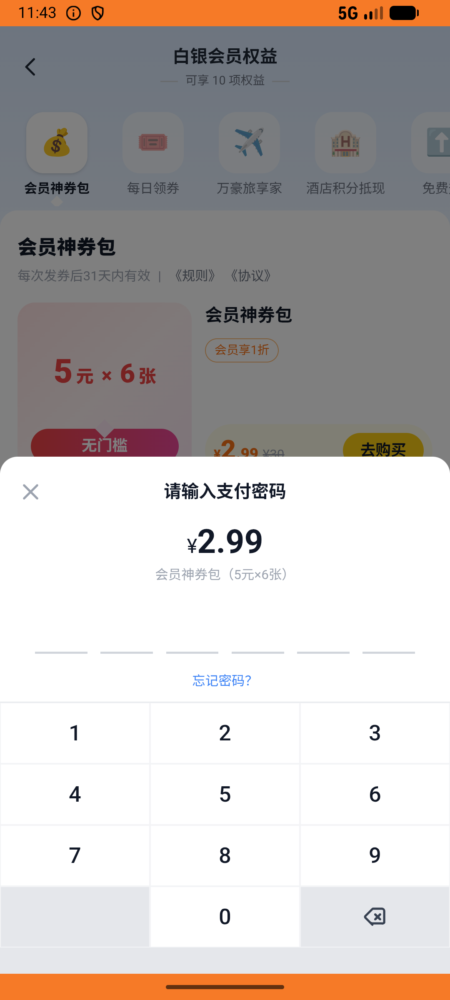

# coupon_v003_buy_and_use_platform_coupon  ❌

- **Brand**: `daishushenghuo`
- **Class**: `DaishushenghuoCouponV003BuyAndUsePlatformCouponTask`
- **Pass@3**: **0/3**  (score = 0.00)
- **Elapsed**: 125s (~2.1 min)
- **Model**: `doubao-seed-2-0-lite-260428`
- **Raw log**: [./raw_logs/DaishushenghuoCouponV003BuyAndUsePlatformCouponTask.log](./raw_logs/DaishushenghuoCouponV003BuyAndUsePlatformCouponTask.log)
- **Generated**: 2026-07-11T12:22:50+08:00
- **Note**: backfilled from /tmp/pass_at_3_full_<ts>/ on 2026-05-02

## Task Goal

> 先买一份会员神券包，再用神券到 Manner Coffee 武康路店下单一杯拿铁并支付

## System Prompt

<details>
<summary>展开查看完整 System Prompt</summary>


> You are provided with a task description, a history of previous actions, and corresponding screenshots. Your goal is to perform the next action to complete the task. Please note that if performing the same action multiple times results in a static screen with no changes, you should attempt a modified or alternative action.
> 
> ---
> 
> ## Function Definition
> 
> - `clarify` — Ask the user for more information to complete the task.
> - `click` — Mouse left single click action.
> - `double_click` — Mouse left double click action.
> - `drag` — Perform a drag action from the start point to the end point. Typically used for swiping or selecting elements.
> - `long_press` — Perform a long press action at the specified coordinates.
> - `open_app` — Open the specified application.
> - `press_back` — Press the back button.
> - `press_enter` — Press the enter key.
> - `press_home` — Press the home button.
> - `take_notes` — Take notes and report the result in the specified content.
> - `type` — Type the specified content. You should manually delete any text from the input box that you want to remove.
> - `wait` — Wait for a certain period of time.

</details>

## User Query

> 请在 com.daishushenghuo 里面完成以下任务：
> 先买一份会员神券包，再用神券到 Manner Coffee 武康路店下单一杯拿铁并支付

## Attempts

| # | Outcome | Steps | Terminated | Reason | Start → End |
|---|---------|-------|------------|--------|-------------|
| 1 | ❌ failed | 5 | answer | 神券包订单已支付（订单类型 = 神券包，状态 = 已支付）: 神券包订单状态错误：预期 paid，实际 "pending"; 已发放 6 张神券（每张 5 元，无门槛，全平台通用）: 神券数量错误：预期 6，实际 0; 在 Manner Coffee 武康路店创建了外卖订单... | 2026-07-11 03:27:10 → 2026-07-11 03:27:48 |
| 2 | ❌ failed | 5 | answer | 神券包订单已支付（订单类型 = 神券包，状态 = 已支付）: 神券包订单状态错误：预期 paid，实际 "pending"; 已发放 6 张神券（每张 5 元，无门槛，全平台通用）: 神券数量错误：预期 6，实际 0; 在 Manner Coffee 武康路店创建了外卖订单... | 2026-07-11 03:27:48 → 2026-07-11 03:28:26 |
| 3 | ❌ failed | 5 | answer | 神券包订单已支付（订单类型 = 神券包，状态 = 已支付）: 神券包订单状态错误：预期 paid，实际 "pending"; 已发放 6 张神券（每张 5 元，无门槛，全平台通用）: 神券数量错误：预期 6，实际 0; 在 Manner Coffee 武康路店创建了外卖订单... | 2026-07-11 03:28:26 → 2026-07-11 03:29:15 |

## Failure Details

### Episode 1 — ❌ failed

- steps_used: `5`
- terminated_reason: `answer`
- reason:

  ```
  神券包订单已支付（订单类型 = 神券包，状态 = 已支付）: 神券包订单状态错误：预期 paid，实际 "pending"; 已发放 6 张神券（每张 5 元，无门槛，全平台通用）: 神券数量错误：预期 6，实际 0; 在 Manner Coffee 武康路店创建了外卖订单（含拿铁，数量=1）: 未在 Manner Coffee 找到外卖订单（团购券订单不算，需通过外卖菜单加购物车下单）
  ```
- death shot: 
  - state: [`./death_shots/DaishushenghuoCouponV003BuyAndUsePlatformCouponTask/episode_001/step_005.json`](./death_shots/DaishushenghuoCouponV003BuyAndUsePlatformCouponTask/episode_001/step_005.json)
  - digest: [`episode_digest.md`](./death_shots/DaishushenghuoCouponV003BuyAndUsePlatformCouponTask/episode_001/episode_digest.md)

### Episode 2 — ❌ failed

- steps_used: `5`
- terminated_reason: `answer`
- reason:

  ```
  神券包订单已支付（订单类型 = 神券包，状态 = 已支付）: 神券包订单状态错误：预期 paid，实际 "pending"; 已发放 6 张神券（每张 5 元，无门槛，全平台通用）: 神券数量错误：预期 6，实际 0; 在 Manner Coffee 武康路店创建了外卖订单（含拿铁，数量=1）: 未在 Manner Coffee 找到外卖订单（团购券订单不算，需通过外卖菜单加购物车下单）
  ```
- death shot: 
  - state: [`./death_shots/DaishushenghuoCouponV003BuyAndUsePlatformCouponTask/episode_002/step_005.json`](./death_shots/DaishushenghuoCouponV003BuyAndUsePlatformCouponTask/episode_002/step_005.json)
  - digest: [`episode_digest.md`](./death_shots/DaishushenghuoCouponV003BuyAndUsePlatformCouponTask/episode_002/episode_digest.md)

### Episode 3 — ❌ failed

- steps_used: `5`
- terminated_reason: `answer`
- reason:

  ```
  神券包订单已支付（订单类型 = 神券包，状态 = 已支付）: 神券包订单状态错误：预期 paid，实际 "pending"; 已发放 6 张神券（每张 5 元，无门槛，全平台通用）: 神券数量错误：预期 6，实际 0; 在 Manner Coffee 武康路店创建了外卖订单（含拿铁，数量=1）: 未在 Manner Coffee 找到外卖订单（团购券订单不算，需通过外卖菜单加购物车下单）
  ```
- death shot: 
  - state: [`./death_shots/DaishushenghuoCouponV003BuyAndUsePlatformCouponTask/episode_003/step_005.json`](./death_shots/DaishushenghuoCouponV003BuyAndUsePlatformCouponTask/episode_003/step_005.json)
  - digest: [`episode_digest.md`](./death_shots/DaishushenghuoCouponV003BuyAndUsePlatformCouponTask/episode_003/episode_digest.md)

---

> 本摘要由 `sengclaw/scripts/pipeline/log_summarizer.py` 自动生成。 原始完整 log 见上方 Raw log 链接（含每 step 的 messages / tool_call / screenshot 引用）。
