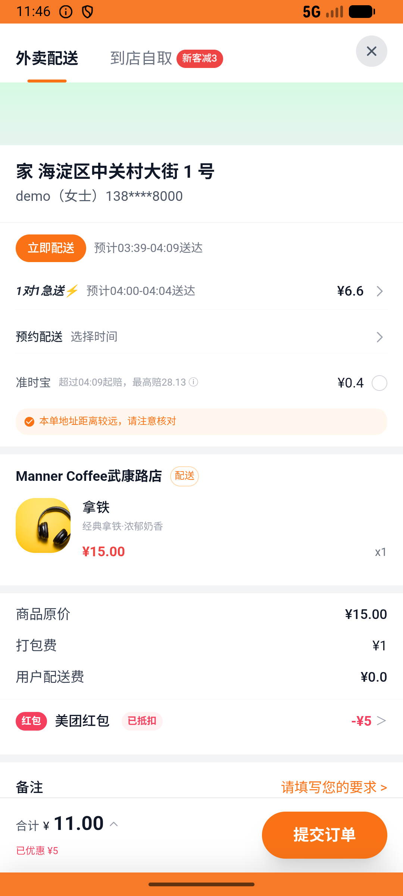

# coupon_v005_coupon_pack_order_unrefundable  ❌

- **Brand**: `daishushenghuo`
- **Class**: `DaishushenghuoCouponV005CouponPackOrderUnrefundableTask`
- **Pass@3**: **0/3**  (score = 0.00)
- **Elapsed**: 705s (~11.8 min)
- **Model**: `doubao-seed-2-0-lite-260428`
- **Raw log**: [./raw_logs/DaishushenghuoCouponV005CouponPackOrderUnrefundableTask.log](./raw_logs/DaishushenghuoCouponV005CouponPackOrderUnrefundableTask.log)
- **Generated**: 2026-07-11T12:22:50+08:00
- **Note**: backfilled from /tmp/pass_at_3_full_<ts>/ on 2026-05-02

## Task Goal

> 之前买的会员神券包用不上，帮我申请退款；要是退不了，就用其中一张到 Manner Coffee 武康路店点一杯拿铁

## System Prompt

<details>
<summary>展开查看完整 System Prompt</summary>


> You are provided with a task description, a history of previous actions, and corresponding screenshots. Your goal is to perform the next action to complete the task. Please note that if performing the same action multiple times results in a static screen with no changes, you should attempt a modified or alternative action.
> 
> ---
> 
> ## Function Definition
> 
> - `clarify` — Ask the user for more information to complete the task.
> - `click` — Mouse left single click action.
> - `double_click` — Mouse left double click action.
> - `drag` — Perform a drag action from the start point to the end point. Typically used for swiping or selecting elements.
> - `long_press` — Perform a long press action at the specified coordinates.
> - `open_app` — Open the specified application.
> - `press_back` — Press the back button.
> - `press_enter` — Press the enter key.
> - `press_home` — Press the home button.
> - `take_notes` — Take notes and report the result in the specified content.
> - `type` — Type the specified content. You should manually delete any text from the input box that you want to remove.
> - `wait` — Wait for a certain period of time.

</details>

## User Query

> 请在 com.daishushenghuo 里面完成以下任务：
> 之前买的会员神券包用不上，帮我申请退款；要是退不了，就用其中一张到 Manner Coffee 武康路店点一杯拿铁

## Attempts

| # | Outcome | Steps | Terminated | Reason | Start → End |
|---|---------|-------|------------|--------|-------------|
| 1 | ❌ failed | 29 | answer | 6 张神券共存：恰好 1 张已使用 + 5 张未使用: 已使用神券数错误：预期 1，实际 0; 在 Manner Coffee 武康路店创建了外卖订单（含拿铁，数量=1）: 未在 Manner Coffee 找到外卖订单 | 2026-07-11 03:32:32 → 2026-07-11 03:36:36 |
| 2 | ❌ failed | 28 | answer | 6 张神券共存：恰好 1 张已使用 + 5 张未使用: 已使用神券数错误：预期 1，实际 0; 在 Manner Coffee 武康路店创建了外卖订单（含拿铁，数量=1）: 未在 Manner Coffee 找到外卖订单 | 2026-07-11 03:36:36 → 2026-07-11 03:40:27 |
| 3 | ❌ failed | 29 | answer | 6 张神券共存：恰好 1 张已使用 + 5 张未使用: 已使用神券数错误：预期 1，实际 0; 在 Manner Coffee 武康路店创建了外卖订单（含拿铁，数量=1）: 未在 Manner Coffee 找到外卖订单 | 2026-07-11 03:40:27 → 2026-07-11 03:44:17 |

## Failure Details

### Episode 1 — ❌ failed

- steps_used: `29`
- terminated_reason: `answer`
- reason:

  ```
  6 张神券共存：恰好 1 张已使用 + 5 张未使用: 已使用神券数错误：预期 1，实际 0; 在 Manner Coffee 武康路店创建了外卖订单（含拿铁，数量=1）: 未在 Manner Coffee 找到外卖订单
  ```
- death shot: 
  - state: [`./death_shots/DaishushenghuoCouponV005CouponPackOrderUnrefundableTask/episode_001/step_029.json`](./death_shots/DaishushenghuoCouponV005CouponPackOrderUnrefundableTask/episode_001/step_029.json)
  - digest: [`episode_digest.md`](./death_shots/DaishushenghuoCouponV005CouponPackOrderUnrefundableTask/episode_001/episode_digest.md)

### Episode 2 — ❌ failed

- steps_used: `28`
- terminated_reason: `answer`
- reason:

  ```
  6 张神券共存：恰好 1 张已使用 + 5 张未使用: 已使用神券数错误：预期 1，实际 0; 在 Manner Coffee 武康路店创建了外卖订单（含拿铁，数量=1）: 未在 Manner Coffee 找到外卖订单
  ```
- death shot: 
  - state: [`./death_shots/DaishushenghuoCouponV005CouponPackOrderUnrefundableTask/episode_002/step_028.json`](./death_shots/DaishushenghuoCouponV005CouponPackOrderUnrefundableTask/episode_002/step_028.json)
  - digest: [`episode_digest.md`](./death_shots/DaishushenghuoCouponV005CouponPackOrderUnrefundableTask/episode_002/episode_digest.md)

### Episode 3 — ❌ failed

- steps_used: `29`
- terminated_reason: `answer`
- reason:

  ```
  6 张神券共存：恰好 1 张已使用 + 5 张未使用: 已使用神券数错误：预期 1，实际 0; 在 Manner Coffee 武康路店创建了外卖订单（含拿铁，数量=1）: 未在 Manner Coffee 找到外卖订单
  ```
- death shot: 
  - state: [`./death_shots/DaishushenghuoCouponV005CouponPackOrderUnrefundableTask/episode_003/step_029.json`](./death_shots/DaishushenghuoCouponV005CouponPackOrderUnrefundableTask/episode_003/step_029.json)
  - digest: [`episode_digest.md`](./death_shots/DaishushenghuoCouponV005CouponPackOrderUnrefundableTask/episode_003/episode_digest.md)

---

> 本摘要由 `sengclaw/scripts/pipeline/log_summarizer.py` 自动生成。 原始完整 log 见上方 Raw log 链接（含每 step 的 messages / tool_call / screenshot 引用）。
