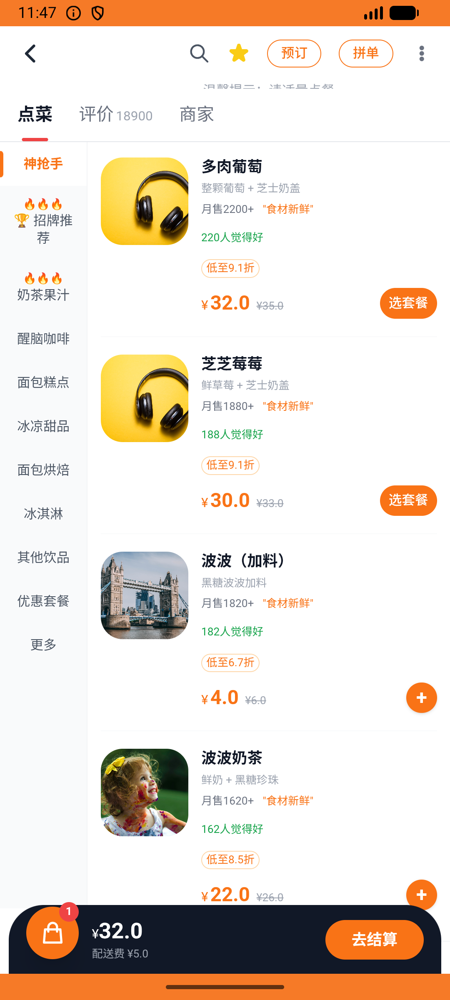

# fan_group_v003_join_laowang_fan_group  ⚠️

- **Brand**: `daishushenghuo`
- **Class**: `DaishushenghuoFanGroupV003JoinLaowangFanGroupTask`
- **Pass@3**: **1/3**  (score = 1.00)
- **Elapsed**: 557s (~9.3 min)
- **Model**: `doubao-seed-2-0-lite-260428`
- **Raw log**: [./raw_logs/DaishushenghuoFanGroupV003JoinLaowangFanGroupTask.log](./raw_logs/DaishushenghuoFanGroupV003JoinLaowangFanGroupTask.log)
- **Generated**: 2026-07-11T12:22:50+08:00
- **Note**: backfilled from /tmp/pass_at_3_full_<ts>/ on 2026-05-02

## Task Goal

> 加入喜茶粉丝群，发一条消息「多肉葡萄什么时候回归？」，再收藏喜茶店铺，并把 1 杯多肉葡萄加入购物车

## System Prompt

<details>
<summary>展开查看完整 System Prompt</summary>


> You are provided with a task description, a history of previous actions, and corresponding screenshots. Your goal is to perform the next action to complete the task. Please note that if performing the same action multiple times results in a static screen with no changes, you should attempt a modified or alternative action.
> 
> ---
> 
> ## Function Definition
> 
> - `clarify` — Ask the user for more information to complete the task.
> - `click` — Mouse left single click action.
> - `double_click` — Mouse left double click action.
> - `drag` — Perform a drag action from the start point to the end point. Typically used for swiping or selecting elements.
> - `long_press` — Perform a long press action at the specified coordinates.
> - `open_app` — Open the specified application.
> - `press_back` — Press the back button.
> - `press_enter` — Press the enter key.
> - `press_home` — Press the home button.
> - `take_notes` — Take notes and report the result in the specified content.
> - `type` — Type the specified content. You should manually delete any text from the input box that you want to remove.
> - `wait` — Wait for a certain period of time.

</details>

## User Query

> 请在 com.daishushenghuo 里面完成以下任务：
> 加入喜茶粉丝群，发一条消息「多肉葡萄什么时候回归？」，再收藏喜茶店铺，并把 1 杯多肉葡萄加入购物车

## Attempts

| # | Outcome | Steps | Terminated | Reason | Start → End |
|---|---------|-------|------------|--------|-------------|
| 1 | ❌ failed | 6 | answer | 已加入喜茶粉丝群: 未找到加入喜茶粉丝群的成员记录; 已在喜茶粉丝群发了一条消息: 未找到在喜茶粉丝群的发言; 消息内容包含「多肉葡萄」: expected: not nil      got: nil; 已收藏喜茶: 未找到对喜茶的收藏记录; 购物车里有多肉葡萄: 未找到... | 2026-07-11 04:22:57 → 2026-07-11 04:23:42 |
| 2 | ❌ failed | 36 | answer | 已加入喜茶粉丝群: 未找到加入喜茶粉丝群的成员记录; 已在喜茶粉丝群发了一条消息: 未找到在喜茶粉丝群的发言; 消息内容包含「多肉葡萄」: expected: not nil      got: nil | 2026-07-11 04:23:42 → 2026-07-11 04:28:15 |
| 3 | ✅ passed | 33 | answer | – | 2026-07-11 04:28:15 → 2026-07-11 04:32:14 |

## Failure Details

### Episode 1 — ❌ failed

- steps_used: `6`
- terminated_reason: `answer`
- reason:

  ```
  已加入喜茶粉丝群: 未找到加入喜茶粉丝群的成员记录; 已在喜茶粉丝群发了一条消息: 未找到在喜茶粉丝群的发言; 消息内容包含「多肉葡萄」: expected: not nil
       got: nil; 已收藏喜茶: 未找到对喜茶的收藏记录; 购物车里有多肉葡萄: 未找到喜茶购物车; 多肉葡萄数量 = 1: expected: not nil
       got: nil
  ```
- death shot: 
  - state: [`./death_shots/DaishushenghuoFanGroupV003JoinLaowangFanGroupTask/episode_001/step_006.json`](./death_shots/DaishushenghuoFanGroupV003JoinLaowangFanGroupTask/episode_001/step_006.json)
  - digest: [`episode_digest.md`](./death_shots/DaishushenghuoFanGroupV003JoinLaowangFanGroupTask/episode_001/episode_digest.md)

### Episode 2 — ❌ failed

- steps_used: `36`
- terminated_reason: `answer`
- reason:

  ```
  已加入喜茶粉丝群: 未找到加入喜茶粉丝群的成员记录; 已在喜茶粉丝群发了一条消息: 未找到在喜茶粉丝群的发言; 消息内容包含「多肉葡萄」: expected: not nil
       got: nil
  ```
- death shot: 
  - state: [`./death_shots/DaishushenghuoFanGroupV003JoinLaowangFanGroupTask/episode_002/step_036.json`](./death_shots/DaishushenghuoFanGroupV003JoinLaowangFanGroupTask/episode_002/step_036.json)
  - digest: [`episode_digest.md`](./death_shots/DaishushenghuoFanGroupV003JoinLaowangFanGroupTask/episode_002/episode_digest.md)

---

> 本摘要由 `sengclaw/scripts/pipeline/log_summarizer.py` 自动生成。 原始完整 log 见上方 Raw log 链接（含每 step 的 messages / tool_call / screenshot 引用）。
