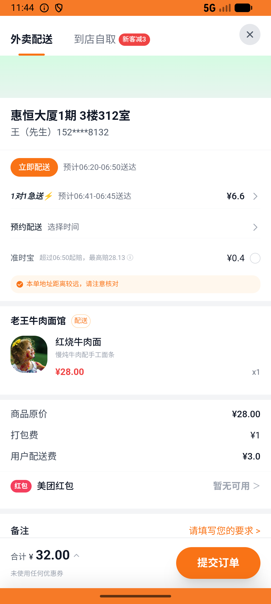

# flow_v009_review_bad_and_refund_orders  ❌

- **Brand**: `daishushenghuo`
- **Class**: `DaishushenghuoFlowV009ReviewBadAndRefundOrdersTask`
- **Pass@3**: **0/3**  (score = 0.00)
- **Elapsed**: 299s (~5.0 min)
- **Model**: `doubao-seed-2-0-lite-260428`
- **Raw log**: [./raw_logs/DaishushenghuoFlowV009ReviewBadAndRefundOrdersTask.log](./raw_logs/DaishushenghuoFlowV009ReviewBadAndRefundOrdersTask.log)
- **Generated**: 2026-07-11T12:22:50+08:00
- **Note**: backfilled from /tmp/pass_at_3_full_<ts>/ on 2026-05-02

## Task Goal

> 在老王牛肉面馆分别下一单红烧牛肉面和一单清汤牛肉面并支付，然后只把清汤牛肉面那单退款

## System Prompt

<details>
<summary>展开查看完整 System Prompt</summary>


> You are provided with a task description, a history of previous actions, and corresponding screenshots. Your goal is to perform the next action to complete the task. Please note that if performing the same action multiple times results in a static screen with no changes, you should attempt a modified or alternative action.
> 
> ---
> 
> ## Function Definition
> 
> - `clarify` — Ask the user for more information to complete the task.
> - `click` — Mouse left single click action.
> - `double_click` — Mouse left double click action.
> - `drag` — Perform a drag action from the start point to the end point. Typically used for swiping or selecting elements.
> - `long_press` — Perform a long press action at the specified coordinates.
> - `open_app` — Open the specified application.
> - `press_back` — Press the back button.
> - `press_enter` — Press the enter key.
> - `press_home` — Press the home button.
> - `take_notes` — Take notes and report the result in the specified content.
> - `type` — Type the specified content. You should manually delete any text from the input box that you want to remove.
> - `wait` — Wait for a certain period of time.

</details>

## User Query

> 请在 com.daishushenghuo 里面完成以下任务：
> 在老王牛肉面馆分别下一单红烧牛肉面和一单清汤牛肉面并支付，然后只把清汤牛肉面那单退款

## Attempts

| # | Outcome | Steps | Terminated | Reason | Start → End |
|---|---------|-------|------------|--------|-------------|
| 1 | ❌ failed | 13 | answer | 红烧牛肉面订单已创建: 未找到红烧牛肉面订单; 清汤牛肉面订单已创建: 未找到清汤牛肉面订单; 红烧牛肉面订单状态 = 已支付（未被误退）: 红烧订单状态错误：预期 'paid'，实际 nil; 清汤牛肉面订单状态 = 已退款: 清汤订单状态错误：预期 'refunded'... | 2026-07-11 06:18:34 → 2026-07-11 06:20:22 |
| 2 | ❌ failed | 13 | answer | 红烧牛肉面订单已创建: 未找到红烧牛肉面订单; 清汤牛肉面订单已创建: 未找到清汤牛肉面订单; 红烧牛肉面订单状态 = 已支付（未被误退）: 红烧订单状态错误：预期 'paid'，实际 nil; 清汤牛肉面订单状态 = 已退款: 清汤订单状态错误：预期 'refunded'... | 2026-07-11 06:20:22 → 2026-07-11 06:22:03 |
| 3 | ❌ failed | 11 | answer | 红烧牛肉面订单已创建: 未找到红烧牛肉面订单; 清汤牛肉面订单已创建: 未找到清汤牛肉面订单; 红烧牛肉面订单状态 = 已支付（未被误退）: 红烧订单状态错误：预期 'paid'，实际 nil; 清汤牛肉面订单状态 = 已退款: 清汤订单状态错误：预期 'refunded'... | 2026-07-11 06:22:03 → 2026-07-11 06:23:32 |

## Failure Details

### Episode 1 — ❌ failed

- steps_used: `13`
- terminated_reason: `answer`
- reason:

  ```
  红烧牛肉面订单已创建: 未找到红烧牛肉面订单; 清汤牛肉面订单已创建: 未找到清汤牛肉面订单; 红烧牛肉面订单状态 = 已支付（未被误退）: 红烧订单状态错误：预期 'paid'，实际 nil; 清汤牛肉面订单状态 = 已退款: 清汤订单状态错误：预期 'refunded'，实际 nil; 退款金额合理（含清汤牛肉面）: 退款金额过低：预期 >= 29.0（清汤牛肉面+配送费），实际 0.0; 两单归属一致（同 user / shop）: 
  expected: 1
       got: nil
  
  (compared using ==)
  ```
- death shot: 
  - state: [`./death_shots/DaishushenghuoFlowV009ReviewBadAndRefundOrdersTask/episode_001/step_013.json`](./death_shots/DaishushenghuoFlowV009ReviewBadAndRefundOrdersTask/episode_001/step_013.json)
  - digest: [`episode_digest.md`](./death_shots/DaishushenghuoFlowV009ReviewBadAndRefundOrdersTask/episode_001/episode_digest.md)

### Episode 2 — ❌ failed

- steps_used: `13`
- terminated_reason: `answer`
- reason:

  ```
  红烧牛肉面订单已创建: 未找到红烧牛肉面订单; 清汤牛肉面订单已创建: 未找到清汤牛肉面订单; 红烧牛肉面订单状态 = 已支付（未被误退）: 红烧订单状态错误：预期 'paid'，实际 nil; 清汤牛肉面订单状态 = 已退款: 清汤订单状态错误：预期 'refunded'，实际 nil; 退款金额合理（含清汤牛肉面）: 退款金额过低：预期 >= 29.0（清汤牛肉面+配送费），实际 0.0; 两单归属一致（同 user / shop）: 
  expected: 1
       got: nil
  
  (compared using ==)
  ```
- death shot: 
  - state: [`./death_shots/DaishushenghuoFlowV009ReviewBadAndRefundOrdersTask/episode_002/step_013.json`](./death_shots/DaishushenghuoFlowV009ReviewBadAndRefundOrdersTask/episode_002/step_013.json)
  - digest: [`episode_digest.md`](./death_shots/DaishushenghuoFlowV009ReviewBadAndRefundOrdersTask/episode_002/episode_digest.md)

### Episode 3 — ❌ failed

- steps_used: `11`
- terminated_reason: `answer`
- reason:

  ```
  红烧牛肉面订单已创建: 未找到红烧牛肉面订单; 清汤牛肉面订单已创建: 未找到清汤牛肉面订单; 红烧牛肉面订单状态 = 已支付（未被误退）: 红烧订单状态错误：预期 'paid'，实际 nil; 清汤牛肉面订单状态 = 已退款: 清汤订单状态错误：预期 'refunded'，实际 nil; 退款金额合理（含清汤牛肉面）: 退款金额过低：预期 >= 29.0（清汤牛肉面+配送费），实际 0.0; 两单归属一致（同 user / shop）: 
  expected: 1
       got: nil
  
  (compared using ==)
  ```
- death shot: 
  - state: [`./death_shots/DaishushenghuoFlowV009ReviewBadAndRefundOrdersTask/episode_003/step_011.json`](./death_shots/DaishushenghuoFlowV009ReviewBadAndRefundOrdersTask/episode_003/step_011.json)
  - digest: [`episode_digest.md`](./death_shots/DaishushenghuoFlowV009ReviewBadAndRefundOrdersTask/episode_003/episode_digest.md)

---

> 本摘要由 `sengclaw/scripts/pipeline/log_summarizer.py` 自动生成。 原始完整 log 见上方 Raw log 链接（含每 step 的 messages / tool_call / screenshot 引用）。
