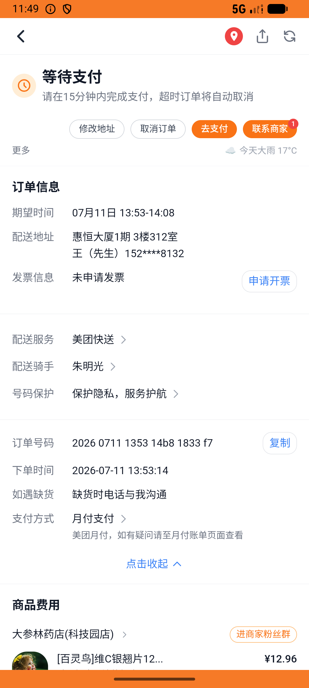
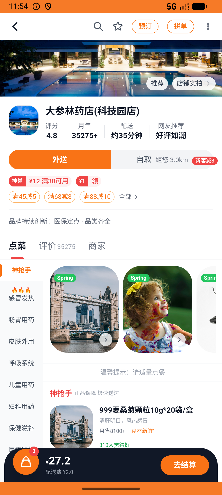

# kanbing_v043_checkout_multi_pharmacies  ⚠️

- **Brand**: `daishushenghuo`
- **Class**: `DaishushenghuoKanbingV043CheckoutMultiPharmaciesTask`
- **Pass@3**: **1/3**  (score = 1.00)
- **Elapsed**: 1468s (~24.5 min)
- **Model**: `doubao-seed-2-0-lite-260428`
- **Raw log**: [./raw_logs/DaishushenghuoKanbingV043CheckoutMultiPharmaciesTask.log](./raw_logs/DaishushenghuoKanbingV043CheckoutMultiPharmaciesTask.log)
- **Generated**: 2026-07-12T10:12:48+08:00
- **Note**: backfilled from /tmp/pass_at_3_full_<ts>/ on 2026-05-02

## Task Goal

> 从看病买药购物车一起下单：南北明华999感冒灵 + 海王星辰复方板蓝根 + 大参林维C银翘片（一次结算 3 单，下单后不要支付）

## System Prompt

<details>
<summary>展开查看完整 System Prompt</summary>


> You are provided with a task description, a history of previous actions, and corresponding screenshots. Your goal is to perform the next action to complete the task. Please note that if performing the same action multiple times results in a static screen with no changes, you should attempt a modified or alternative action.
> 
> ---
> 
> ## Function Definition
> 
> - `clarify` — Ask the user for more information to complete the task.
> - `click` — Mouse left single click action.
> - `double_click` — Mouse left double click action.
> - `drag` — Perform a drag action from the start point to the end point. Typically used for swiping or selecting elements.
> - `long_press` — Perform a long press action at the specified coordinates.
> - `open_app` — Open the specified application.
> - `press_back` — Press the back button.
> - `press_enter` — Press the enter key.
> - `press_home` — Press the home button.
> - `take_notes` — Take notes and report the result in the specified content.
> - `type` — Type the specified content. You should manually delete any text from the input box that you want to remove.
> - `wait` — Wait for a certain period of time.

</details>

## User Query

> 请在 com.daishushenghuo 里面完成以下任务：
> 从看病买药购物车一起下单：南北明华999感冒灵 + 海王星辰复方板蓝根 + 大参林维C银翘片（一次结算 3 单，下单后不要支付）

## Attempts

| # | Outcome | Steps | Terminated | Reason | Start → End |
|---|---------|-------|------------|--------|-------------|
| 1 | ❌ failed | 46 | answer | 南北明华药店订单已创建（含999感冒灵 ×1）: 数量应为 1，实际 2; 大参林药店订单已创建（含维C银翘片 ×1）: 数量应为 1，实际 2; 3 笔订单金额正确：南北明华¥14.61 + 海王¥22.44 + 大参林¥9.48 = ¥46.53: 南北明华预期 ¥14... | 2026-07-11 13:46:17 → 2026-07-11 13:53:39 |
| 2 | ⏰ timeout | 80 | max_steps | 大参林药店订单已创建（含维C银翘片 ×1）: 未找到大参林订单; 3 笔订单金额正确：南北明华¥14.61 + 海王¥22.44 + 大参林¥9.48 = ¥46.53: 南北明华预期 ¥14.61，实际 ¥26.83; 3 家药店购物车都被清空: 大参林药店(科技园店) ... | 2026-07-11 13:53:39 → 2026-07-11 14:05:22 |
| 3 | ✅ passed | 36 | answer | – | 2026-07-11 14:05:22 → 2026-07-11 14:10:45 |

## Failure Details

### Episode 1 — ❌ failed

- steps_used: `46`
- terminated_reason: `answer`
- reason:

  ```
  南北明华药店订单已创建（含999感冒灵 ×1）: 数量应为 1，实际 2; 大参林药店订单已创建（含维C银翘片 ×1）: 数量应为 1，实际 2; 3 笔订单金额正确：南北明华¥14.61 + 海王¥22.44 + 大参林¥9.48 = ¥46.53: 南北明华预期 ¥14.61，实际 ¥36.38
  ```
- death shot: 
  - state: [`./death_shots/DaishushenghuoKanbingV043CheckoutMultiPharmaciesTask/episode_001/step_046.json`](./death_shots/DaishushenghuoKanbingV043CheckoutMultiPharmaciesTask/episode_001/step_046.json)
  - digest: [`episode_digest.md`](./death_shots/DaishushenghuoKanbingV043CheckoutMultiPharmaciesTask/episode_001/episode_digest.md)

### Episode 2 — ⏰ timeout

- steps_used: `80`
- terminated_reason: `max_steps`
- reason:

  ```
  大参林药店订单已创建（含维C银翘片 ×1）: 未找到大参林订单; 3 笔订单金额正确：南北明华¥14.61 + 海王¥22.44 + 大参林¥9.48 = ¥46.53: 南北明华预期 ¥14.61，实际 ¥26.83; 3 家药店购物车都被清空: 大参林药店(科技园店) 购物车未清空，仍有 3 件商品
  ```
- death shot: 
  - state: [`./death_shots/DaishushenghuoKanbingV043CheckoutMultiPharmaciesTask/episode_002/step_080.json`](./death_shots/DaishushenghuoKanbingV043CheckoutMultiPharmaciesTask/episode_002/step_080.json)
  - digest: [`episode_digest.md`](./death_shots/DaishushenghuoKanbingV043CheckoutMultiPharmaciesTask/episode_002/episode_digest.md)

---

> 本摘要由 `sengclaw/scripts/pipeline/log_summarizer.py` 自动生成。 原始完整 log 见上方 Raw log 链接（含每 step 的 messages / tool_call / screenshot 引用）。
