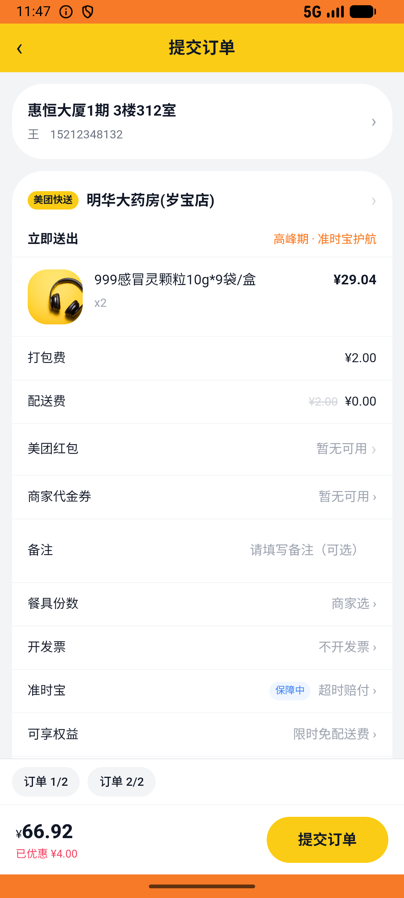

# kanbing_v045_kanbing_ai_two_pharmacies_pay  ❌

- **Brand**: `daishushenghuo`
- **Class**: `DaishushenghuoKanbingV045KanbingAiTwoPharmaciesPayTask`
- **Pass@3**: **0/3**  (score = 0.00)
- **Elapsed**: 867s (~14.4 min)
- **Model**: `doubao-seed-2-0-lite-260428`
- **Raw log**: [./raw_logs/DaishushenghuoKanbingV045KanbingAiTwoPharmaciesPayTask.log](./raw_logs/DaishushenghuoKanbingV045KanbingAiTwoPharmaciesPayTask.log)
- **Generated**: 2026-07-12T10:12:48+08:00
- **Note**: backfilled from /tmp/pass_at_3_full_<ts>/ on 2026-05-02

## Task Goal

> 感冒了：先用小团健康管家咨询，再到明华大药房+仁和大药房各买 999感冒灵（每家起送 ¥20，单盒不够可多买几盒凑单），购物车一起下单并支付

## System Prompt

<details>
<summary>展开查看完整 System Prompt</summary>


> You are provided with a task description, a history of previous actions, and corresponding screenshots. Your goal is to perform the next action to complete the task. Please note that if performing the same action multiple times results in a static screen with no changes, you should attempt a modified or alternative action.
> 
> ---
> 
> ## Function Definition
> 
> - `clarify` — Ask the user for more information to complete the task.
> - `click` — Mouse left single click action.
> - `double_click` — Mouse left double click action.
> - `drag` — Perform a drag action from the start point to the end point. Typically used for swiping or selecting elements.
> - `long_press` — Perform a long press action at the specified coordinates.
> - `open_app` — Open the specified application.
> - `press_back` — Press the back button.
> - `press_enter` — Press the enter key.
> - `press_home` — Press the home button.
> - `take_notes` — Take notes and report the result in the specified content.
> - `type` — Type the specified content. You should manually delete any text from the input box that you want to remove.
> - `wait` — Wait for a certain period of time.

</details>

## User Query

> 请在 com.daishushenghuo 里面完成以下任务：
> 感冒了：先用小团健康管家咨询，再到明华大药房+仁和大药房各买 999感冒灵（每家起送 ¥20，单盒不够可多买几盒凑单），购物车一起下单并支付

## Attempts

| # | Outcome | Steps | Terminated | Reason | Start → End |
|---|---------|-------|------------|--------|-------------|
| 1 | ❌ failed | 31 | answer | 明华大药房订单已创建（含999感冒灵 ≥ 1）: 未找到明华大药房订单; 仁和大药房订单已创建（含999感冒灵 ≥ 1）: 未找到仁和大药房订单; 明华大药房订单状态 = paid: 预期 'paid'，实际 nil; 仁和大药房订单状态 = paid: 预期 'paid'... | 2026-07-11 14:26:28 → 2026-07-11 14:30:47 |
| 2 | ❌ failed | 33 | answer | 明华大药房订单已创建（含999感冒灵 ≥ 1）: 未找到明华大药房订单; 仁和大药房订单已创建（含999感冒灵 ≥ 1）: 未找到仁和大药房订单; 明华大药房订单状态 = paid: 预期 'paid'，实际 nil; 仁和大药房订单状态 = paid: 预期 'paid'... | 2026-07-11 14:30:47 → 2026-07-11 14:35:58 |
| 3 | ❌ failed | 35 | answer | 明华大药房订单已创建（含999感冒灵 ≥ 1）: 未找到明华大药房订单; 仁和大药房订单已创建（含999感冒灵 ≥ 1）: 未找到仁和大药房订单; 明华大药房订单状态 = paid: 预期 'paid'，实际 nil; 仁和大药房订单状态 = paid: 预期 'paid'... | 2026-07-11 14:35:58 → 2026-07-11 14:40:55 |

## Failure Details

### Episode 1 — ❌ failed

- steps_used: `31`
- terminated_reason: `answer`
- reason:

  ```
  明华大药房订单已创建（含999感冒灵 ≥ 1）: 未找到明华大药房订单; 仁和大药房订单已创建（含999感冒灵 ≥ 1）: 未找到仁和大药房订单; 明华大药房订单状态 = paid: 预期 'paid'，实际 nil; 仁和大药房订单状态 = paid: 预期 'paid'，实际 nil; 明华大药房订单金额满足起送（≥ ¥20）: 预期 ≥ ¥20.0，实际 ¥; 仁和大药房订单金额满足起送（≥ ¥20）: 预期 ≥ ¥20.0，实际 ¥; 两笔订单 paid_at 都已记录: 明华订单 paid_at 为空; 两家药房购物车都被清空: 明华大药房(岁宝店) 购物车未清空，仍有 1 件商品
  ```
- death shot: 
  - state: [`./death_shots/DaishushenghuoKanbingV045KanbingAiTwoPharmaciesPayTask/episode_001/step_031.json`](./death_shots/DaishushenghuoKanbingV045KanbingAiTwoPharmaciesPayTask/episode_001/step_031.json)
  - digest: [`episode_digest.md`](./death_shots/DaishushenghuoKanbingV045KanbingAiTwoPharmaciesPayTask/episode_001/episode_digest.md)

### Episode 2 — ❌ failed

- steps_used: `33`
- terminated_reason: `answer`
- reason:

  ```
  明华大药房订单已创建（含999感冒灵 ≥ 1）: 未找到明华大药房订单; 仁和大药房订单已创建（含999感冒灵 ≥ 1）: 未找到仁和大药房订单; 明华大药房订单状态 = paid: 预期 'paid'，实际 nil; 仁和大药房订单状态 = paid: 预期 'paid'，实际 nil; 明华大药房订单金额满足起送（≥ ¥20）: 预期 ≥ ¥20.0，实际 ¥; 仁和大药房订单金额满足起送（≥ ¥20）: 预期 ≥ ¥20.0，实际 ¥; 两笔订单 paid_at 都已记录: 明华订单 paid_at 为空; 两家药房购物车都被清空: 明华大药房(岁宝店) 购物车未清空，仍有 1 件商品
  ```
- death shot: 
  - state: [`./death_shots/DaishushenghuoKanbingV045KanbingAiTwoPharmaciesPayTask/episode_002/step_033.json`](./death_shots/DaishushenghuoKanbingV045KanbingAiTwoPharmaciesPayTask/episode_002/step_033.json)
  - digest: [`episode_digest.md`](./death_shots/DaishushenghuoKanbingV045KanbingAiTwoPharmaciesPayTask/episode_002/episode_digest.md)

### Episode 3 — ❌ failed

- steps_used: `35`
- terminated_reason: `answer`
- reason:

  ```
  明华大药房订单已创建（含999感冒灵 ≥ 1）: 未找到明华大药房订单; 仁和大药房订单已创建（含999感冒灵 ≥ 1）: 未找到仁和大药房订单; 明华大药房订单状态 = paid: 预期 'paid'，实际 nil; 仁和大药房订单状态 = paid: 预期 'paid'，实际 nil; 明华大药房订单金额满足起送（≥ ¥20）: 预期 ≥ ¥20.0，实际 ¥; 仁和大药房订单金额满足起送（≥ ¥20）: 预期 ≥ ¥20.0，实际 ¥; 两笔订单 paid_at 都已记录: 明华订单 paid_at 为空; 两家药房购物车都被清空: 明华大药房(岁宝店) 购物车未清空，仍有 1 件商品
  ```
- death shot: 
  - state: [`./death_shots/DaishushenghuoKanbingV045KanbingAiTwoPharmaciesPayTask/episode_003/step_035.json`](./death_shots/DaishushenghuoKanbingV045KanbingAiTwoPharmaciesPayTask/episode_003/step_035.json)
  - digest: [`episode_digest.md`](./death_shots/DaishushenghuoKanbingV045KanbingAiTwoPharmaciesPayTask/episode_003/episode_digest.md)

---

> 本摘要由 `sengclaw/scripts/pipeline/log_summarizer.py` 自动生成。 原始完整 log 见上方 Raw log 链接（含每 step 的 messages / tool_call / screenshot 引用）。
