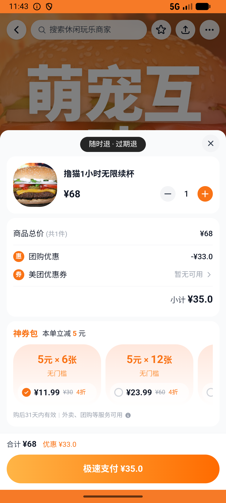

# leisure_v006_girlfriend_day_out  ❌

- **Brand**: `daishushenghuo`
- **Class**: `DaishushenghuoLeisureV006GirlfriendDayOutTask`
- **Pass@3**: **0/3**  (score = 0.00)
- **Elapsed**: 218s (~3.6 min)
- **Model**: `doubao-seed-2-0-lite-260428`
- **Raw log**: [./raw_logs/DaishushenghuoLeisureV006GirlfriendDayOutTask.log](./raw_logs/DaishushenghuoLeisureV006GirlfriendDayOutTask.log)
- **Generated**: 2026-07-12T10:12:48+08:00
- **Note**: backfilled from /tmp/pass_at_3_full_<ts>/ on 2026-05-02

## Task Goal

> 闺蜜下午组局：先去猫咪森林·萌宠互动馆撸猫1小时（顺手收藏这家店），再到锦时汉服体验馆故宫店做汉服单人体验+妆造，两单都立即支付

## System Prompt

<details>
<summary>展开查看完整 System Prompt</summary>


> You are provided with a task description, a history of previous actions, and corresponding screenshots. Your goal is to perform the next action to complete the task. Please note that if performing the same action multiple times results in a static screen with no changes, you should attempt a modified or alternative action.
> 
> ---
> 
> ## Function Definition
> 
> - `clarify` — Ask the user for more information to complete the task.
> - `click` — Mouse left single click action.
> - `double_click` — Mouse left double click action.
> - `drag` — Perform a drag action from the start point to the end point. Typically used for swiping or selecting elements.
> - `long_press` — Perform a long press action at the specified coordinates.
> - `open_app` — Open the specified application.
> - `press_back` — Press the back button.
> - `press_enter` — Press the enter key.
> - `press_home` — Press the home button.
> - `take_notes` — Take notes and report the result in the specified content.
> - `type` — Type the specified content. You should manually delete any text from the input box that you want to remove.
> - `wait` — Wait for a certain period of time.

</details>

## User Query

> 请在 com.daishushenghuo 里面完成以下任务：
> 闺蜜下午组局：先去猫咪森林·萌宠互动馆撸猫1小时（顺手收藏这家店），再到锦时汉服体验馆故宫店做汉服单人体验+妆造，两单都立即支付

## Attempts

| # | Outcome | Steps | Terminated | Reason | Start → End |
|---|---------|-------|------------|--------|-------------|
| 1 | ❌ failed | 9 | answer | 猫咪森林撸猫1小时已支付团购订单存在: 未找到猫咪森林·萌宠互动馆「撸猫1小时无限续杯」的已支付团购订单; 锦时汉服单人体验已支付团购订单存在: 未找到锦时汉服体验馆「【单人体验】汉服+简单妆造」的已支付团购订单; 两笔订单金额正确（猫咪¥35 + 汉服¥88）: 猫咪订单... | 2026-07-11 15:03:04 → 2026-07-11 15:04:18 |
| 2 | ❌ failed | 9 | answer | 猫咪森林撸猫1小时已支付团购订单存在: 未找到猫咪森林·萌宠互动馆「撸猫1小时无限续杯」的已支付团购订单; 锦时汉服单人体验已支付团购订单存在: 未找到锦时汉服体验馆「【单人体验】汉服+简单妆造」的已支付团购订单; 两笔订单金额正确（猫咪¥35 + 汉服¥88）: 猫咪订单... | 2026-07-11 15:04:18 → 2026-07-11 15:05:30 |
| 3 | ❌ failed | 9 | answer | 猫咪森林撸猫1小时已支付团购订单存在: 未找到猫咪森林·萌宠互动馆「撸猫1小时无限续杯」的已支付团购订单; 锦时汉服单人体验已支付团购订单存在: 未找到锦时汉服体验馆「【单人体验】汉服+简单妆造」的已支付团购订单; 两笔订单金额正确（猫咪¥35 + 汉服¥88）: 猫咪订单... | 2026-07-11 15:05:30 → 2026-07-11 15:06:41 |

## Failure Details

### Episode 1 — ❌ failed

- steps_used: `9`
- terminated_reason: `answer`
- reason:

  ```
  猫咪森林撸猫1小时已支付团购订单存在: 未找到猫咪森林·萌宠互动馆「撸猫1小时无限续杯」的已支付团购订单; 锦时汉服单人体验已支付团购订单存在: 未找到锦时汉服体验馆「【单人体验】汉服+简单妆造」的已支付团购订单; 两笔订单金额正确（猫咪¥35 + 汉服¥88）: 猫咪订单预期 ¥35，实际 ¥; 两笔订单 paid_at 都已记录: 猫咪订单 paid_at 为空; 两笔订单 order_type 都是 group_deal: 
  expected: "group_deal"
       got: nil
  
  (compared using ==)
  ; 两笔订单都标识为「到店消费」: 
  expected: "到店消费"
       got: nil
  
  (compared using ==)
  ```
- death shot: 
  - state: [`./death_shots/DaishushenghuoLeisureV006GirlfriendDayOutTask/episode_001/step_009.json`](./death_shots/DaishushenghuoLeisureV006GirlfriendDayOutTask/episode_001/step_009.json)
  - digest: [`episode_digest.md`](./death_shots/DaishushenghuoLeisureV006GirlfriendDayOutTask/episode_001/episode_digest.md)

### Episode 2 — ❌ failed

- steps_used: `9`
- terminated_reason: `answer`
- reason:

  ```
  猫咪森林撸猫1小时已支付团购订单存在: 未找到猫咪森林·萌宠互动馆「撸猫1小时无限续杯」的已支付团购订单; 锦时汉服单人体验已支付团购订单存在: 未找到锦时汉服体验馆「【单人体验】汉服+简单妆造」的已支付团购订单; 两笔订单金额正确（猫咪¥35 + 汉服¥88）: 猫咪订单预期 ¥35，实际 ¥; 两笔订单 paid_at 都已记录: 猫咪订单 paid_at 为空; 两笔订单 order_type 都是 group_deal: 
  expected: "group_deal"
       got: nil
  
  (compared using ==)
  ; 两笔订单都标识为「到店消费」: 
  expected: "到店消费"
       got: nil
  
  (compared using ==)
  ```
- death shot: 
  - state: [`./death_shots/DaishushenghuoLeisureV006GirlfriendDayOutTask/episode_002/step_009.json`](./death_shots/DaishushenghuoLeisureV006GirlfriendDayOutTask/episode_002/step_009.json)
  - digest: [`episode_digest.md`](./death_shots/DaishushenghuoLeisureV006GirlfriendDayOutTask/episode_002/episode_digest.md)

### Episode 3 — ❌ failed

- steps_used: `9`
- terminated_reason: `answer`
- reason:

  ```
  猫咪森林撸猫1小时已支付团购订单存在: 未找到猫咪森林·萌宠互动馆「撸猫1小时无限续杯」的已支付团购订单; 锦时汉服单人体验已支付团购订单存在: 未找到锦时汉服体验馆「【单人体验】汉服+简单妆造」的已支付团购订单; 两笔订单金额正确（猫咪¥35 + 汉服¥88）: 猫咪订单预期 ¥35，实际 ¥; 两笔订单 paid_at 都已记录: 猫咪订单 paid_at 为空; 两笔订单 order_type 都是 group_deal: 
  expected: "group_deal"
       got: nil
  
  (compared using ==)
  ; 两笔订单都标识为「到店消费」: 
  expected: "到店消费"
       got: nil
  
  (compared using ==)
  ```
- death shot: 
  - state: [`./death_shots/DaishushenghuoLeisureV006GirlfriendDayOutTask/episode_003/step_009.json`](./death_shots/DaishushenghuoLeisureV006GirlfriendDayOutTask/episode_003/step_009.json)
  - digest: [`episode_digest.md`](./death_shots/DaishushenghuoLeisureV006GirlfriendDayOutTask/episode_003/episode_digest.md)

---

> 本摘要由 `sengclaw/scripts/pipeline/log_summarizer.py` 自动生成。 原始完整 log 见上方 Raw log 链接（含每 step 的 messages / tool_call / screenshot 引用）。
