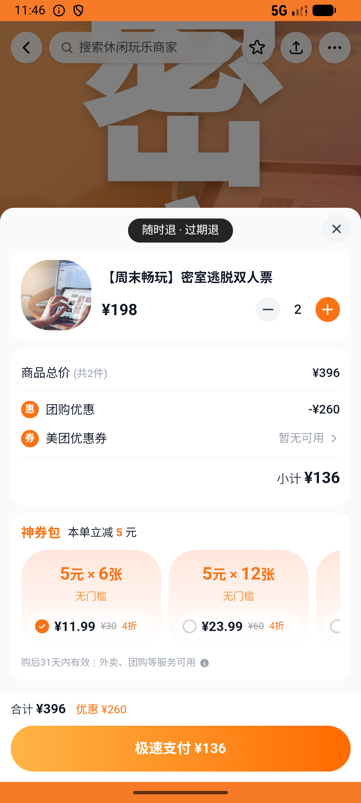

# leisure_v011_videos_then_pinchang_mishi  ❌

- **Brand**: `daishushenghuo`
- **Class**: `DaishushenghuoLeisureV011VideosThenPinchangMishiTask`
- **Pass@3**: **0/3**  (score = 0.00)
- **Elapsed**: 599s (~10.0 min)
- **Model**: `doubao-seed-2-0-lite-260428`
- **Raw log**: [./raw_logs/DaishushenghuoLeisureV011VideosThenPinchangMishiTask.log](./raw_logs/DaishushenghuoLeisureV011VideosThenPinchangMishiTask.log)
- **Generated**: 2026-07-12T10:12:48+08:00
- **Note**: backfilled from /tmp/pass_at_3_full_<ts>/ on 2026-05-02

## Task Goal

> 周末解闷先逛视频流刷一会，再去品场页种草，最后看到 X 先生密室逃脱(三里屯店) 的「【周末畅玩】密室逃脱双人票」¥68 觉得划算，下 2 张并支付（共 ¥136），顺手把这家密室收藏起来

## System Prompt

<details>
<summary>展开查看完整 System Prompt</summary>


> You are provided with a task description, a history of previous actions, and corresponding screenshots. Your goal is to perform the next action to complete the task. Please note that if performing the same action multiple times results in a static screen with no changes, you should attempt a modified or alternative action.
> 
> ---
> 
> ## Function Definition
> 
> - `clarify` — Ask the user for more information to complete the task.
> - `click` — Mouse left single click action.
> - `double_click` — Mouse left double click action.
> - `drag` — Perform a drag action from the start point to the end point. Typically used for swiping or selecting elements.
> - `long_press` — Perform a long press action at the specified coordinates.
> - `open_app` — Open the specified application.
> - `press_back` — Press the back button.
> - `press_enter` — Press the enter key.
> - `press_home` — Press the home button.
> - `take_notes` — Take notes and report the result in the specified content.
> - `type` — Type the specified content. You should manually delete any text from the input box that you want to remove.
> - `wait` — Wait for a certain period of time.

</details>

## User Query

> 请在 com.daishushenghuo 里面完成以下任务：
> 周末解闷先逛视频流刷一会，再去品场页种草，最后看到 X 先生密室逃脱(三里屯店) 的「【周末畅玩】密室逃脱双人票」¥68 觉得划算，下 2 张并支付（共 ¥136），顺手把这家密室收藏起来

## Attempts

| # | Outcome | Steps | Terminated | Reason | Start → End |
|---|---------|-------|------------|--------|-------------|
| 1 | ❌ failed | 21 | answer | X 先生密室订单已支付（双人票）: 未找到密室双人票已支付团购订单; 订单 quantity = 2: 预期 quantity=2，实际 ; 订单 actual_amount = ¥136.00（68 × 2）: 预期 ¥136.00，实际 ¥; 订单 order_type... | 2026-07-11 15:38:29 → 2026-07-11 15:41:52 |
| 2 | ❌ failed | 17 | answer | X 先生密室订单已支付（双人票）: 未找到密室双人票已支付团购订单; 订单 quantity = 2: 预期 quantity=2，实际 ; 订单 actual_amount = ¥136.00（68 × 2）: 预期 ¥136.00，实际 ¥; 订单 order_type... | 2026-07-11 15:41:52 → 2026-07-11 15:44:27 |
| 3 | ❌ failed | 26 | answer | X 先生密室订单已支付（双人票）: 未找到密室双人票已支付团购订单; 订单 quantity = 2: 预期 quantity=2，实际 ; 订单 actual_amount = ¥136.00（68 × 2）: 预期 ¥136.00，实际 ¥; 订单 order_type... | 2026-07-11 15:44:27 → 2026-07-11 15:48:28 |

## Failure Details

### Episode 1 — ❌ failed

- steps_used: `21`
- terminated_reason: `answer`
- reason:

  ```
  X 先生密室订单已支付（双人票）: 未找到密室双人票已支付团购订单; 订单 quantity = 2: 预期 quantity=2，实际 ; 订单 actual_amount = ¥136.00（68 × 2）: 预期 ¥136.00，实际 ¥; 订单 order_type = group_deal: 
  expected: "group_deal"
       got: nil
  
  (compared using ==)
  ; X 先生密室已被收藏: 未收藏 X 先生密室逃脱(三里屯店)
  ```
- death shot: 
  - state: [`./death_shots/DaishushenghuoLeisureV011VideosThenPinchangMishiTask/episode_001/step_021.json`](./death_shots/DaishushenghuoLeisureV011VideosThenPinchangMishiTask/episode_001/step_021.json)
  - digest: [`episode_digest.md`](./death_shots/DaishushenghuoLeisureV011VideosThenPinchangMishiTask/episode_001/episode_digest.md)

### Episode 2 — ❌ failed

- steps_used: `17`
- terminated_reason: `answer`
- reason:

  ```
  X 先生密室订单已支付（双人票）: 未找到密室双人票已支付团购订单; 订单 quantity = 2: 预期 quantity=2，实际 ; 订单 actual_amount = ¥136.00（68 × 2）: 预期 ¥136.00，实际 ¥; 订单 order_type = group_deal: 
  expected: "group_deal"
       got: nil
  
  (compared using ==)
  ; X 先生密室已被收藏: 未收藏 X 先生密室逃脱(三里屯店)
  ```
- death shot: 
  - state: [`./death_shots/DaishushenghuoLeisureV011VideosThenPinchangMishiTask/episode_002/step_017.json`](./death_shots/DaishushenghuoLeisureV011VideosThenPinchangMishiTask/episode_002/step_017.json)
  - digest: [`episode_digest.md`](./death_shots/DaishushenghuoLeisureV011VideosThenPinchangMishiTask/episode_002/episode_digest.md)

### Episode 3 — ❌ failed

- steps_used: `26`
- terminated_reason: `answer`
- reason:

  ```
  X 先生密室订单已支付（双人票）: 未找到密室双人票已支付团购订单; 订单 quantity = 2: 预期 quantity=2，实际 ; 订单 actual_amount = ¥136.00（68 × 2）: 预期 ¥136.00，实际 ¥; 订单 order_type = group_deal: 
  expected: "group_deal"
       got: nil
  
  (compared using ==)
  ; X 先生密室已被收藏: 未收藏 X 先生密室逃脱(三里屯店)
  ```
- death shot: 
  - state: [`./death_shots/DaishushenghuoLeisureV011VideosThenPinchangMishiTask/episode_003/step_026.json`](./death_shots/DaishushenghuoLeisureV011VideosThenPinchangMishiTask/episode_003/step_026.json)
  - digest: [`episode_digest.md`](./death_shots/DaishushenghuoLeisureV011VideosThenPinchangMishiTask/episode_003/episode_digest.md)

---

> 本摘要由 `sengclaw/scripts/pipeline/log_summarizer.py` 自动生成。 原始完整 log 见上方 Raw log 链接（含每 step 的 messages / tool_call / screenshot 引用）。
