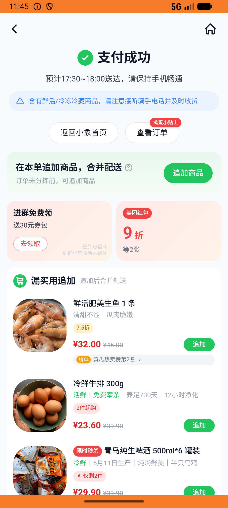
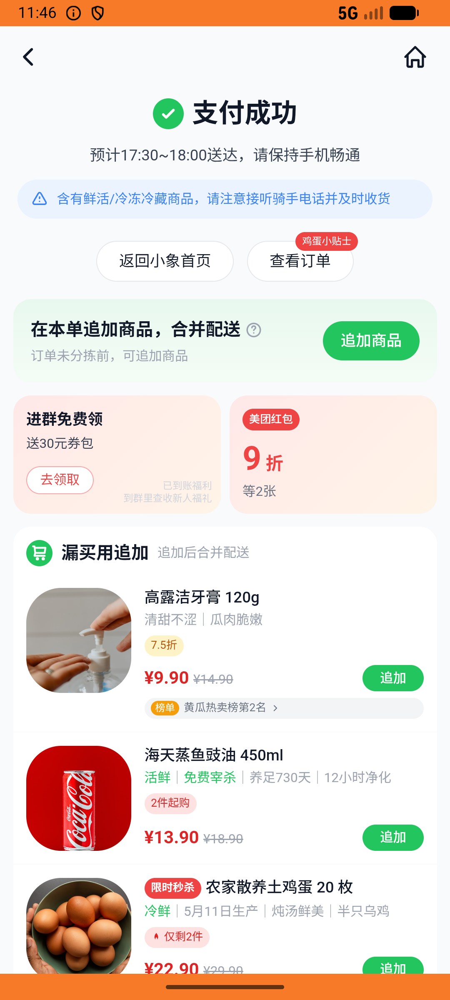
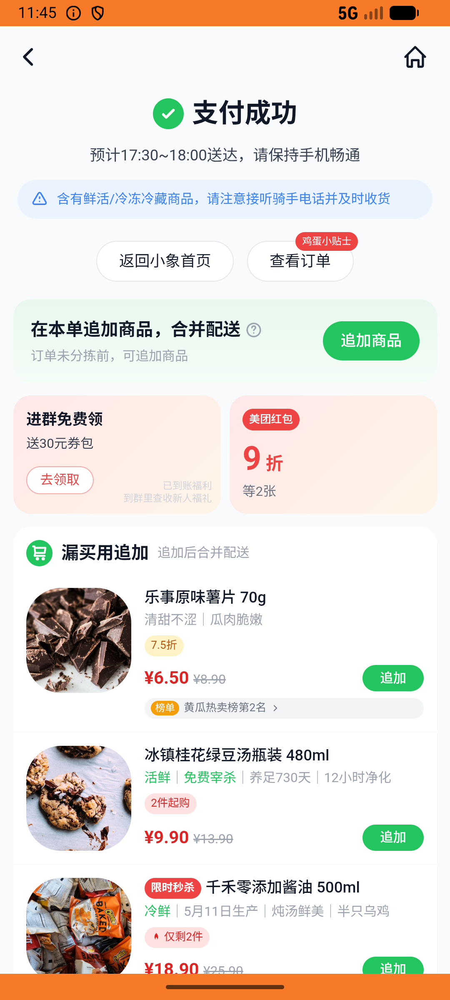

# xxsm_v022_place_order_with_remark  ❌

- **Brand**: `daishushenghuo`
- **Class**: `DaishushenghuoXxsmV022PlaceOrderWithRemarkTask`
- **Pass@3**: **0/3**  (score = 0.00)
- **Elapsed**: 646s (~10.8 min)
- **Model**: `doubao-seed-2-0-lite-260428`
- **Raw log**: [./raw_logs/DaishushenghuoXxsmV022PlaceOrderWithRemarkTask.log](./raw_logs/DaishushenghuoXxsmV022PlaceOrderWithRemarkTask.log)
- **Generated**: 2026-07-13T14:39:18+08:00
- **Note**: backfilled from /tmp/pass_at_3_full_<ts>/ on 2026-05-02

## Task Goal

> 在小象超市下单 1 份红心火龙果 2 个，备注不要塑料袋，点击底部极速支付按钮，弹出支付密码弹窗后输入 123456 确认提交（沙箱仿真，无真实扣款）

## System Prompt

<details>
<summary>展开查看完整 System Prompt</summary>


> You are provided with a task description, a history of previous actions, and corresponding screenshots. Your goal is to perform the next action to complete the task. Please note that if performing the same action multiple times results in a static screen with no changes, you should attempt a modified or alternative action.
> 
> ---
> 
> ## Function Definition
> 
> - `clarify` — Ask the user for more information to complete the task.
> - `click` — Mouse left single click action.
> - `double_click` — Mouse left double click action.
> - `drag` — Perform a drag action from the start point to the end point. Typically used for swiping or selecting elements.
> - `long_press` — Perform a long press action at the specified coordinates.
> - `open_app` — Open the specified application.
> - `press_back` — Press the back button.
> - `press_enter` — Press the enter key.
> - `press_home` — Press the home button.
> - `take_notes` — Take notes and report the result in the specified content.
> - `type` — Type the specified content. You should manually delete any text from the input box that you want to remove.
> - `wait` — Wait for a certain period of time.

</details>

## User Query

> 请在 com.daishushenghuo 里面完成以下任务：
> 在小象超市下单 1 份红心火龙果 2 个，备注不要塑料袋，点击底部极速支付按钮，弹出支付密码弹窗后输入 123456 确认提交（沙箱仿真，无真实扣款）

## Attempts

| # | Outcome | Steps | Terminated | Reason | Start → End |
|---|---------|-------|------------|--------|-------------|
| 1 | ❌ failed | 25 | answer | 订单金额正确: 预期总额 ¥18.9，实际为 ¥19.9 | 2026-07-13 13:57:18 → 2026-07-13 14:00:48 |
| 2 | ❌ failed | 24 | answer | 订单金额正确: 预期总额 ¥18.9，实际为 ¥19.9 | 2026-07-13 14:00:48 → 2026-07-13 14:04:48 |
| 3 | ❌ failed | 25 | answer | 订单金额正确: 预期总额 ¥18.9，实际为 ¥19.9 | 2026-07-13 14:04:48 → 2026-07-13 14:08:04 |

## Failure Details

### Episode 1 — ❌ failed

- steps_used: `25`
- terminated_reason: `answer`
- reason:

  ```
  订单金额正确: 预期总额 ¥18.9，实际为 ¥19.9
  ```
- death shot: 
  - state: [`./death_shots/DaishushenghuoXxsmV022PlaceOrderWithRemarkTask/episode_001/step_025.json`](./death_shots/DaishushenghuoXxsmV022PlaceOrderWithRemarkTask/episode_001/step_025.json)
  - digest: [`episode_digest.md`](./death_shots/DaishushenghuoXxsmV022PlaceOrderWithRemarkTask/episode_001/episode_digest.md)

### Episode 2 — ❌ failed

- steps_used: `24`
- terminated_reason: `answer`
- reason:

  ```
  订单金额正确: 预期总额 ¥18.9，实际为 ¥19.9
  ```
- death shot: 
  - state: [`./death_shots/DaishushenghuoXxsmV022PlaceOrderWithRemarkTask/episode_002/step_024.json`](./death_shots/DaishushenghuoXxsmV022PlaceOrderWithRemarkTask/episode_002/step_024.json)
  - digest: [`episode_digest.md`](./death_shots/DaishushenghuoXxsmV022PlaceOrderWithRemarkTask/episode_002/episode_digest.md)

### Episode 3 — ❌ failed

- steps_used: `25`
- terminated_reason: `answer`
- reason:

  ```
  订单金额正确: 预期总额 ¥18.9，实际为 ¥19.9
  ```
- death shot: 
  - state: [`./death_shots/DaishushenghuoXxsmV022PlaceOrderWithRemarkTask/episode_003/step_025.json`](./death_shots/DaishushenghuoXxsmV022PlaceOrderWithRemarkTask/episode_003/step_025.json)
  - digest: [`episode_digest.md`](./death_shots/DaishushenghuoXxsmV022PlaceOrderWithRemarkTask/episode_003/episode_digest.md)

---

> 本摘要由 `sengclaw/scripts/pipeline/log_summarizer.py` 自动生成。 原始完整 log 见上方 Raw log 链接（含每 step 的 messages / tool_call / screenshot 引用）。
