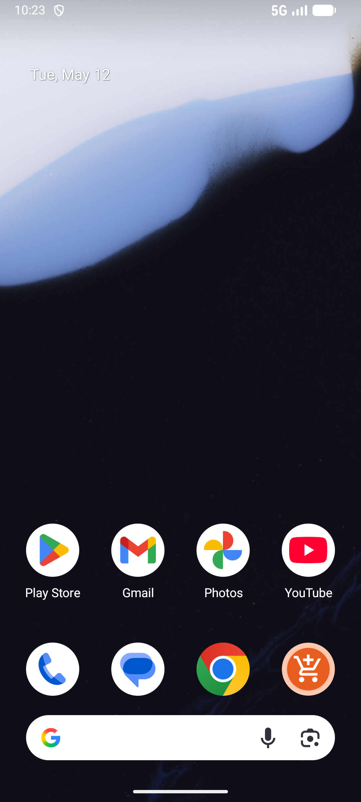

# checkin_tab_v002_complete_daily_checkin  ❌

- **Brand**: `duwu`
- **Class**: `DuwuCheckinTabV002CompleteDailyCheckinTask`
- **Pass@3**: **0/3**  (score = 0.00)
- **Elapsed**: 453s (~7.5 min)
- **Model**: `doubao-seed-2-0-lite-260428`
- **Raw log**: [./raw_logs/DuwuCheckinTabV002CompleteDailyCheckinTask.log](./raw_logs/DuwuCheckinTabV002CompleteDailyCheckinTask.log)
- **Generated**: 2026-05-21T20:14:10+08:00

## Task Goal

> 当前App：【DU物】。

## Attempts

| # | Outcome | Steps | Terminated | Reason | Start → End |
|---|---------|-------|------------|--------|-------------|
| 1 | ❌ failed | 11 | answer | – | 2026-05-21 20:06:37 → 2026-05-21 20:09:12 |
| 2 | ❌ failed | 14 | answer | – | 2026-05-21 20:09:12 → 2026-05-21 20:13:17 |
| 3 | ❌ failed | 4 | answer | – | 2026-05-21 20:13:17 → 2026-05-21 20:14:10 |

## Failure Details

### Episode 1 — ❌ failed

- steps_used: `11`
- terminated_reason: `answer`
- death shot: 
  - state: [`./death_shots/DuwuCheckinTabV002CompleteDailyCheckinTask/episode_001/step_011.json`](./death_shots/DuwuCheckinTabV002CompleteDailyCheckinTask/episode_001/step_011.json)

### Episode 2 — ❌ failed

- steps_used: `14`
- terminated_reason: `answer`
- death shot: 
  - state: [`./death_shots/DuwuCheckinTabV002CompleteDailyCheckinTask/episode_002/step_014.json`](./death_shots/DuwuCheckinTabV002CompleteDailyCheckinTask/episode_002/step_014.json)

### Episode 3 — ❌ failed

- steps_used: `4`
- terminated_reason: `answer`
- death shot: 
  - state: [`./death_shots/DuwuCheckinTabV002CompleteDailyCheckinTask/episode_003/step_004.json`](./death_shots/DuwuCheckinTabV002CompleteDailyCheckinTask/episode_003/step_004.json)

---

> 本摘要由 `sengclaw/scripts/pipeline/log_summarizer.py` 自动生成。 原始完整 log 见上方 Raw log 链接（含每 step 的 messages / tool_call / screenshot 引用）。
