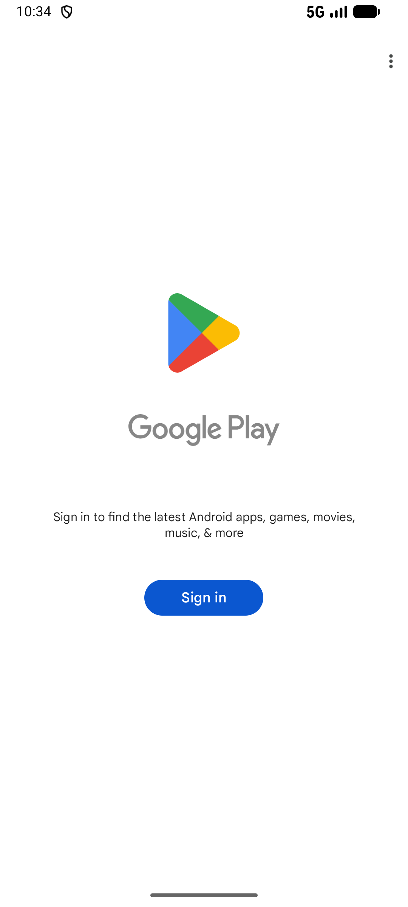

# feed_like_v001_like_airpods_max_post  ⚠️

- **Brand**: `duwu`
- **Class**: `DuwuFeedLikeV001LikeAirpodsMaxPostTask`
- **Pass@3**: **2/3**  (score = 1.00)
- **Elapsed**: 339s (~5.7 min)
- **Model**: `doubao-seed-2-0-lite-260428`
- **Raw log**: [./raw_logs/DuwuFeedLikeV001LikeAirpodsMaxPostTask.log](./raw_logs/DuwuFeedLikeV001LikeAirpodsMaxPostTask.log)
- **Generated**: 2026-05-23T03:31:26+08:00

## Task Goal

> 【当前账户档案】账号：demo@rlbox.ai；昵称：福瑜是我。请基于以上档案完成下列任务：找到「入手 AirPods Max 一个月使用感受」这篇帖子，先点赞，再撤销，再重新点赞

## Attempts

| # | Outcome | Steps | Terminated | Reason | Start → End |
|---|---------|-------|------------|--------|-------------|
| 1 | ✅ passed | 11 | answer | – | 2026-05-23 03:25:47 → 2026-05-23 03:27:10 |
| 2 | ✅ passed | 11 | answer | – | 2026-05-23 03:27:10 → 2026-05-23 03:28:36 |
| 3 | ❌ failed | 20 | answer | – | 2026-05-23 03:28:36 → 2026-05-23 03:31:26 |

## Failure Details

### Episode 3 — ❌ failed

- steps_used: `20`
- terminated_reason: `answer`
- death shot: 
  - state: [`./death_shots/DuwuFeedLikeV001LikeAirpodsMaxPostTask/episode_003/step_020.json`](./death_shots/DuwuFeedLikeV001LikeAirpodsMaxPostTask/episode_003/step_020.json)
  - digest: [`episode_digest.md`](./death_shots/DuwuFeedLikeV001LikeAirpodsMaxPostTask/episode_003/episode_digest.md)

---

> 本摘要由 `sengclaw/scripts/pipeline/log_summarizer.py` 自动生成。 原始完整 log 见上方 Raw log 链接（含每 step 的 messages / tool_call / screenshot 引用）。
