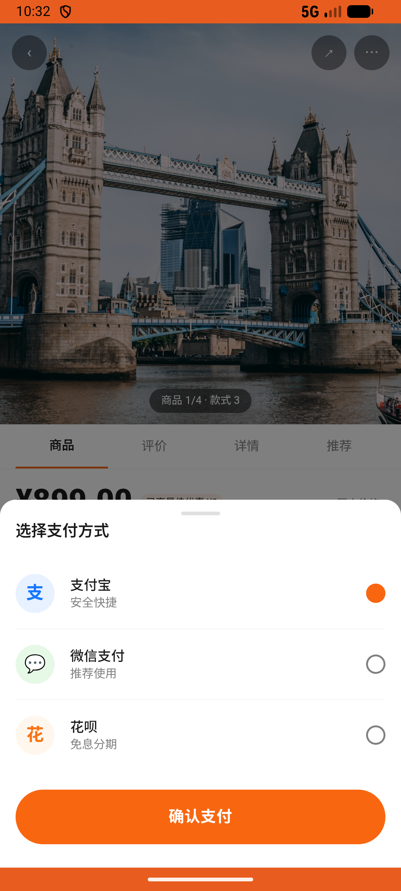

# order_v001_buy_product  ⚠️

- **Brand**: `duwu`
- **Class**: `DuwuOrderV001BuyProductTask`
- **Pass@3**: **1/3**  (score = 1.00)
- **Elapsed**: 239s (~4.0 min)
- **Model**: `doubao-seed-2-0-lite-260428`
- **Raw log**: [./raw_logs/DuwuOrderV001BuyProductTask.log](./raw_logs/DuwuOrderV001BuyProductTask.log)
- **Generated**: 2026-05-23T04:11:23+08:00

## Task Goal

> 【当前账户档案】账号：demo@rlbox.ai；昵称：福瑜是我。请基于以上档案完成下列任务：在 Nike Air Max 90 商品页点「立即购买」，选「黑白色」规格，支付方式选支付宝，完成下单

## Attempts

| # | Outcome | Steps | Terminated | Reason | Start → End |
|---|---------|-------|------------|--------|-------------|
| 1 | ❌ failed | 10 | answer | – | 2026-05-23 04:07:24 → 2026-05-23 04:08:42 |
| 2 | ✅ passed | 11 | answer | – | 2026-05-23 04:08:42 → 2026-05-23 04:10:14 |
| 3 | ❌ failed | 6 | answer | – | 2026-05-23 04:10:14 → 2026-05-23 04:11:23 |

## Failure Details

### Episode 1 — ❌ failed

- steps_used: `10`
- terminated_reason: `answer`
- death shot: 
  - state: [`./death_shots/DuwuOrderV001BuyProductTask/episode_001/step_010.json`](./death_shots/DuwuOrderV001BuyProductTask/episode_001/step_010.json)
  - digest: [`episode_digest.md`](./death_shots/DuwuOrderV001BuyProductTask/episode_001/episode_digest.md)

### Episode 3 — ❌ failed

- steps_used: `6`
- terminated_reason: `answer`
- death shot: 
  - state: [`./death_shots/DuwuOrderV001BuyProductTask/episode_003/step_006.json`](./death_shots/DuwuOrderV001BuyProductTask/episode_003/step_006.json)
  - digest: [`episode_digest.md`](./death_shots/DuwuOrderV001BuyProductTask/episode_003/episode_digest.md)

---

> 本摘要由 `sengclaw/scripts/pipeline/log_summarizer.py` 自动生成。 原始完整 log 见上方 Raw log 链接（含每 step 的 messages / tool_call / screenshot 引用）。
